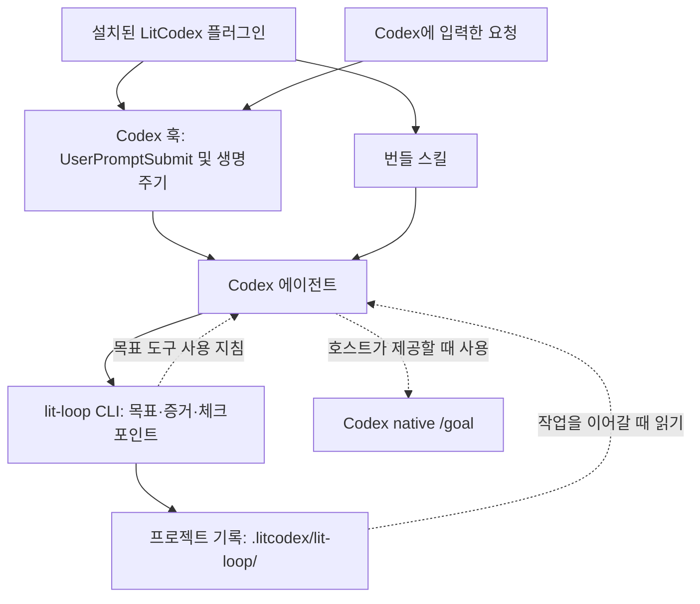

<p align="center"><picture><source media="(prefers-reduced-motion: reduce)" srcset="./docs/assets/cover-motion-still.webp" /></picture></p>

<p align="center"></p>

<details>
<summary>ASCII 로고 복사</summary>

```
                             ▄▄▄▄
                   ▗███▌   ▗██████▖
 ▗▄▄▄▄▄          ▗▟████▌   ▝██████▘
 ▐█████        ▗▟██████▌    ▝▀▜█▀▘
 ▐█████      ▗▟███████▄▄▄▄▄▄▄▄▄▄▄▄▄▄▄▄▄▄▄▄
 ▐█████    ▗▟█████████████████████████ ▐█▀
 ▐█████    ████████████████████████████▀
 ▐█████    ██▛▘   ▄ ▄▄▄▄▖▄▄▄▄▄▄▄▄▄▄▄▄▄▖
 ▐█████    ▀    ▄██ ████▌█████████████▌
 ▐█████       ▄████ ████▌█████████████▌
 ▐█████     ▄█████▛
 ▐█████  ▗▟█████▀▘       ▄▄▄▄▄     ▗▖
 ▐█████ ▐█████▀          █████     ▐▛▀
 ▐█████ ▐███▀            █████
 ▐█████ ▐█▀              █████
 ▐█████ ▝                █████
 ▐█████▄▄▄▄▄▄▄▖          █████
 ▐███████████▛           █████
 ▐██████████▀            █████

LIT · codex
```

</details>

<p align="center"></p>
<p align="center"></p>

<p align="center">
<a href="#설치"></a>
<a href="./LICENSE"></a>
</p>

<p align="center">
<a href="./docs/usage-Ko-KR.md"> 문서</a> &nbsp; <a href="#설치">설치</a> &nbsp; <a href="./docs/assets/readme/ignition-film.mp4"> Ignition</a> &nbsp; <a href="./LICENSE"> MIT</a>
</p>

# LitCodex

**Keep the work lit.**

[English](./README.md) · [설치](#설치) · [첫 작업](#lit으로-시작하기) · [스킬](#스킬-한눈에-보기) · [A/B 결과](#ab-기본-codex와-lit-비교) · [명령어](#명령어) · [문제 해결](#문제-해결) · [문서](#문서와-기여)

## LitCodex란

LitCodex는 Codex CLI 플러그인입니다. 계획, 검토, 조사와 오래 이어지는 실행 루프를 Codex에 더해서,
한 번 시작한 작업이 대화가 끝난 뒤에도 이어지게 합니다.

요청에 `lit`을 붙이면 됩니다. LitCodex는 그 요청을 목표로 바꾸고 통과·실패를 가릴 기준을 붙인 뒤,
결과를 프로젝트에 기록합니다. 다음 세션에 그 기록을 읽게 하면 멈춘 자리부터 이어갈 수 있습니다.

## 왜 LitCodex인가

**불씨를 건네받았다.<br>
이제, 당신의 작업에 옮길 차례다.**

고치고 싶은 버그 하나. 만들고 싶은 화면 하나. 끝내고 싶은 프로젝트 하나.

시작은 짧은 한 줄이면 됩니다. 어려운 건 그다음입니다. 대화가 길어지고 세션이 바뀌면,
어디까지 했는지부터 다시 짚어야 합니다. 어떤 결정을 내렸는지, 무엇을 확인했는지,
다음에는 무엇을 해야 하는지.

**LIT은 그 불씨를 남깁니다.** 목표와 계획, 확인한 결과, 다음에 할 일을 프로젝트에 기록합니다.
다음 세션에서 그 기록을 읽고 작업을 이어갈 수 있도록.

**대화가 끝난 자리에서, 다음 작업이 시작되도록.**

“꺼지지 않는 불”은 에이전트가 끝없이 돌아간다는 뜻이 아닙니다. **세션이 끝나도, 이어갈 작업을 남긴다는 뜻입니다.**

<p align="center"> </p>

## 설치

Node.js 22 이상과 Codex CLI가 있으면 아래 명령 하나로 설치합니다.

```sh
npm exec --yes --package @litfamily/litcodex@1.0.9 -- litcodex install
```

설치기는 플러그인·훅·에이전트를 등록하고, `~/.codex/config.toml`에서 자신이 관리하는 항목만 갱신합니다.
설치 중에는 리드 모델, 헬퍼 모델, 출력 스타일 세 가지를 묻습니다. 새로 설치하면 리드 경로는
`gpt-6-astra`/`xhigh`, 일반 헬퍼는 `gpt-6-luna`/`max`가 기본값이고, 지원되는 다른 모델과 추론 수준을 골라도 됩니다.

npm 패키지 하나에 필요한 것이 모두 들어 있어서 이 저장소를 복제할 필요가 없고, 설치에 GitHub 인증도 필요하지 않습니다.
실제 모델 작업을 시작할 때는 Codex 인증과 모델 사용 권한이 필요합니다.

알아 두면 좋은 변형이 두 가지 있습니다.

- 무엇이 바뀌는지 먼저 보려면 `npm exec --yes --package @litfamily/litcodex@1.0.9 -- litcodex --dry-run install`을 실행하세요.
- 묻는 단계 없이 설치하려면 `npm exec --yes --package @litfamily/litcodex@1.0.9 -- litcodex install --yes`를 실행하세요. 명시한 `--style <id>`는 그대로 적용됩니다.

예전 패키지 이름(`litcodex-ai`)으로 설치했다면 [기존 설치 이전 안내](./docs/npm-migration.md)를 먼저 읽어 주세요.

### 전역 명령으로 쓰기

`litcodex`를 `PATH`에서 바로 부르고 싶다면 다음을 실행합니다.

```sh
npm install -g @litfamily/litcodex
litcodex install
```

`npm install -g`는 패키지의 postinstall 스크립트를 실행합니다. 전역으로 설치했고 `CI`가 설정되어 있지 않으면
짧은 환영 문구를 보여 준 뒤 `lit-typographic-motion`이 쓰는 모션 런타임을 미리 준비(pre-warm)해 봅니다.

이 준비 과정은 네트워크를 씁니다. `npm ci`가 고정된 `opentype.js`, `playwright-core`, `ws`를 npm 레지스트리에서
받고, 고정된 글꼴·라이선스 파일은 GitHub와 apache.org에서 내려받습니다. 브라우저는 내려받지 않으며
`${XDG_CACHE_HOME:-~/.cache}/litcodex/motion-runtime/`에 설치합니다. 준비가 끝나지 않아도 패키지는 설치된 채로
남고, 스크립트가 나중에 다시 실행할 명령 `litcodex motion-runtime install`을 알려 줍니다.

스크립트를 건너뛰려면 `--ignore-scripts`를 붙이거나(환영 문구도 함께 빠집니다) 그 명령에만 `CI=1`을 설정하세요.
`litcodex install`도 설치가 성공하면 같은 준비 과정을 실행하며, 이를 끄는 옵션은 없습니다.

> 전역 설치가 없다면 `npm exec --yes --package @litfamily/litcodex@1.0.9 -- litcodex <command>` 형식을 사용하세요. 예: `npm exec --yes --package @litfamily/litcodex@1.0.9 -- litcodex doctor`.

### 기존 설정과 떼어 놓고 써 보기

지금 쓰는 설정을 건드리지 않고 체험하려면 [격리된 체험 안내](./docs/npm-migration.md#isolated-local-trial)를 따르세요.
`CODEX_HOME`만 바꿔서는 부족합니다. 기존 홈의 설정이 여전히 검색될 수 있기 때문입니다.

### Windows

Windows에서도 설치기와 CLI shim은 동작합니다. 디렉터리 디스크립터에 의존하는 Python 경로는 POSIX가 필요해서,
Windows에서는 `BLOCKED_UNSUPPORTED_PYTHON_POSIX_RUNTIME`으로 멈춥니다. 자세한 내용은
[플랫폼·질문 정책](./docs/usage-Ko-KR.md#설치)에 있습니다.

## lit으로 시작하기

프로젝트에서 Codex를 열고, 시작 검토에서 LitCodex 훅을 승인한 뒤 다음을 입력하세요.

```text
lit 회원가입 폼에 입력 검증을 추가해줘
```

따로 떨어진 단어 `lit`은 `<lit-loop-mode>`를 선택합니다. `UserPromptSubmit` 훅은 `systemMessage`로
5행짜리 활성화 마크를 보내는데, 터미널 색상 설정과 관계없이 늘 같은 일반 텍스트입니다. 답변은
`🔥 **LIT IGNITED · <discipline>** 🔥` 한 줄로 시작합니다.

`split`, `literal`, `litmus`처럼 `lit`이 단어 안에 들어 있을 뿐이면 반응하지 않고, 코드 스팬과 코드 펜스 안의 `lit`도 마찬가지입니다.
슬래시로 시작하는 일반적인 명령 형태도 무시하지만, 정확한 `/litresearch`만 예외로 연구 모드로 라우팅합니다.

`handoff`와 `lit-scientific-visualization`은 메시지 전체가 그 한 단어일 때만 동작합니다.
정확히 단독으로 입력한 `handoff`는 인수인계 문서를 만듭니다. `lit-scientific-visualization`만 단독으로 입력하면
훅이 `<lit-scientific-visualization-mode>`를 선택합니다. Python 의존성을 설치하지는 않습니다.

### 작은 결과물 하나부터

빈 프로젝트에서, 직접 확인할 수 있는 작업을 맡겨 보세요.

```text
lit 현재 폴더에 HTML 파일 하나로 할 일 목록을 만들어줘. 외부 의존성은 설치하지 마.
할 일 추가와 완료 처리를 확인하고, 확인하지 못한 부분은 따로 남겨줘.
```

끝나면 세 가지를 보세요. 결과물, 실제로 돌린 확인, 아직 남은 일입니다. 상태 마크는 요청이 제 경로로
들어갔다는 표시일 뿐, 화면이 제대로 동작한다는 증거는 아닙니다.

`lit recap`으로 기록된 상태를 읽을 수 있습니다. 세션을 마치기 전에는 다른 문구 없이 `handoff`만 보내세요.
다음 세션에서는 그 인수인계 문서와 프로젝트 목표를 먼저 읽고 이어가도록 요청하면 됩니다.

목표는 성공 기준을 모두 통과해야 완료됩니다. 단계마다 작업에 남는 것은 다음과 같습니다.

| 단계 | 작업에 남기는 것 |
| --- | --- |
| 계획하기 | 통과 여부를 확인할 수 있는 목표와 기준 |
| 만들기 | 직접 살펴볼 수 있는 작은 결과물 |
| 확인하기 | 완료한 기준의 증거와 아직 해결하지 못한 문제 |
| 다음 작업에 건네기 | 결정한 내용, 남은 일, 다시 시작할 위치 |

Codex의 native goal과 로컬 루프 기록은 따로 관리됩니다. native goal이 paused 또는 blocked 상태라면
[문제 해결](#문제-해결)의 복구 절차를 따르세요. 인수인계 문서를 만들었다고 저절로 재개되지는 않습니다.

### 자주 쓰는 경로

| 입력 | 하는 일 |
| --- | --- |
| `lit` | 프로젝트에 목표와 확인 기준을 남기며 범위가 정해진 작업을 시작합니다. |
| `handoff` 또는 `/lit-handoff` | 확인한 결과와 다음 할 일을 다음 세션으로 넘깁니다. |
| `lit-plan` | 무엇이든 고치기 전에 계획과 성공 기준부터 씁니다. |
| `lit start work <승인된 계획>` | 승인한 계획을 실행합니다. |
| `review-work` | 변경과 그 근거를 검토합니다. |
| `litresearch` | 출처를 달아 조사하고, 아직 불확실한 부분을 따로 적어 둡니다. |

전체 목록은 [명령어](#명령어)에 있습니다.

## 스킬 한눈에 보기

번들 스킬을 모두 모았습니다. 줄마다 시작하는 방법과 얻는 것을 적었고, 마지막 줄은 알아서 돌아가는 검사를 묶었습니다.

<table>
<tr><th>이렇게 됩니다</th><th>스킬</th><th>얻는 것</th></tr>
<tr>
<td></td>
<td><code>lit-loop</code><br /><sub><code>lit</code> · <code>$litcodex:lit-loop</code></sub></td>
<td>요청에 <code>lit</code>만 붙이세요. 범위를 정하고 증거와 함께 일하며, 확인하지 못한 것은 그대로 기록합니다.</td>
</tr>
<tr>
<td></td>
<td><code>litwork</code><br /><sub><code>litwork</code> · <code>$litcodex:litwork</code></sub></td>
<td>처음부터 끝까지 꼼꼼한 구현이나 수정입니다. 실패하는 테스트 먼저, 그다음 실제 화면에서 증명합니다.</td>
</tr>
<tr>
<td></td>
<td><code>lit-plan</code><br /><sub><code>lit plan</code> · <code>$litcodex:lit-plan</code></sub></td>
<td><code>.litcodex/plans/</code>에 번호 붙은 작업 목록을 만듭니다. 계획만 세웁니다.</td>
</tr>
<tr>
<td></td>
<td>Start Work<br /><sub><code>lit start work &lt;approved-plan&gt;</code></sub></td>
<td>승인된 계획을 다섯 관문으로 실행합니다. 끝에는 리뷰 다섯 갈래가 모두 통과해야 합니다.</td>
</tr>
<tr>
<td></td>
<td><code>review-work</code><br /><sub><code>lit review</code> · <code>$litcodex:review-work</code></sub></td>
<td>막는 힘이 있는 리뷰 다섯 갈래입니다. 하나라도 실패하면 승인되지 않습니다.</td>
</tr>
<tr>
<td></td>
<td><code>litgoal</code><br /><sub><code>lit goal</code> · <code>$litcodex:litgoal</code></sub></td>
<td>관찰 가능한 기준을 붙인 목표 하나를 오래 가는 lit-loop에 묶습니다.</td>
</tr>
<tr>
<td></td>
<td><code>lit-recap</code><br /><sub><code>lit recap</code> · <code>$litcodex:lit-recap</code></sub></td>
<td>읽기 전용 요약입니다. 끝난 일, 진행 중인 일, 막힌 곳, 증거 위치, 다음 단계를 보여줍니다.</td>
</tr>
<tr>
<td></td>
<td><code>lit-handoff</code><br /><sub><code>handoff</code> · <code>/lit-handoff</code></sub></td>
<td><code>handoff</code>라고 치면 다음 세션이 읽고 이어갈 인수인계 파일이 생깁니다.</td>
</tr>
<tr>
<td></td>
<td><code>deep-interview</code><br /><sub><code>deep-interview</code> · <code>$litcodex:deep-interview</code></sub></td>
<td>한 번에 한 질문씩 물어 만들 수 있을 만큼 분명하게 다듬습니다. Quick, Standard, Deep 중에서 목표를 고릅니다.</td>
</tr>
<tr>
<td></td>
<td><code>litresearch</code><br /><sub><code>lit research</code> · <code>$litcodex:litresearch</code></sub></td>
<td>조사를 요청할 때만 움직입니다. 여러 갈래로 증거를 모아 출처와 함께 종합합니다.</td>
</tr>
<tr>
<td></td>
<td><code>lit-crucible</code><br /><sub><code>lit-crucible</code> · <code>$litcodex:lit-crucible</code></sub></td>
<td>계획 전에 요구사항을 반박해 봅니다. 반박을 견딘 위험만 계획으로 넘어갑니다.</td>
</tr>
<tr>
<td></td>
<td><code>lit-init</code><br /><sub><code>lit-init</code> · <code>$litcodex:lit-init</code></sub></td>
<td>저장소에 실제로 있는 것을 근거로, 필요한 곳에만 짧은 AGENTS.md 안내를 만듭니다.</td>
</tr>
<tr>
<td></td>
<td><code>lit-comprehend</code><br /><sub><code>lit-comprehend</code> · <code>$litcodex:lit-comprehend</code></sub></td>
<td>에이전트가 쓴 작업을 이해하도록 돕는 설명 페이지입니다. 직관, 흐름 설명, 짧은 퀴즈 순서입니다.</td>
</tr>
<tr>
<td></td>
<td><code>lit-humanizer</code><br /><sub><code>$litcodex:lit-humanizer</code></sub></td>
<td>딱딱한 AI 문장을 한국어나 영어로 다시 씁니다. 사실과 단서는 남기고 군더더기는 뺍니다.</td>
</tr>
<tr>
<td></td>
<td><code>lit-diagram-drawer</code><br /><sub><code>$litcodex:lit-diagram-drawer</code></sub></td>
<td>슬라이드와 문서에 넣을 다이어그램을 편집 가능한 형태로 그리고, 검사한 뒤 PNG와 SVG로 내보냅니다.</td>
</tr>
<tr>
<td></td>
<td><code>lit-pptx</code><br /><sub><code>$litcodex:lit-pptx</code></sub></td>
<td><code>lit</code>으로 발표자료를 요청하면 편집 가능한 PowerPoint 파일과 원고 Markdown이 나옵니다. 기본은 AZURE-PRO와 Pretendard이고, 파일에 배치 검사를 돌리며 LibreOffice가 있으면 렌더링된 슬라이드도 확인합니다.</td>
</tr>
<tr>
<td></td>
<td><code>lit-docx</code><br /><sub><code>$litcodex:lit-docx</code></sub></td>
<td><code>lit</code>으로 보고서를 요청하면 서식을 갖춘 Word 파일과 원고 Markdown이 나옵니다. 한국어는 korean-generic 서식을 쓰고, 파일을 다시 열어 검사하며 LibreOffice가 있으면 페이지도 확인합니다.</td>
</tr>
<tr>
<td></td>
<td><code>lit-fetch</code><br /><sub><code>$litcodex:lit-fetch</code></sub></td>
<td>보통 방법으로 부족할 때, 주소·DNS·본문 안전 검사를 거쳐 공개 페이지를 읽습니다.</td>
</tr>
<tr>
<td></td>
<td><code>lit-scientific-visualization</code><br /><sub><code>lit-scientific-visualization</code> · <code>$litcodex:lit-scientific-visualization</code></sub></td>
<td>학술지 규격 그림을 벡터와 600 DPI로 내보냅니다. 그래프 종류는 데이터 성격에 맞춰 고릅니다.</td>
</tr>
<tr>
<td></td>
<td><code>lit-team</code><br /><sub><code>lit team</code> · <code>$litcodex:lit-team</code></sub></td>
<td>여러 작업자에게 겹치지 않는 몫을 나누고, 각자 증거와 함께 보고하게 합니다.</td>
</tr>
<tr>
<td></td>
<td><code>litcodex-doctor</code><br /><sub><code>$litcodex:litcodex-doctor</code></sub></td>
<td>업데이트나 설정 실패 뒤에 LitCodex와 Codex 설치 상태를 점검합니다.</td>
</tr>
<tr>
<td></td>
<td><code>litcodex-report-bug</code><br /><sub><code>$litcodex:litcodex-report-bug</code></sub></td>
<td>LitCodex나 Codex의 버그 보고서를 출처와 함께 작성합니다.</td>
</tr>
<tr>
<td></td>
<td><code>litcodex-contribute-bug-fix</code><br /><sub><code>$litcodex:litcodex-contribute-bug-fix</code></sub></td>
<td>진단한 결함을 테스트가 붙은 수정 PR로 만듭니다.</td>
</tr>
<tr>
<td></td>
<td><code>coding-session-audit</code><br /><sub><code>$litcodex:coding-session-audit</code></sub></td>
<td>지난 Codex 세션을 기록으로 읽고, 어디서 멈췄는지 보여줍니다.</td>
</tr>
<tr>
<td></td>
<td><code>debugging</code><br /><sub><code>$litcodex:debugging</code></sub></td>
<td>버그를 재현하고, 가설을 세 개 이상 세워 확인한 뒤, 확인된 원인만 고칩니다.</td>
</tr>
<tr>
<td></td>
<td><code>refactor</code><br /><sub><code>$litcodex:refactor</code></sub></td>
<td>동작을 테스트로 고정한 채 코드 구조를 바꿉니다. 단계마다 확인합니다.</td>
</tr>
<tr>
<td></td>
<td><code>lit-code</code><br /><sub><code>$litcodex:lit-code</code></sub></td>
<td>엄격한 구현 규칙입니다. 테스트 먼저, 경계에서 타입 확인, 작은 파일.</td>
</tr>
<tr>
<td></td>
<td><code>lit-commit</code><br /><sub><code>$litcodex:lit-commit</code></sub></td>
<td>변경을 저장소 스타일에 맞는 작은 커밋으로 나눕니다. 관계없는 작업은 건드리지 않습니다.</td>
</tr>
<tr>
<td></td>
<td><code>lsp-setup</code><br /><sub><code>$litcodex:lsp-setup</code></sub></td>
<td>언어 서버 설정을 확인하고, 필요할 때 실제 진단 검사를 돌립니다.</td>
</tr>
<tr>
<td></td>
<td><code>readme-studio</code><br /><sub><code>$litcodex:readme-studio</code></sub></td>
<td>사실에 맞는 README와 움직이는 커버를 만들고, 휴대폰과 데스크톱 폭, 라이트와 다크 모드에서 확인합니다.</td>
</tr>
<tr>
<td></td>
<td><code>lit-typographic-motion</code><br /><sub><code>$litcodex:lit-typographic-motion</code></sub></td>
<td><code>lit</code>으로 영상을 요청하면 트리트먼트를 먼저 쓰고, 직접 만든 무대 페이지나 타입 엔진으로 영상을 만들고, 사운드를 입힌 뒤 렌더링된 스틸을 보며 다듬습니다.</td>
</tr>
<tr>
<td></td>
<td><code>structural-search</code><br /><sub><code>$litcodex:structural-search</code></sub></td>
<td>글자 대신 문법 구조로 코드를 찾고, 바꾸기 전에 결과를 미리 보여줍니다.</td>
</tr>
<tr>
<td></td>
<td><code>visual-qa</code><br /><sub><code>$litcodex:visual-qa</code></sub></td>
<td>실제 화면을 폭별로 확인해 결과를 정직하게 돌려줍니다. 막히면 무엇이 막았는지 정확히 알려줍니다.</td>
</tr>
<tr>
<td></td>
<td><code>browser-drive</code><br /><sub><code>browser-drive</code> · <code>$litcodex:browser-drive</code></sub></td>
<td>브라우저 드라이버를 먼저 확인한 뒤 실제 페이지를 조작합니다. 드라이버가 없으면 그렇다고 말합니다.</td>
</tr>
<tr>
<td></td>
<td><code>frontend-ui-ux</code><br /><sub><code>$litcodex:frontend-ui-ux</code></sub></td>
<td>실제로 동작하는 화면을 만들고, 측정 프로브로 일곱 가지 보기를 렌더링합니다. 네 가지 폭, 다크 모드, 모션 줄이기, 200% 확대입니다.</td>
</tr>
<tr>
<td></td>
<td><code>lit-burnoff</code><br /><sub><code>$litcodex:lit-burnoff</code></sub></td>
<td>테스트로 동작을 먼저 묶어 두고, 변경분에 붙은 AI식 군더더기를 걷어냅니다.</td>
</tr>
<tr>
<td></td>
<td><code>lit-burnoff-file</code><br /><sub><code>$litcodex:lit-burnoff-file</code></sub></td>
<td>파일 하나만 정리합니다. 설명조 주석과 과한 방어 코드를 줄이고 중첩을 펴줍니다.</td>
</tr>
<tr>
<td></td>
<td><code>wikify</code><br /><sub><code>$litcodex:wikify</code></sub></td>
<td>검토를 거친 프로젝트 지식을 디스크에 두고, 나중 질문에 출처와 함께 답합니다.</td>
</tr>
<tr>
<td></td>
<td><code>autoresearch</code><br /><sub><code>$litcodex:autoresearch</code></sub></td>
<td>승인된 예산 안에서 실험을 반복합니다. 한 번에 하나만 바꾸고, 결과에 따라 남기거나 되돌립니다.</td>
</tr>
<tr>
<td></td>
<td><code>autoconference</code><br /><sub><code>$litcodex:autoconference</code></sub></td>
<td>예산을 정한 연구 회의입니다. 연구자와 리뷰어가 따로 일하고, 종합에는 반대 의견도 남깁니다.</td>
</tr>
<tr>
<td></td>
<td><code>rules</code> · <code>lsp</code> · <code>comment-checker</code><br /><sub>자동 실행</sub></td>
<td>알아서 돌아갑니다. 프롬프트마다 프로젝트 규칙을 넣고, 수정 뒤에는 LSP와 주석을 확인합니다.</td>
</tr>
</table>

## A/B: 기본 Codex와 lit 비교

아래 요청은 모두 가볍게 쓴 한국어 한 줄입니다. 기준선에는 그 줄을 그대로 보냈고, lit 실행군에는 같은 줄 끝에
` lit`만 붙였습니다.

두 실행군 모두 2026-09-26에 Codex CLI 0.157.1과 `gpt-6-sol`(high effort)로 한 번씩 돌렸고, 실행마다 따로 만든
일회용 홈을 썼습니다. lit 실행군은 배포 전 로컬 빌드의 LitCodex를 사용했습니다. 배포된 버전으로 실행한 결과가
아닙니다. LitCodex를 고쳐 다시 실행한 작업에서는 마지막 lit 실행을 같은 기준선과 비교했습니다.

블라인드 심사(Claude Opus 5.5)가 두 결과의 순서를 바꿔 가며 비교했고, 이어서 메인테이너가 두 결과를 나란히 놓고
최종 판정을 내렸습니다. 심사 판정은 참고용으로 옆에 적었습니다.

S3와 S4는 이후 인터페이스 라운드에서 S11과 함께 다시 실행했습니다. S5는 오피스 라운드에서 S8, S9와 함께 다시
실행했고, 이때 lit 실행군은 `lit-pptx`와 `lit-docx`를 사용했습니다.

| 작업 | 요청 | 최종 판정 | 블라인드 심사(같은 라운드) |
| --- | --- | --- | --- |
| S1 터미널 할 일 CLI | `터미널에서 쓰는 할 일 관리 CLI 만들어줘` | **기준선 승** | 기준선 승 |
| S2 API 서버 버그 | `이 API 서버 가끔 이상하게 동작하는데 고쳐줘` | **무승부** | 기준선 승 |
| S3 가계부 대시보드 | `개인 가계부 대시보드 웹페이지 만들어줘` | **LitCodex 승** | 기준선 승 |
| S4 카페 랜딩 페이지 | `동네 카페 브랜드 랜딩페이지 만들어줘` | **LitCodex 승** | 무승부 |
| S5 자료 기반 보고서와 발표자료 | `sources 폴더 자료로 보고서랑 발표자료 만들어줘` | **LitCodex 승** | 무승부 |
| S6 Node 22→24 조사 | `Node 22에서 24로 올릴 때 달라지는 거 조사해줘` | **LitCodex 승** | LitCodex 승 |
| S7 주문·결제·배송 구조도 | `주문-결제-배송 서비스 구조도 그려줘` | **LitCodex 승** (블라인드 심사 판정, 메인테이너 미검토) | LitCodex 승 |
| S8 분기 실적 발표자료 | `분기 실적 발표자료 만들어줘` | **LitCodex 승** | 기준선 승 |
| S9 신제품 기획서 | `신제품 기획서 써줘` | **LitCodex 승** | LitCodex 승 |
| S11 회의실 예약 웹앱 | `회의실 예약 웹앱 만들어줘` | **LitCodex 승** | 기준선 승 |
| 합계 | | **8승 1무 1패** | 3승 2무 5패 |

모션 스킬 `lit-typographic-motion`은 첫 A/B 이후 새로 만들었고, 아직 A/B 결과가 없습니다. 맨 위 커버는 LitFamily 모션 스킬로 만들었습니다.

두 라운드 모두 화면 확인이 제대로 되지 않았습니다. 인터페이스 라운드에서는 Codex 샌드박스가 브라우저를 막아 lit
실행군의 인터페이스 프로브가 화면을 측정하지 못했고, 두 실행군 모두 렌더링된 화면을 확인하지 못했습니다. 오피스
라운드에서는 샌드박스 안에서 렌더러가 실패해 lit 실행군이 슬라이드와 페이지 미리보기를 보지 못했으며, 답변마다 그
사실을 밝혔습니다. 메인테이너는 오피스 라운드 전체를 두고 실무에 쓰기에는 LitCodex 결과물이 훨씬 낫다고 봤습니다.

### 양쪽이 만든 것

- **S1, 패.** 기준선 CLI는 할 일 추가, 목록, 수정, 완료, 재개, 삭제를 지원하고 마감일도 검증합니다. LitCodex CLI는 명령이 더 적었고(수정과 마감일 없음), Python 3.10을 지원한다고 적었지만 3.11부터 있는 API를 불러왔으며, 자체 테스트도 검사 환경에서 통과하지 못했습니다. 블라인드 심사는 앞선 두 번의 LitCodex 실행에서도 기준선을 골랐고, 메인테이너도 확실한 패배로 판정했습니다.
- **S2, 무승부.** 양쪽 모두 심어 둔 버그 여섯 개를 전부 고쳤고, 보이는 테스트 실패도 없었습니다. 심사는 기준선을 조금 더 높게 봤습니다. 항목 생성 응답이 200에서 201로 바뀐다는 점을 기준선 답변은 밝혔고 LitCodex 답변은 빠뜨렸기 때문입니다. 메인테이너는 무승부로 판정했습니다.
- **S3, 승.** LitCodex 대시보드는 월별 수입, 지출, 예산을 보여 주고 거래 추가, 삭제, 검색과 예산 변경을 지원합니다. 심사는 수입·지출 선 그래프, 카테고리 도넛, 카테고리별 예산을 갖춘 기준선의 분석이 더 풍부하다고 봤습니다. 메인테이너는 LitCodex 화면을 골랐습니다.
- **S4, 승.** 심사는 무승부로 봤습니다. 기준선은 매장 외관 사진과 메뉴 구성이 더 완성도 있었고, LitCodex 페이지는 요청에 주소와 영업시간이 없어 방문자에게 시안 표시를 보여 줬습니다. 검사 결과 LitCodex 페이지에는 잘린 글자가 없었지만(기준선 9건), 접근성 지적은 더 많았습니다(38건 대 29건).
- **S5, 승.** LitCodex는 Word 보고서와 7장 발표자료를 만들고, 각각 편집 가능한 Markdown 원본을 함께 남겼습니다. 심사는 무승부로 봤습니다. 기준선 보고서는 자료 기준 기간 상자, 해석 열, 번호 붙은 출처 표기로 더 잘 짜였고, LitCodex 슬라이드는 더 다듬어져 보였습니다. 정확한 사실은 기준선 12/12, LitCodex 11/12였고 양쪽 모두 틀린 사실은 없었습니다. 근거 없는 숫자 검출은 14건 대 5건이었습니다.
- **S6, 승.** LitCodex는 `dirent.path`가 제거됐다고 정확히 짚었고(기준선은 사용 중단 예고로만 설명), `require(esm)`와 타입 스트리핑이 Node 22에 이미 들어 있다는 점도 밝혔습니다. 포함된 사실은 10개 중 3개 대 2개였고, 공식 출처 비율은 LitCodex 75%, 기준선 100%였습니다.
- **S7, 승(블라인드 심사 판정, 메인테이너 미검토).** LitCodex는 연결선마다 라벨을 달고 결제 실패 경로까지 넣은 구조도를 렌더링한 PNG와 편집 가능한 HTML로 저장했습니다. 기준선은 더 많은 서비스를 담았지만 답변에 Mermaid 코드만 남기고 렌더링한 파일은 만들지 않았습니다.
- **S8, 승.** 요청에는 수치가 없었습니다. 기준선은 모든 숫자 자리를 비워 둔 10장짜리 채움형 템플릿을 만들었고, 검사에서 넘치는 텍스트 상자 18개가 나왔습니다. LitCodex는 가상 회사를 내세워 예시 수치임을 밝힌 8장 발표자료와 표 3개를 만들었고, 넘치는 상자 1개와 겹침 1건이 나왔습니다. 심사는 기준선 템플릿을 골랐습니다.
- **S9, 승.** 기준선은 채팅 답변으로 짧은 기획안만 쓰고 문서 파일은 만들지 않았습니다. LitCodex는 Markdown 원본과 함께 6쪽짜리 Word 기획서를 썼습니다. 의사결정 관문, 범위, 일정, 위험, 단위 경제성을 담았고 모든 수치를 가정으로 표시했습니다. 심사도 LitCodex를 골랐지만, 남은 점검 파일, 목록 한 곳의 번호 오류, 지나친 단서 표현을 지적했습니다.
- **S11, 승.** 심사는 기준선을 골랐습니다. 기준선에는 주간 날짜 막대와 회의실별 시간표가 있어 빈 칸을 눌러 바로 예약할 수 있지만, LitCodex 앱은 큰 머리말과 회의실 목록 위주라 기존 예약을 볼 수 없다는 이유였습니다. LitCodex는 날짜, 인원, 설비로 회의실을 찾고 겹치는 예약을 막으며, 단위 테스트를 포함하고, 접근성 지적은 2건(기준선 124건)이었습니다.

### 화면으로 보기

**S3 가계부 대시보드: 왼쪽 기준선, 오른쪽 LitCodex.**

<p> </p>

<details><summary>S3 휴대전화 화면</summary>

<p> </p>

</details>

**S4 카페 랜딩 페이지: 왼쪽 기준선, 오른쪽 LitCodex.**

<p> </p>

<details><summary>S4 휴대전화 화면</summary>

<p> </p>

</details>

**S5 앞쪽 슬라이드 다섯 장: 위 기준선, 아래 LitCodex.**

<p></p>
<p></p>

**S7 LitCodex 구조도.** 기준선은 렌더링한 파일 없이 Mermaid 코드만 답했습니다.

<p></p>

**S8 앞쪽 슬라이드 다섯 장: 위 기준선, 아래 LitCodex.**

<p></p>
<p></p>

**S9 LitCodex 기획서 앞쪽 세 쪽.** 기준선은 채팅으로만 답하고 파일을 만들지 않았습니다.

<p></p>

**S11 회의실 예약 웹앱: 왼쪽 기준선, 오른쪽 LitCodex.**

<p> </p>

<details><summary>S11 휴대전화 화면</summary>

<p> </p>

</details>

## 어떻게 동작하나요

Codex가 플러그인을 불러오고 훅을 실행합니다. 훅은 요청이 어떤 모드에 속하는지 가리고 맥락을 보태며,
스킬은 에이전트가 일하는 절차를 안내합니다. 루프 CLI는 프로젝트 기록을 관리하고, Codex의 native goal 도구를
쓸 때 따를 지침을 출력합니다.



native goal로 이어지는 점선은 에이전트가 따르는 절차입니다. 패키지가 native goal 도구를 직접 호출하지는 않습니다.
도구가 없는 세션에서는 로컬 기록을 유지하고, native goal을 동기화하지 못했다고 남깁니다. paused 또는 blocked인
목표는 문서의 복구 절차를 따라야 하며, 인수인계 문서를 읽었다고 자동으로 재개되지는 않습니다.

훅과 에이전트 실행은 Codex CLI가 맡습니다. 인증, 모델 접근, 권한, 화면 확인은 Codex와 사용자 환경의 몫이어서,
경로 표시나 이 README의 이미지만으로 작업이 끝났다고 볼 수는 없습니다. 더 자세한 내용은
[실행·상태 참고서](./docs/usage-Ko-KR.md)에 있습니다.

## 명령어

### Codex 작성창에서

| 입력 | 모드 | 하는 일 |
| --- | --- | --- |
| `lit` 또는 `lit-loop` | **lit-loop** | 오래 이어지는 루프에서 작업하며 증거를 체크포인트로 남김 |
| `litwork` | **litwork** | 결과 중심 작업, 수동 QA 증거 포함 |
| `lit-plan` 또는 `lit plan` | **lit-plan** | 계획만 작성: 증거와 마지막 완료 주장이 담긴 범위 있는 계획 |
| `deep-interview` 또는 `lit deep interview` | **deep-interview** | 계획만 작성: 모호한 요구를 질문으로 좁힘 |
| `litgoal` 또는 `lit goal` | **litgoal** | 목표와 기준을 루프 상태에 연결 |
| `lit-recap` 또는 `lit recap` | **lit-recap** | `.litcodex` 원장을 읽기 전용으로 요약 |
| `lit-comprehend` 또는 `comprehend` | **lit-comprehend** | 작업 트리 밖에 자체 완결형 설명 자료 생성 |
| `review-work` 또는 `lit review` | **review-work** | 계획이나 끝난 작업을 읽기 전용으로 검토 |
| `litresearch`, `/litresearch` 또는 `lit research` | **litresearch** | 사실·가설·출처·불확실성을 나눠 적는 연구 저널 |
| `lit start work <plan-name>` | **Start Work** | 승인된 계획을 실행하고 증거를 남김 |
| 정확히 단독으로 입력한 `handoff` | **lit-handoff** | 비밀값을 빼고 인수인계 문서를 만들거나 갱신 |
| 정확히 단독으로 입력한 `lit-scientific-visualization` | **lit-scientific-visualization** | 훅을 통해 출판용 시각화 어댑터를 불러옴 |

같은 모드를 한 세션에서 다시 입력해도 달라지는 것은 없습니다. 개별 스킬은 Codex skill picker에서 정확한 ID로
고르거나, `$litcodex:lit-handoff`, `$litcodex:lit-scientific-visualization`, `$litcodex:lit-humanizer`,
`$litcodex:lit-fetch`처럼 `$litcodex:` 접두어를 붙인 이름으로 불러도 됩니다.

이름을 알아 두면 편한 스킬도 몇 가지 있습니다.

- **다이어그램.** 아키텍처, 워크플로, 시스템, 개념 다이어그램은 Codex skill picker에서 `lit-diagram-drawer`를
  고르세요. `lit`으로 다이어그램을 요청해도 이 스킬을 읽도록 안내합니다. 제품 화면과 측정 데이터 그래프는 각자
  전용 스킬이 있습니다.
- **Word와 PowerPoint.** 보고서·기획서는 `lit-docx`, 발표자료는 `lit-pptx`를 고릅니다. 범위가 정해진 `lit`
  요청은 필요한 스킬을 알아서 읽고, 두 형식을 함께 요청하면 둘 다 씁니다. 두 스킬 모두 편집 가능한 Markdown 원본을
  DOCX/PPTX 옆에 남깁니다. 고정된 의존성은 `litcodex install`이 Codex 세션 밖에서 제품 캐시에 준비하고,
  `litcodex office-runtime status`나 `litcodex doctor`로 준비 상태를 볼 수 있습니다. 네트워크 없이 설치했다면
  나중에 샌드박스 밖에서 `litcodex office-runtime install`을 실행하세요. LibreOffice·pandoc·XeLaTeX 지원 여부는
  Office 실행기의 doctor 명령이 알려 줍니다.
- **글 다듬기.** 영어·한국어 글은 `lit-humanizer`를 고르세요. 저장하기 전에 확실한 초안 흔적 몇 가지를 막고,
  약한 패턴은 알려 주기만 합니다. 만든 Office·PDF 파일도 호스트가 텍스트를 뽑을 수 있으면 생성 직후에 확인합니다.

### CLI 명령어

| 명령 | 하는 일 |
| --- | --- |
| `litcodex install` | LitCodex 플러그인과 훅 등록 |
| `litcodex doctor` | 설치, 루프 상태, 호스트 기능, 실제 적용된 설정 진단 |
| `litcodex uninstall` | 플러그인과 LitCodex가 관리하는 설정 제거 |
| `litcodex config migrate` | 관리되는 Codex 설정을 미리 보거나 적용 |
| `litcodex hook user-prompt-submit` | 호스트가 훅을 부를 때 쓰는 진입점 |
| `litcodex loop create` | 브리프에서 목표와 성공 기준 도출 |
| `litcodex loop status --json` | 루프 상태를 JSON으로 확인 |
| `litcodex loop run` | 다음에 실행할 수 있는 목표 선택 |
| `litcodex loop record-evidence` | 기준 하나의 통과·실패·차단 결과 기록 |
| `litcodex loop checkpoint` | 모든 기준을 통과했을 때만 목표 완료 처리 |
| `litcodex loop doctor` | 루프 상태 진단 또는 복구 |

전체 스킬은 Codex skill picker에서 볼 수 있습니다. 이름이 바뀐 스킬은 한 릴리스 동안 예전 이름으로도 불러집니다.
[이름 전환 정책](./docs/usage-Ko-KR.md#스킬-이름-전환)과 [CHANGELOG.md](./CHANGELOG.md)를 참고하세요.

## 작업 기록이 남는 곳

프로젝트의 루프 상태는 `.litcodex/lit-loop/` 아래에 있습니다. 기록 파일은 `brief.md`, `goals.json`,
`ledger.jsonl`이고, 증거는 `evidence/` 폴더에 쌓입니다. 쓰기는 원자적으로 이뤄지고, 손상된 목표 파일은 버리지 않고
`.bak`으로 보존합니다. 이 상태는 로컬에만 있으며 Git과 패키지에서 제외됩니다.
[상태·복구 참고서](./docs/usage-Ko-KR.md#루프-상태)에서 자세히 볼 수 있습니다.

## 설치 확인

```sh
npm exec --yes --package @litfamily/litcodex@1.0.9 -- litcodex doctor
```

`litcodex doctor`는 등록·훅·설정·호스트 기능을, `litcodex loop doctor`는 현재 프로젝트의 루프 상태를 확인합니다.
설치 검사를 통과해도 인증된 모델 작업이나 자식 에이전트 실행까지 확인한 것은 아닙니다.

## 안전

- 계획과 증거는 언제든 검토할 수 있습니다. 테스트 명령을 돌렸다는 사실만으로 성공 기준을 완료 처리하지 않습니다.
- 설치는 관련 없는 Codex 설정을 그대로 둡니다. `--reconfigure` 전에는 바뀔 내용을 먼저 확인하세요.
- 진단 자체는 Codex 설정, 설치 상태, 플러그인 상태를 바꾸지 않습니다. 조건에 맞는 대화형 doctor 실행에서는
  캐시해 둔 안내를 보여 줄 수 있고, 백그라운드 작업은 정해진 레지스트리만 조회해
  `~/.litcodex/update-check.json`을 새로 고칩니다. 이 작업은 패키지를 설치하지 않습니다. 이와 별개로, 조건에 맞는 대화형 관리 명령 뒤에는
  업데이트 실행기가 새 전역 패키지를 설치할 수 있습니다. `LITCODEX_NO_UPDATE_CHECK=1`로 두 업데이트 경로를 모두
  끌 수 있습니다. 실패했거나 `--json`·`--dry-run`·비TTY·CI·opt-out인 doctor 실행은 부수 효과가 없습니다.
  [개인정보 안내](./docs/privacy.md)를 참고하세요.
- 모델 경로는 설정값일 뿐, 그 모델을 쓸 수 있다거나 실제로 실행된다는 보장은 아닙니다.
  [모델 호환성](./docs/usage-Ko-KR.md#설치)을 참고하세요.

## Jev 스킬 힌트 (선택)

LitCodex는 TypeSafe(typesafe.ai)의 호스팅 모델 Jev에게 일반 프롬프트에 맞는 번들 LitCodex 스킬을 물어볼 수
있습니다. Jev가 충분한 확신으로 하나를 고르면 `UserPromptSubmit` 훅이 그 스킬 이름을 담은 참고용 한 줄을 이번
턴 컨텍스트에 추가합니다. 스킬을 불러올지는 여전히 Codex가 정합니다. 힌트는 권한을 주거나 도구를 실행하지
않습니다.

기본값은 꺼짐입니다. 켜려면 Codex를 실행하는 환경에 두 변수를 모두 설정한 뒤 Codex를 다시 시작하세요.

```sh
export LITCODEX_JEV=1
export TYPESAFE_API_KEY=<본인의 TypeSafe 키>
```

- **켜면 조건에 맞는 프롬프트가 매번 TypeSafe(typesafe.ai)로 전송됩니다.** 먼저 2,000자로 자르고 홈 경로,
  이메일 주소, 토큰 형태의 문자열을 가립니다. 파일, 도구 출력, 대화 기록 같은 세션의 다른 내용은 보내지
  않습니다. 슬래시 명령, `$skill` 언급, 이미 lit 경로를 시작하는 프롬프트도 보내지 않습니다.
- 토큰 형태가 아닌 내용은 그대로 전송됩니다. 호스트 이름, 고객 이름, `password=…` 형식으로 쓰지 않은 비밀번호가
  그 예입니다.
- `TYPESAFE_API_KEY`는 Codex를 시작하는 셸에서 export되므로 Codex의 도구도 이 값을 읽을 수 있습니다. 이 기능
  전용 키를 쓰고 사용 한도를 낮게 설정하세요.
- 비용은 본인 키로 TypeSafe에 청구되며 입력 토큰 100만 개당 약 0.04달러입니다. 요청에는 프롬프트와 스킬 목록이
  함께 들어가고, 세션당 요청은 최대 200회입니다(`LITCODEX_JEV_MAX_CALLS`).
- 힌트 자체는 모델에게만 전달됩니다. 직접 보려면 `LITCODEX_JEV_SHOW=1`도 설정하세요. 힌트가 붙은 턴마다 Codex
  대화 화면에 `Jev → lit-humanizer (0.37s)` 같은 한 줄이 나타납니다.
- 켜져 있으면 세션마다 lit 경로를 시작하지 않는 첫 프롬프트에서 `✦ Jev skill hint ON`이 한 번 나타나 켜진
  상태임을 알려 줍니다.
- 요청마다 최대 1.5초까지만 기다립니다. 시간 초과나 다른 실패가 나면 힌트 없이 평소처럼 진행하고, 짧은 안내를
  세션당 한 번만 보여 줍니다.
- `litcodex doctor`는 `Jev skill hint: off`, `on`, `flag on but TYPESAFE_API_KEY missing` 중 하나를 보여 줍니다.
- 끄려면 `LITCODEX_JEV`를 지운 뒤(`1`이 아닌 값이어도 꺼집니다) Codex를 다시 시작하세요.
  [개인정보 안내](./docs/privacy.md#optional-jev-skill-hint)도 참고하세요.

## 문제 해결

- **출력 없이 pane이 닫힌다면.** 아직 어느 단계에서 실패했는지 알 수 없습니다. 이미 열려 있는 터미널에서 도움말,
  설치, doctor를 하나씩 따로 실행하고 각 종료 코드를 남기세요. 그다음 [단계별 확인](./docs/npm-migration.md#isolated-local-trial)을
  따르되, 호스트는 직접 실행하세요.
- **활성화되지 않는다면.** `litcodex doctor`를 실행하고 Codex에서 훅을 승인했는지 확인하세요.
- **명령을 찾지 못한다면.** 위의 `npm exec` 형식을 쓰거나, npm 전역 bin 경로가 `PATH`에 있는지 확인하세요.
- **native goal이 paused 또는 blocked라면.** `/goal resume`으로 재개하고 활성 상태인지 확인한 뒤
  `litcodex loop run --retry-failed`로 다시 시도하세요. 미완료 목표는 지우지 말고 남겨 두세요. 자세한 내용은 [복구 참고서](./docs/usage-Ko-KR.md#문제-해결)에 있습니다.

## 제거

```sh
npm exec --yes --package @litfamily/litcodex@1.0.9 -- litcodex uninstall
```

`litcodex uninstall`은 플러그인과 LitCodex가 관리하는 설정을 지우고, 관련 없는 설정은 그대로 둡니다.

## 라이선스

[MIT](./LICENSE)

## 문서와 기여

- [사용 참고서](./docs/usage-Ko-KR.md): 전체 경로, 모델 설정, 플랫폼 제약, 복구 절차
- [LitCodex 계약](./docs/spec/litcodex-contract.md): 훅, native goal 경계, 증거 요건
- [참조 분석](./docs/reference-analysis.md): 설계와 호환성 판단
- 릴리스 이력은 [릴리스 provenance](./docs/release/provenance.md), [publish checklist](./docs/release/publish-checklist.md),
  [CHANGELOG.md](./CHANGELOG.md)에 있습니다.

테스트, 픽스처, 테스트 헬퍼, Vitest 설정은 이 저장소에만 있습니다. npm 패키지와 설치된 마켓플레이스 플러그인에는
들어가지 않습니다.

[기여 안내](./CONTRIBUTING.md) · [보안](./SECURITY.md) · [행동 규범](./CODE_OF_CONDUCT.md) · [지원](./SUPPORT.md) · [개인정보](./docs/privacy.md)

### LITFAMILY


다섯 제품을 다섯 아머드 머신으로 그린 LIT 패밀리 일러스트입니다.

### Ignition 모션

포스터를 선택하면 10초 영상을 볼 수 있습니다.

<p align="center"><a href="./docs/assets/readme/ignition-film.mp4"></a></p>

[애니메이션 GIF](./docs/assets/readme/ignition-readme.gif) · [미디어·아이콘 출처](./docs/assets/readme/README.md)
