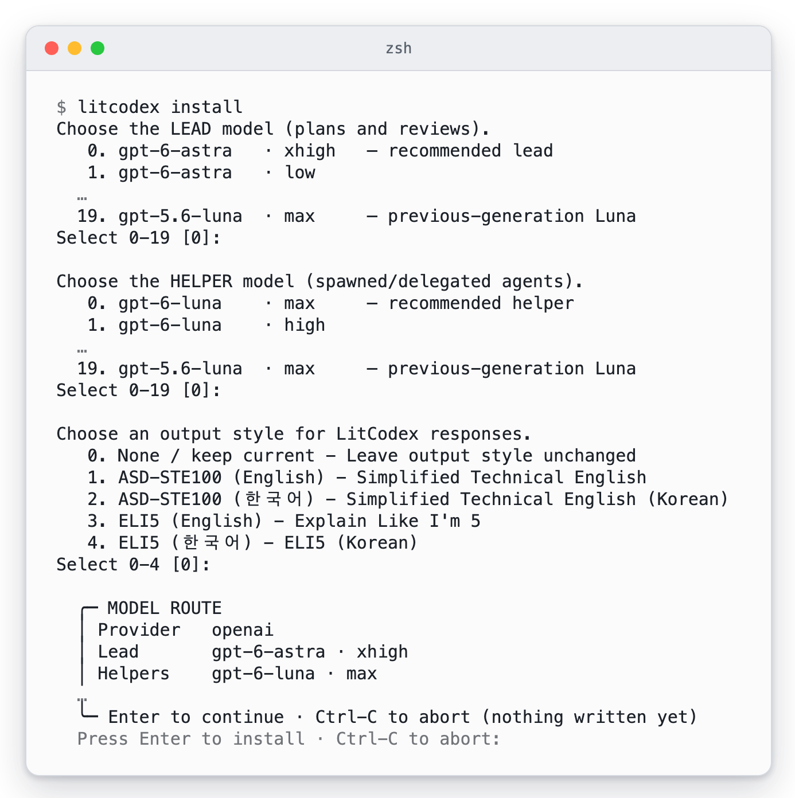
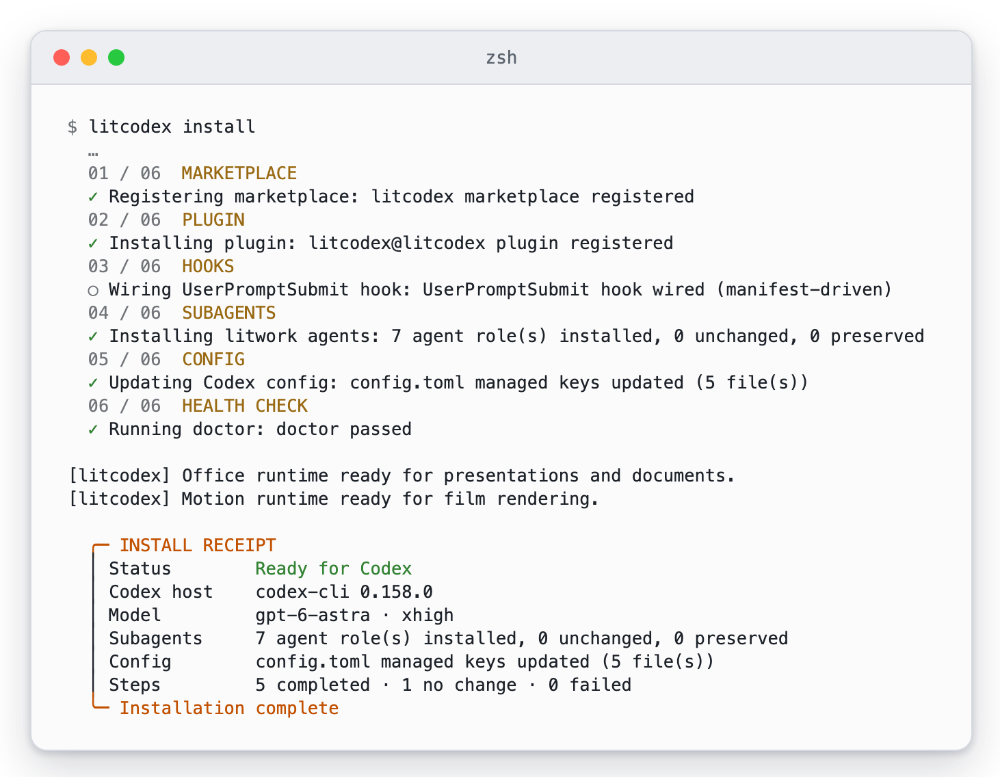
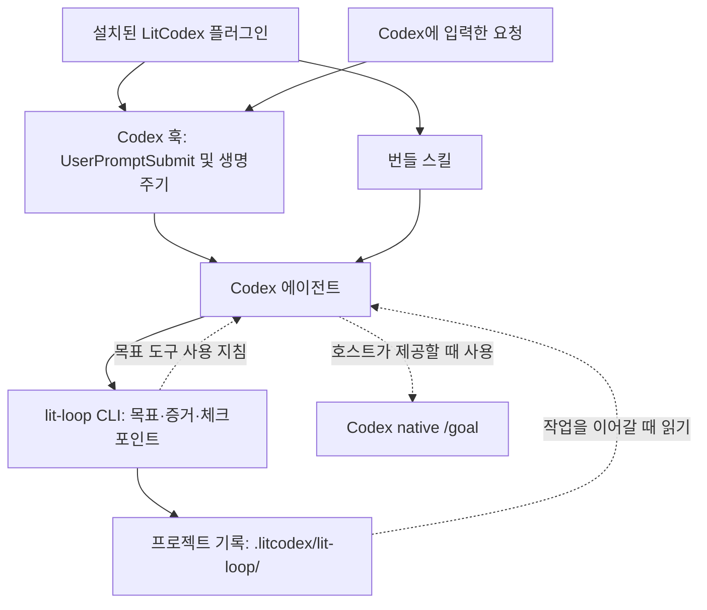

<p align="center"><picture><source media="(prefers-reduced-motion: reduce)" srcset="./docs/assets/cover-motion-still.webp" /></picture></p>

<p align="center"></p>

<details>
<summary>ASCII 로고 복사</summary>

```
                             ▄▄▄▄
                   ▗███▌   ▗██████▖
 ▗▄▄▄▄▄          ▗▟████▌   ▝██████▘
 ▐█████        ▗▟██████▌    ▝▀▜█▀▘
 ▐█████      ▗▟███████▄▄▄▄▄▄▄▄▄▄▄▄▄▄▄▄▄▄▄▄
 ▐█████    ▗▟█████████████████████████ ▐█▀
 ▐█████    ████████████████████████████▀
 ▐█████    ██▛▘   ▄ ▄▄▄▄▖▄▄▄▄▄▄▄▄▄▄▄▄▄▖
 ▐█████    ▀    ▄██ ████▌█████████████▌
 ▐█████       ▄████ ████▌█████████████▌
 ▐█████     ▄█████▛
 ▐█████  ▗▟█████▀▘       ▄▄▄▄▄     ▗▖
 ▐█████ ▐█████▀          █████     ▐▛▀
 ▐█████ ▐███▀            █████
 ▐█████ ▐█▀              █████
 ▐█████ ▝                █████
 ▐█████▄▄▄▄▄▄▄▖          █████
 ▐███████████▛           █████
 ▐██████████▀            █████

LIT · codex
```

</details>

<p align="center"></p>
<p align="center"></p>

<p align="center">
<a href="#설치"></a>
<a href="./LICENSE"></a>
</p>

<p align="center">
<a href="./docs/usage-Ko-KR.md"> 문서</a> &nbsp; <a href="#설치">설치</a> &nbsp; <a href="./docs/assets/readme/ignition-film.mp4"> Ignition</a> &nbsp; <a href="./LICENSE"> MIT</a>
</p>

# LitCodex

**Keep the work lit.**

[English](./README.md) · [설치](#설치) · [첫 작업](#lit으로-시작하기) · [스킬](#스킬-한눈에-보기) · [명령어](#명령어) · [문제 해결](#문제-해결) · [문서](#문서와-기여)

## LitCodex란

LitCodex는 Codex CLI 플러그인입니다. 계획, 검토, 조사와 오래 이어지는 실행 루프를 Codex에 더해서,
한 번 시작한 작업이 대화가 끝난 뒤에도 이어지게 합니다.

요청에 `lit`을 붙이면 됩니다. LitCodex는 그 요청을 목표로 바꾸고 통과·실패를 가릴 기준을 붙인 뒤,
결과를 프로젝트에 기록합니다. 다음 세션에 그 기록을 읽게 하면 멈춘 자리부터 이어갈 수 있습니다.

## 왜 LitCodex인가

**불씨를 건네받았다.<br>
이제, 당신의 작업에 옮길 차례다.**

고치고 싶은 버그 하나. 만들고 싶은 화면 하나. 끝내고 싶은 프로젝트 하나.

시작은 짧은 한 줄이면 됩니다. 어려운 건 그다음입니다. 대화가 길어지고 세션이 바뀌면,
어디까지 했는지부터 다시 짚어야 합니다. 어떤 결정을 내렸는지, 무엇을 확인했는지,
다음에는 무엇을 해야 하는지.

**LIT은 그 불씨를 남깁니다.** 목표와 계획, 확인한 결과, 다음에 할 일을 프로젝트에 기록합니다.
다음 세션에서 그 기록을 읽고 작업을 이어갈 수 있도록.

**대화가 끝난 자리에서, 다음 작업이 시작되도록.**

“꺼지지 않는 불”은 **에이전트가 멈춘 뒤에도 이어갈 작업이 남는다는 뜻입니다.**

<p align="center"> </p>

## 설치

Node.js 22 이상과 Codex CLI가 있으면 아래 명령 하나로 설치합니다.

```sh
npm exec --yes --package @litfamily/litcodex@1.0.13 -- litcodex install
```

설치기는 Codex 안에 LitCodex 자리를 만듭니다. 플러그인과 훅, 에이전트를 등록하고,
`~/.codex/config.toml`에서는 자기가 관리하는 항목만 고칩니다. 설치 중에 세 가지를 묻습니다. 어떤 모델이
작업을 이끌지, 어떤 모델이 거들지, 답변을 어떤 스타일로 받을지입니다. 새로 설치하면 이끄는 쪽(리드)은
`gpt-6-astra`/`xhigh`, 일반 헬퍼는 `gpt-6-luna`/`max`로 시작하고, 지원되는 다른 모델과 추론 수준으로 바꿔도 됩니다.

필요한 것은 npm 패키지에 다 들어 있어서 저장소를 복제할 일도, GitHub에 로그인할 일도 없습니다.
Codex 로그인과 모델 사용 권한은 실제 모델 작업을 시작할 때 필요합니다.

알아 두면 좋은 변형이 두 가지 있습니다.

- 설치 전에 무엇이 바뀌는지 먼저 보고 싶다면 `npm exec --yes --package @litfamily/litcodex@1.0.13 -- litcodex --dry-run install`을 실행하세요.
- 사람이 지켜보지 않는 환경에서 한 번에 설치하려면 `npm exec --yes --package @litfamily/litcodex@1.0.13 -- litcodex install --yes`를 실행하세요. 직접 넘긴 `--style <id>`는 그대로 반영됩니다.

실행하기 전에 설치기가 무엇을 출력하는지 보고 싶다면 [설치부터 첫 작업까지 보이는 화면](#설치부터-첫-작업까지-보이는-화면)에 질문 화면과 영수증, doctor 검사가 있습니다.

예전 패키지 이름(`litcodex-ai`)으로 설치했다면 [기존 설치 이전 안내](./docs/npm-migration.md)를 먼저 읽어 주세요.

### 전역 명령으로 쓰기

`litcodex`를 `PATH`에서 바로 부르고 싶다면 다음을 실행합니다.

```sh
npm install -g @litfamily/litcodex
litcodex install
```

전역으로 설치하면 파일 복사로 끝나지 않습니다. `CI`가 설정되어 있지 않으면 내려받기가 끝난 뒤 짧은 설치
스크립트가 환영 문구를 보여 주고, 영상 스킬 `lit-typographic-motion`이 쓸 도구를 미리 받아 둡니다. 처음 영상을
요청할 때 렌더링 도구가 이미 준비되어 있게 하려는 것입니다.

미리 받아 두는 만큼 인터넷을 씁니다. 스크립트가 `npm ci`로 버전이 고정된 `opentype.js`, `playwright-core`, `ws`를
npm 레지스트리에서 받고, 역시 고정된 글꼴·라이선스 파일을 GitHub와 apache.org에서 받습니다. 브라우저는 받지
않습니다. 받은 것은 모두 `${XDG_CACHE_HOME:-~/.cache}/litcodex/motion-runtime/`에 들어갑니다. 이 단계가 끝나지
않아도 LitCodex 설치는 그대로 남고, 나중에 다시 해 볼 명령 `litcodex motion-runtime install`을 알려 줍니다.

전역 설치 때 이 스크립트를 빼고 싶다면 방법은 두 가지입니다.

- `npm install -g`에 `--ignore-scripts`를 붙이세요. 스크립트가 통째로 빠지고 환영 문구도 나오지 않습니다.
- 그 명령에만 `CI=1`을 설정하세요. 스크립트가 이 값을 보고 아무것도 하지 않은 채 끝납니다. `CI`가 원래
  설정된 빌드 서버에서 조용히 넘어가는 것과 같은 방식입니다.

여기서 빼면 내려받기가 뒤로 미뤄질 뿐입니다. `litcodex install`이 설치에 성공한 뒤 같은 방식으로 영상 도구를
준비하고, 이 단계는 끌 수 없습니다.

> 전역 설치가 없다면 `npm exec --yes --package @litfamily/litcodex@1.0.13 -- litcodex <command>` 형식을 사용하세요. 예: `npm exec --yes --package @litfamily/litcodex@1.0.13 -- litcodex doctor`.

### 기존 설정과 떼어 놓고 써 보기

지금 쓰는 설정을 건드리지 않고 체험하려면 [격리된 체험 안내](./docs/npm-migration.md#isolated-local-trial)를 따르세요.
이 안내는 체험용 홈 디렉터리를 통째로 따로 만듭니다. `CODEX_HOME` 하나만 바꾸면 기존 홈의 설정이 여전히 읽힐 수 있기 때문입니다.

### Windows

Windows에서도 설치기와 CLI shim은 동작합니다. 다만 POSIX 디렉터리 디스크립터를 쓰는 Python 경로는
Windows에서 돌 수 없어서 `BLOCKED_UNSUPPORTED_PYTHON_POSIX_RUNTIME`으로 멈춥니다. 자세한 내용은
[플랫폼·질문 정책](./docs/usage-Ko-KR.md#설치)에 있습니다.

## lit으로 시작하기

프로젝트에서 Codex를 열고, 시작 검토에서 LitCodex 훅을 승인한 뒤 다음을 입력하세요.

```text
lit 회원가입 폼에 입력 검증을 추가해줘
```

`lit`이 독립된 단어로 들어 있으면 LitCodex가 요청을 작업 루프에 올립니다(내부 이름은 `<lit-loop-mode>`).
화면에서는 두 가지로 알 수 있습니다. 먼저 5행짜리 LIT 마크가 뜹니다. `UserPromptSubmit` 훅이 일반 텍스트로
보내는 것이라 터미널 색상 설정과 상관없이 똑같이 보입니다. 이어서 답변이
`🔥 **LIT IGNITED · <discipline>** 🔥` 한 줄로 시작합니다.

`split`, `literal`, `litmus`처럼 `lit`이 단어 속 글자로만 섞여 있을 때는 반응하지 않고, 코드 스팬이나 코드 블록 안의 `lit`에도
반응하지 않습니다. 슬래시 명령도 건드리지 않는데, `/litresearch` 하나만 예외로 조사를 시작합니다.

메시지 전체가 그 한 단어일 때만 동작하는 단어도 두 개 있습니다. `handoff`만 보내면 인수인계 문서를 만듭니다.
`lit-scientific-visualization`만 보내면 시각화 작업 모드(`<lit-scientific-visualization-mode>`)로 바뀝니다.
Python 패키지는 설치하지 않습니다.

### 작은 결과물 하나부터

빈 프로젝트에서, 직접 확인할 수 있는 작업을 맡겨 보세요.

```text
lit 현재 폴더에 HTML 파일 하나로 할 일 목록을 만들어줘. 외부 의존성은 설치하지 마.
할 일 추가와 완료 처리를 확인하고, 확인하지 못한 부분은 따로 남겨줘.
```

끝나면 세 가지를 보세요. 결과물, 실제로 돌린 확인, 아직 남은 일입니다. 상태 마크가 보이면 요청이 LitCodex에
닿은 것입니다. 페이지가 제대로 되는지는 직접 열어서 할 일을 하나 추가해 보면 압니다.

`lit recap`으로 기록된 상태를 읽을 수 있습니다. 세션을 마치기 전에는 다른 문구 없이 `handoff`만 보내세요.
다음 세션에서는 그 인수인계 문서와 프로젝트 목표를 먼저 읽고 이어가도록 요청하면 됩니다.

목표는 성공 기준을 모두 통과해야 완료됩니다. 단계마다 작업에 남는 것은 다음과 같습니다.

| 단계 | 작업에 남기는 것 |
| --- | --- |
| 계획하기 | 통과 여부를 확인할 수 있는 목표와 기준 |
| 만들기 | 직접 살펴볼 수 있는 작은 결과물 |
| 확인하기 | 완료한 기준의 증거와 아직 해결하지 못한 문제 |
| 다음 작업에 건네기 | 결정한 내용, 남은 일, 다시 시작할 위치 |

Codex는 자체 목표 기능(`/goal`)을 따로 두고, LitCodex 기록은 그와 별개로 남습니다. Codex 목표가 멈췄거나(paused)
막혔다면(blocked) [문제 해결](#문제-해결)의 복구 절차로 되살리세요. 인수인계 문서는 메모를 다음 세션으로 넘길 뿐, 목표 상태는 그대로 둡니다.

### 자주 쓰는 경로

| 입력 | 하는 일 |
| --- | --- |
| `lit` | 프로젝트에 목표와 확인 기준을 남기며 범위가 정해진 작업을 시작합니다. |
| `handoff` 또는 `/lit-handoff` | 확인한 결과와 다음 할 일을 다음 세션으로 넘깁니다. |
| `lit-plan` | 무엇이든 고치기 전에 계획과 성공 기준부터 씁니다. |
| `lit start work <승인된 계획>` | 승인한 계획을 실행합니다. |
| `review-work` | 변경과 그 근거를 검토합니다. |
| `litresearch` | 출처를 달아 조사하고, 아직 불확실한 부분을 따로 적어 둡니다. |

전체 목록은 [명령어](#명령어)에 있습니다.

## 설치부터 첫 작업까지 보이는 화면

설치부터 첫 작업까지 LitCodex가 무엇을 출력하는지 사진 다섯 장으로 보여 줍니다. 모두 임시 홈에서 실제 프로그램을 실행해 캡처했고,
사진을 짧게 하려고 뺀 줄은 사진마다 설명에 적었습니다. 사진은 Codex CLI 0.158에서 만들었으며, Codex 버전에 따라 훅 줄의 표현이나
위치가 조금 다를 수 있습니다. 선택 기능인 Jev 스킬 힌트의 사진은 [Jev](#화면에-나타나는-모습)에 따로 있습니다.

대화형으로 실행하면 설치기가 세 가지를 묻습니다. 어떤 모델이 이끌지, 어떤 모델이 거들지, 답변을 어떤 스타일로 받을지입니다.
그때마다 Enter를 누르면 첫 번째 선택지가 골라집니다. 권장 모델과 현재 출력 스타일입니다. 이어서 설치기가 쓰려는 경로를 상자로 보여 주고, Enter를 한 번 더 누르기 전까지는
아무것도 쓰지 않습니다.

<p><picture><source media="(prefers-color-scheme: dark)" srcset="./docs/assets/screens/screen-install-questions-dark.webp" /></picture><br /><sub>임시 홈에서 실제 litcodex install을 실행하고 질문마다 Enter로 답해 캡처했습니다. 모델 목록은 각각 스무 줄인데 처음 두 줄과 마지막 줄만 남겼고, 경로 줄도 뺐습니다. …는 뺀 자리입니다.</sub></p>

마지막 Enter 뒤에 설치기는 여섯 단계를 차례로 거치고 영수증을 출력합니다. 먼저 Status 줄을 보세요. Ready for Codex라고 나오면
플러그인, 훅, 에이전트 역할 일곱 개, 관리하는 설정 항목이 모두 자리를 잡았고 doctor 검사도 통과했다는 뜻입니다. 영수증 위의
두 줄은 설치가 미리 준비하는 Office 도구와 영상 도구의 상태입니다. 이 준비가 끝나지 않으면 그렇다고 알리고, 나중에 실행할
명령을 알려 줍니다.

<p><picture><source media="(prefers-color-scheme: dark)" srcset="./docs/assets/screens/screen-install-receipt-dark.webp" /></picture><br /><sub>같은 설치에서 캡처했습니다. 단계마다 붙는 설명과 경로 줄, 영수증의 일부 줄은 뺐습니다. 이 임시 홈에는 영상 도구가 이미 캐시에 있어서 두 런타임 줄이 바로 나왔습니다.</sub></p>

결과를 가장 빨리 확인하는 방법은 `litcodex doctor`입니다. 대부분의 줄이 yes 또는 no로 답하고, 이상이 없으면 All checks passed.로
끝납니다. Jev 줄은 힌트를 켜지 않았다면 off로 나옵니다.

<p><picture><source media="(prefers-color-scheme: dark)" srcset="./docs/assets/screens/screen-doctor-dark.webp" /></picture><br /><sub>설치 직후 같은 홈에서 실행한 litcodex doctor 출력입니다. 모델 경로, 동시 실행, 업데이트 관련 줄과 Codex 로그인이 없는 홈에서 나오는 경고, 영상 도구 줄은 뺐습니다.</sub></p>

`lit`으로 시작하는 요청을 입력하면 훅이 모델보다 먼저 답합니다. 5행짜리 LIT 마크와, 고른 경로의 이름을 적은 줄을 출력합니다.
`handoff`와 `lit recap`에서도 같은 마크가 나오고 경로 이름만 달라서, 어떤 모드가 요청을 받았는지 한눈에 알 수 있습니다.

<p><picture><source media="(prefers-color-scheme: dark)" srcset="./docs/assets/screens/screen-lit-ignited-dark.webp" /></picture><br /><sub>실제 Codex 0.158 세션에서 LitCodex 훅을 돌리고 모델 자리는 로컬 대역이 맡아 캡처했습니다. 그래서 컴퓨터 밖으로 나간 것은 없습니다. 시작 배너, 훅 검토 화면, 모델의 답변은 뺐습니다.</sub></p>

마크 뒤에서는 루프가 프로젝트 안에 점수를 적어 둡니다. 새 목표는 확인 기준 세 개에 통과 0개로 시작합니다. 결과를 기록할 때마다
숫자가 올라가고, 기준이 모두 통과하기 전에 목표를 끝내 달라고 하면 거절합니다.

<p><picture><source media="(prefers-color-scheme: dark)" srcset="./docs/assets/screens/screen-loop-dark.webp" /></picture><br /><sub>빈 프로젝트에서 실제 loop 명령을 실행해 캡처했습니다. 긴 명령은 백슬래시로 나눠 한 화면에 맞췄고, 두 번째 증거 기록 명령의 출력은 뺐습니다. 사진과 만든 방법은 <a href="./docs/assets/screens/README.md">미디어 안내</a>에 정리했습니다.</sub></p>

## 움직이는 모습 보기

23초짜리 영상이 작은 작업 하나가 LitCodex를 거치는 과정을 따라갑니다. 요청에 `lit`을 붙이면 요청이 확인 네 개가 있는 목표가 됩니다. 확인 세 개는 증거가 기록되면 초록색으로 바뀌고, 하나는 열린 채로 남습니다. 인수인계(handoff)가 열린 확인을 다음 세션으로 넘기고, 다음 세션에서 마무리합니다. 영상 속 작업과 확인 항목은 영상을 위해 만든 예시입니다.

<p align="center"><picture><source media="(prefers-reduced-motion: reduce)" srcset="./docs/assets/promo/promo-ko-still.webp" /></picture></p>

[소리와 함께 영상 보기](./docs/assets/promo/promo-ko.mp4) · [포스터](./docs/assets/promo/promo-ko-poster.png)

## 스킬 한눈에 보기

번들 스킬을 모두 모았습니다. 줄마다 시작하는 방법과 얻는 것을 적었고, 마지막 줄은 알아서 돌아가는 검사를 묶었습니다.

<table>
<tr><th>이렇게 됩니다</th><th>스킬</th><th>얻는 것</th></tr>
<tr>
<td></td>
<td><code>lit-loop</code><br /><sub><code>lit</code> · <code>$litcodex:lit-loop</code></sub></td>
<td>요청에 <code>lit</code>만 붙이세요. 범위를 정하고 단계마다 확인하며 일하고, 확인하지 못한 것은 그대로 적어 둡니다.</td>
</tr>
<tr>
<td></td>
<td><code>litwork</code><br /><sub><code>litwork</code> · <code>$litcodex:litwork</code></sub></td>
<td>처음부터 끝까지 꼼꼼한 구현이나 수정입니다. 실패하는 테스트 먼저, 그다음 실제 화면에서 증명합니다.</td>
</tr>
<tr>
<td></td>
<td><code>lit-plan</code><br /><sub><code>lit plan</code> · <code>$litcodex:lit-plan</code></sub></td>
<td><code>.litcodex/plans/</code>에 번호 붙은 작업 목록을 만듭니다. 계획만 세웁니다.</td>
</tr>
<tr>
<td></td>
<td>Start Work<br /><sub><code>lit start work &lt;approved-plan&gt;</code></sub></td>
<td>승인된 계획을 다섯 관문으로 실행합니다. 끝에는 리뷰 다섯 개를 모두 통과해야 합니다.</td>
</tr>
<tr>
<td></td>
<td><code>review-work</code><br /><sub><code>lit review</code> · <code>$litcodex:review-work</code></sub></td>
<td>리뷰 다섯 개가 따로 돌고, 하나라도 통과하지 못하면 승인이 나지 않습니다.</td>
</tr>
<tr>
<td></td>
<td><code>litgoal</code><br /><sub><code>lit goal</code> · <code>$litcodex:litgoal</code></sub></td>
<td>눈으로 확인할 수 있는 기준을 단 목표 하나를 lit-loop에 걸어, 세션이 바뀌어도 이어지게 합니다.</td>
</tr>
<tr>
<td></td>
<td><code>lit-recap</code><br /><sub><code>lit recap</code> · <code>$litcodex:lit-recap</code></sub></td>
<td>읽기 전용 요약입니다. 끝난 일, 진행 중인 일, 막힌 곳, 증거 위치, 다음 단계를 보여줍니다.</td>
</tr>
<tr>
<td></td>
<td><code>lit-handoff</code><br /><sub><code>handoff</code> · <code>/lit-handoff</code></sub></td>
<td><code>handoff</code>라고 치면 다음 세션이 읽고 이어갈 인수인계 파일이 생깁니다.</td>
</tr>
<tr>
<td></td>
<td><code>deep-interview</code><br /><sub><code>deep-interview</code> · <code>$litcodex:deep-interview</code></sub></td>
<td>한 번에 한 질문씩 물어 만들 수 있을 만큼 분명하게 다듬습니다. Quick, Standard, Deep 중에서 목표를 고릅니다.</td>
</tr>
<tr>
<td></td>
<td><code>litresearch</code><br /><sub><code>lit research</code> · <code>$litcodex:litresearch</code></sub></td>
<td>조사를 요청할 때만 움직입니다. 여러 갈래로 증거를 모아 출처와 함께 종합합니다.</td>
</tr>
<tr>
<td></td>
<td><code>lit-crucible</code><br /><sub><code>lit-crucible</code> · <code>$litcodex:lit-crucible</code></sub></td>
<td>계획 전에 요구사항을 반박해 봅니다. 반박을 견딘 위험만 계획으로 넘어갑니다.</td>
</tr>
<tr>
<td></td>
<td><code>lit-init</code><br /><sub><code>lit-init</code> · <code>$litcodex:lit-init</code></sub></td>
<td>저장소에 실제로 있는 것을 근거로, 필요한 곳에만 짧은 AGENTS.md 안내를 만듭니다.</td>
</tr>
<tr>
<td></td>
<td><code>lit-comprehend</code><br /><sub><code>lit-comprehend</code> · <code>$litcodex:lit-comprehend</code></sub></td>
<td>에이전트가 쓴 작업을 이해하도록 돕는 설명 페이지입니다. 직관, 흐름 설명, 짧은 퀴즈 순서입니다.</td>
</tr>
<tr>
<td></td>
<td><code>lit-humanizer</code><br /><sub><code>$litcodex:lit-humanizer</code></sub></td>
<td>딱딱한 AI 문장을 한국어나 영어로 다시 씁니다. 사실과 단서는 남기고 군더더기는 뺍니다.</td>
</tr>
<tr>
<td></td>
<td><code>lit-diagram-drawer</code><br /><sub><code>$litcodex:lit-diagram-drawer</code></sub></td>
<td>슬라이드와 문서에 넣을 다이어그램을 편집 가능한 형태로 그리고, 검사한 뒤 PNG와 SVG로 내보냅니다.</td>
</tr>
<tr>
<td></td>
<td><code>lit-pptx</code><br /><sub><code>$litcodex:lit-pptx</code></sub></td>
<td><code>lit</code>으로 발표자료를 요청하면 편집 가능한 PowerPoint 파일과 원고 Markdown이 나옵니다. 기본은 AZURE-PRO와 Pretendard이고, 파일에 배치 검사를 돌리며 LibreOffice가 있으면 렌더링된 슬라이드도 확인합니다.</td>
</tr>
<tr>
<td></td>
<td><code>lit-docx</code><br /><sub><code>$litcodex:lit-docx</code></sub></td>
<td><code>lit</code>으로 보고서를 요청하면 서식을 갖춘 Word 파일과 원고 Markdown이 나옵니다. 한국어는 korean-generic 서식을 쓰고, 파일을 다시 열어 검사하며 LibreOffice가 있으면 페이지도 확인합니다.</td>
</tr>
<tr>
<td></td>
<td><code>lit-fetch</code><br /><sub><code>$litcodex:lit-fetch</code></sub></td>
<td>보통 방법으로 부족할 때, 주소·DNS·본문 안전 검사를 거쳐 공개 페이지를 읽습니다.</td>
</tr>
<tr>
<td></td>
<td><code>lit-scientific-visualization</code><br /><sub><code>lit-scientific-visualization</code> · <code>$litcodex:lit-scientific-visualization</code></sub></td>
<td>학술지 규격 그림을 벡터와 600 DPI로 내보냅니다. 그래프 종류는 데이터 성격에 맞춰 고릅니다.</td>
</tr>
<tr>
<td></td>
<td><code>lit-team</code><br /><sub><code>lit team</code> · <code>$litcodex:lit-team</code></sub></td>
<td>여러 작업자에게 겹치지 않는 몫을 나누고, 각자 증거와 함께 보고하게 합니다.</td>
</tr>
<tr>
<td></td>
<td><code>litcodex-doctor</code><br /><sub><code>$litcodex:litcodex-doctor</code></sub></td>
<td>업데이트나 설정 실패 뒤에 LitCodex와 Codex 설치 상태를 점검합니다.</td>
</tr>
<tr>
<td></td>
<td><code>litcodex-report-bug</code><br /><sub><code>$litcodex:litcodex-report-bug</code></sub></td>
<td>LitCodex나 Codex의 버그 보고서를 출처와 함께 작성합니다.</td>
</tr>
<tr>
<td></td>
<td><code>litcodex-contribute-bug-fix</code><br /><sub><code>$litcodex:litcodex-contribute-bug-fix</code></sub></td>
<td>진단한 결함을 테스트가 붙은 수정 PR로 만듭니다.</td>
</tr>
<tr>
<td></td>
<td><code>coding-session-audit</code><br /><sub><code>$litcodex:coding-session-audit</code></sub></td>
<td>지난 Codex 세션을 기록으로 읽고, 어디서 멈췄는지 보여줍니다.</td>
</tr>
<tr>
<td></td>
<td><code>debugging</code><br /><sub><code>$litcodex:debugging</code></sub></td>
<td>버그를 재현하고, 가설을 세 개 이상 세워 확인한 뒤, 확인된 원인만 고칩니다.</td>
</tr>
<tr>
<td></td>
<td><code>refactor</code><br /><sub><code>$litcodex:refactor</code></sub></td>
<td>동작을 테스트로 고정한 채 코드 구조를 바꿉니다. 단계마다 확인합니다.</td>
</tr>
<tr>
<td></td>
<td><code>lit-code</code><br /><sub><code>$litcodex:lit-code</code></sub></td>
<td>엄격한 구현 규칙입니다. 테스트 먼저, 경계에서 타입 확인, 작은 파일.</td>
</tr>
<tr>
<td></td>
<td><code>lit-commit</code><br /><sub><code>$litcodex:lit-commit</code></sub></td>
<td>변경을 저장소 스타일에 맞는 작은 커밋으로 나눕니다. 관계없는 작업은 건드리지 않습니다.</td>
</tr>
<tr>
<td></td>
<td><code>lsp-setup</code><br /><sub><code>$litcodex:lsp-setup</code></sub></td>
<td>언어 서버 설정을 확인하고, 필요할 때 실제 진단 검사를 돌립니다.</td>
</tr>
<tr>
<td></td>
<td><code>readme-studio</code><br /><sub><code>$litcodex:readme-studio</code></sub></td>
<td>사실에 맞는 README와 움직이는 커버를 만들고, 휴대폰과 데스크톱 폭, 라이트와 다크 모드에서 확인합니다.</td>
</tr>
<tr>
<td></td>
<td><code>lit-typographic-motion</code><br /><sub><code>$litcodex:lit-typographic-motion</code></sub></td>
<td><code>lit</code>으로 영상을 요청하면 트리트먼트를 먼저 쓰고, 직접 만든 무대 페이지나 타입 엔진으로 영상을 만들고, 사운드를 입힌 뒤 렌더링된 스틸을 보며 다듬습니다.</td>
</tr>
<tr>
<td></td>
<td><code>structural-search</code><br /><sub><code>$litcodex:structural-search</code></sub></td>
<td>글자 대신 문법 구조로 코드를 찾고, 바꾸기 전에 결과를 미리 보여줍니다.</td>
</tr>
<tr>
<td></td>
<td><code>visual-qa</code><br /><sub><code>$litcodex:visual-qa</code></sub></td>
<td>실제 화면을 폭별로 확인해 결과를 정직하게 돌려줍니다. 막히면 무엇이 막았는지 정확히 알려줍니다.</td>
</tr>
<tr>
<td></td>
<td><code>browser-drive</code><br /><sub><code>browser-drive</code> · <code>$litcodex:browser-drive</code></sub></td>
<td>브라우저 드라이버를 먼저 확인한 뒤 실제 페이지를 조작합니다. 드라이버가 없으면 그렇다고 말합니다.</td>
</tr>
<tr>
<td></td>
<td><code>frontend-ui-ux</code><br /><sub><code>$litcodex:frontend-ui-ux</code></sub></td>
<td>실제로 동작하는 화면을 만들고, 측정 프로브로 일곱 가지 보기를 렌더링합니다. 네 가지 폭, 다크 모드, 모션 줄이기, 200% 확대입니다.</td>
</tr>
<tr>
<td></td>
<td><code>lit-burnoff</code><br /><sub><code>$litcodex:lit-burnoff</code></sub></td>
<td>테스트로 동작을 먼저 묶어 두고, 변경분에 붙은 AI식 군더더기를 걷어냅니다.</td>
</tr>
<tr>
<td></td>
<td><code>lit-burnoff-file</code><br /><sub><code>$litcodex:lit-burnoff-file</code></sub></td>
<td>파일 하나만 정리합니다. 설명조 주석과 과한 방어 코드를 줄이고 중첩을 펴줍니다.</td>
</tr>
<tr>
<td></td>
<td><code>wikify</code><br /><sub><code>$litcodex:wikify</code></sub></td>
<td>검토를 거친 프로젝트 지식을 디스크에 두고, 나중 질문에 출처와 함께 답합니다.</td>
</tr>
<tr>
<td></td>
<td><code>autoresearch</code><br /><sub><code>$litcodex:autoresearch</code></sub></td>
<td>승인된 예산 안에서 실험을 반복합니다. 한 번에 하나만 바꾸고, 결과에 따라 남기거나 되돌립니다.</td>
</tr>
<tr>
<td></td>
<td><code>autoconference</code><br /><sub><code>$litcodex:autoconference</code></sub></td>
<td>예산을 정한 연구 회의입니다. 연구자와 리뷰어가 따로 일하고, 종합에는 반대 의견도 남깁니다.</td>
</tr>
<tr>
<td></td>
<td><code>rules</code> · <code>lsp</code> · <code>comment-checker</code><br /><sub>자동 실행</sub></td>
<td>알아서 돌아갑니다. 프롬프트마다 프로젝트 규칙을 넣고, 수정 뒤에는 LSP와 주석을 확인합니다.</td>
</tr>
</table>

## 어떻게 동작하나요

Codex가 플러그인을 불러오고 훅을 실행합니다. 훅은 요청이 어떤 모드에 속하는지 가리고 맥락을 보태며,
스킬은 에이전트가 일하는 절차를 안내합니다. 루프 CLI는 프로젝트 기록을 관리하고, Codex의 native goal 도구를
쓸 때 따를 지침을 출력합니다.



Codex 목표 도구로 이어지는 점선은 에이전트가 따르는 지침입니다. LitCodex가 그 도구를 직접 부르는 일은 없습니다.
도구가 있으면 에이전트가 쓰고, 없으면 로컬 기록만 이어 가면서 Codex 목표와 맞추지 못했다고 적어 둡니다. 멈췄거나
막힌 목표는 문서의 복구 절차를 거쳐야 다시 움직이고, 인수인계 문서를 읽는 것만으로는 그대로 멈춰 있습니다.

실제 실행은 Codex CLI가 합니다. 훅과 에이전트를 띄우고, 로그인, 모델 접근, 권한, 화면 확인도 모두 사용자 컴퓨터의
Codex 안에서 일어납니다. 그러니 작업은 결과물과 실제로 돌린 확인을 보고 판단하세요. 경로 표시와 이 README의
그림은 작업이 어디서 시작됐는지를 보여 줄 뿐입니다. 더 자세한 내용은 [실행·상태 참고서](./docs/usage-Ko-KR.md)에 있습니다.

## 명령어

### Codex 작성창에서

| 입력 | 모드 | 하는 일 |
| --- | --- | --- |
| `lit` 또는 `lit-loop` | **lit-loop** | 오래 이어지는 루프에서 작업하며 증거를 체크포인트로 남김 |
| `litwork` | **litwork** | 결과 중심 작업, 수동 QA 증거 포함 |
| `lit-plan` 또는 `lit plan` | **lit-plan** | 계획만 작성: 증거와 마지막 완료 주장이 담긴 범위 있는 계획 |
| `deep-interview` 또는 `lit deep interview` | **deep-interview** | 계획만 작성: 모호한 요구를 질문으로 좁힘 |
| `litgoal` 또는 `lit goal` | **litgoal** | 목표와 기준을 루프 상태에 연결 |
| `lit-recap` 또는 `lit recap` | **lit-recap** | `.litcodex` 원장을 읽기 전용으로 요약 |
| `lit-comprehend` 또는 `comprehend` | **lit-comprehend** | 작업 트리 밖에 자체 완결형 설명 자료 생성 |
| `review-work` 또는 `lit review` | **review-work** | 계획이나 끝난 작업을 읽기 전용으로 검토 |
| `litresearch`, `/litresearch` 또는 `lit research` | **litresearch** | 사실·가설·출처·불확실성을 나눠 적는 연구 저널 |
| `lit start work <plan-name>` | **Start Work** | 승인된 계획을 실행하고 증거를 남김 |
| 정확히 단독으로 입력한 `handoff` | **lit-handoff** | 비밀값을 빼고 인수인계 문서를 만들거나 갱신 |
| 정확히 단독으로 입력한 `lit-scientific-visualization` | **lit-scientific-visualization** | 훅을 통해 출판용 시각화 어댑터를 불러옴 |

같은 모드를 한 세션에서 다시 입력해도 달라지는 것은 없습니다. 개별 스킬은 Codex skill picker에서 정확한 ID로
고르거나, `$litcodex:lit-handoff`, `$litcodex:lit-scientific-visualization`, `$litcodex:lit-humanizer`,
`$litcodex:lit-fetch`처럼 `$litcodex:` 접두어를 붙인 이름으로 불러도 됩니다.

이름을 알아 두면 편한 스킬도 몇 가지 있습니다.

- **다이어그램.** 아키텍처, 워크플로, 시스템, 개념 다이어그램은 Codex skill picker에서 `lit-diagram-drawer`를
  고르세요. `lit`으로 다이어그램을 요청해도 이 스킬을 읽도록 안내합니다. 제품 화면과 측정 데이터 그래프는 각자
  전용 스킬이 있습니다.
- **Word와 PowerPoint.** 보고서·기획서는 `lit-docx`, 발표자료는 `lit-pptx`를 고릅니다. `lit`으로 둘 중 하나를
  요청하면 맞는 스킬을 알아서 읽고, 둘 다 요청하면 둘 다 씁니다. 어느 쪽이든 편집 가능한 Markdown 원본이
  DOCX/PPTX 옆에 남습니다. 두 스킬에 필요한 고정 버전 도구는 `litcodex install`이 Codex 세션 밖에서 미리 받아
  둡니다. 준비됐는지는 `litcodex office-runtime status`나 `litcodex doctor`로 확인하세요. 네트워크 없이 설치했다면
  나중에 샌드박스 밖에서 `litcodex office-runtime install`을 실행하면 됩니다. LibreOffice·pandoc·XeLaTeX처럼 선택적으로
  쓰는 도구가 있는지는 Office 실행기의 doctor 명령이 알려 줍니다.
- **글 다듬기.** 영어·한국어 글은 `lit-humanizer`를 고르세요. 파일에 쓰기 직전에 훅이 누가 봐도 초안 티가 나는
  표현 몇 가지는 막고, 애매한 것은 막지 않고 짚어만 줍니다. Office·PDF 파일은 호스트가 텍스트를 꺼낼 수 있으면
  만들어진 직후에 확인합니다.

### CLI 명령어

| 명령 | 하는 일 |
| --- | --- |
| `litcodex install` | LitCodex 플러그인과 훅 등록 |
| `litcodex doctor` | 설치, 루프 상태, 호스트 기능, 실제 적용된 설정 진단 |
| `litcodex uninstall` | 플러그인과 LitCodex가 관리하는 설정 제거 |
| `litcodex config migrate` | 관리되는 Codex 설정을 미리 보거나 적용 |
| `litcodex hook user-prompt-submit` | 호스트가 훅을 부를 때 쓰는 진입점 |
| `litcodex loop create` | 브리프에서 목표와 성공 기준 도출 |
| `litcodex loop status --json` | 루프 상태를 JSON으로 확인 |
| `litcodex loop run` | 다음에 실행할 수 있는 목표 선택 |
| `litcodex loop record-evidence` | 기준 하나의 통과·실패·차단 결과 기록 |
| `litcodex loop checkpoint` | 모든 기준을 통과했을 때만 목표 완료 처리 |
| `litcodex loop doctor` | 루프 상태 진단 또는 복구 |

전체 스킬은 Codex skill picker에서 볼 수 있습니다. 이름이 바뀐 스킬은 한 릴리스 동안 예전 이름으로도 불러집니다.
[이름 전환 정책](./docs/usage-Ko-KR.md#스킬-이름-전환)과 [CHANGELOG.md](./CHANGELOG.md)를 참고하세요.

## 작업 기록이 남는 곳

프로젝트의 루프 상태는 `.litcodex/lit-loop/` 아래에 있습니다. 기록 파일은 `brief.md`, `goals.json`,
`ledger.jsonl`이고, 증거는 `evidence/` 폴더에 쌓입니다. 파일은 한 번에 통째로 써서 중간에 끊긴 상태로 남지 않고,
목표 파일이 손상되면 버리지 않고 `.bak`으로 남겨 되살릴 수 있게 합니다. 이 기록은 이 컴퓨터에만 있고 Git과 패키지에는 들어가지 않습니다.
[상태·복구 참고서](./docs/usage-Ko-KR.md#루프-상태)에서 자세히 볼 수 있습니다.

## 설치 확인

```sh
npm exec --yes --package @litfamily/litcodex@1.0.13 -- litcodex doctor
```

`litcodex doctor`는 등록·훅·설정·호스트 기능을, `litcodex loop doctor`는 현재 프로젝트의 루프 상태를 확인합니다.
둘 다 설치 상태를 보는 검사입니다. 로그인한 모델 작업과 자식 에이전트가 실제로 도는지는 작은 작업을 하나 맡겨 보면 알 수 있습니다.

## 안전

- 계획과 증거는 언제든 열어 볼 수 있습니다. 성공 기준은 통과했다는 증거가 기록돼야 완료되고, 테스트 명령을
  돌리기만 한 것으로는 부족합니다.
- 설치해도 관련 없는 Codex 설정은 그대로입니다. `--reconfigure` 전에는 바뀔 내용을 먼저 확인하세요.
- doctor 진단은 Codex 설정, 설치 상태, 플러그인 상태를 바꾸지 않고 살펴보기만 합니다. 그 밖에 백그라운드에서 도는
  업데이트 기능이 두 가지 있고, 둘 다 끌 수 있습니다.
  - 업데이트 안내. 터미널에서 직접 실행해 성공적으로 끝난 doctor처럼 조건에 맞는 실행이면, 캐시해 둔 새 버전
    안내가 뜰 수 있습니다. 이 안내를 새로 유지하려고 백그라운드 작업이 정해진 레지스트리만 조회해
    `~/.litcodex/update-check.json`에 적어 둡니다. 이 작업은 아무것도 설치하지 않습니다.
  - 업데이트 실행기. 조건에 맞는 대화형 관리 명령 뒤에는 별도의 업데이트 실행기가 새 전역 패키지를 설치할 수 있습니다.

  둘 다 원하지 않으면 `LITCODEX_NO_UPDATE_CHECK=1`을 설정하세요. 실패했거나 `--json`·`--dry-run`으로 돌렸거나,
  비TTY·CI 환경이거나 이 설정으로 끈 doctor 실행은 부수 효과가 없습니다. [개인정보 안내](./docs/privacy.md)를 참고하세요.
- 고른 모델은 설정 파일에 적히는 값입니다. 그 모델을 실제로 쓸 수 있는지, 실제로 도는지는 Codex와 사용자 계정에
  달려 있습니다. [모델 호환성](./docs/usage-Ko-KR.md#설치)을 참고하세요.

## 자동 핸드오프 (선택)

긴 세션은 언젠가 컨텍스트가 가득 차고, 다음 컨텍스트는 이번에 배운 내용을 모른 채 시작합니다. 핸드오프 파일은 그
내용을 다음 컨텍스트로 넘겨 줍니다. 이 기능은 대화가 정해 둔 크기에 이르면 핸드오프를 대신 써 주므로, 컨텍스트
사용량을 계속 지켜보지 않아도 됩니다.

기본값은 꺼짐이고, 어느 지점(컨텍스트 창의 몇 퍼센트)에서 동작할지는 직접 고릅니다. LitCodex에는 기본 퍼센트가
없습니다. 켜려면 아래 문장을 프롬프트 전체로 보내세요(60은 예시이며 1에서 99 사이의 정수면 됩니다).

```text
lit-handoff auto on 60
```

LitCodex가 바로 답하며, 이 프롬프트는 모델에게 보내지 않습니다. 나머지도 같은 형태입니다.

- `lit-handoff auto off`는 기능을 끄고 숫자는 기억해 둡니다.
- 숫자 없이 `lit-handoff auto on`을 보내면 마지막으로 쓴 숫자를 다시 쓰고, 한 번도 정한 적이 없으면 숫자를 물어봅니다.
- `lit-handoff auto status`는 현재 설정과 그 이유를 보여 줍니다.

환경 변수를 쓰고 싶다면 Codex를 시작하기 전에 `LITCODEX_AUTO_HANDOFF=1`과 `LITCODEX_AUTO_HANDOFF_PERCENT=60`을
설정하세요. 두 변수가 설정돼 있는 동안에는 명령보다 우선합니다. 퍼센트가 1에서 99 사이의 정수가 아니면 기능은 꺼진
채로 있고, `litcodex doctor`가 그 이유를 알려 줍니다.

정한 퍼센트에 이르면 이런 일이 일어납니다. Codex에서 LitCodex가 스스로 하는 단계에는 "자동"이라고 적었습니다.

1. **지켜보기(자동).** 턴이 끝날 때 Stop 훅이 마지막 모델 요청이 컨텍스트 창을 얼마나 썼는지 읽습니다. Codex가 자체
   압축 설정과 비교하는 값과 같은 수치입니다.
2. **저장하기(자동, 한 번 넘을 때마다 한 번).** 정한 퍼센트 이상이면 lit-handoff 스킬로 지금 핸드오프를 쓰고, 파일에
   이 세션을 가리키는 줄을 넣어 달라고 모델에게 요청합니다. 요청은 한 번뿐이며, 컨텍스트가 퍼센트 아래로 내려갔다가
   다시 올라온 뒤에야 다시 요청합니다.
3. **압축하기(명령으로 켰다면 자동, 아니면 안내).** 명령으로 켜면 프로젝트의 `.codex/config.toml`에도 같은 퍼센트가
   기록되어, 핸드오프를 저장한 턴이 끝나자마자 Codex가 압축합니다. Codex는 신뢰한 프로젝트에서만 이 파일을 읽고,
   이 설정은 Codex CLI 0.158 이상이 필요합니다. LitCodex는 Codex 설정에서 프로젝트가 신뢰 상태인지 확인하고, 신뢰
   상태일 때만 자동 압축을 약속합니다. Codex가 압축하도록 설정되어 있지 않으면(환경 변수로 켰거나, 프로젝트를 아직
   신뢰하지 않았거나, 프로젝트 파일에 이미 다른 값이 있는 경우) 모델이 한 줄로 끝맺습니다: "Handoff saved. Run /compact now."
4. **다시 불러오기(자동).** 압축이 끝나면 LitCodex가 이 세션이 방금 저장한 핸드오프의 앞부분과 경로를 모델에게 한 번
   전달합니다. 트리거보다 앞서 쓰인 핸드오프나 다른 세션을 가리키는 핸드오프는 제외합니다.

Codex가 스스로 압축하는 지점보다 낮은 퍼센트를 고르세요. 그렇지 않으면 핸드오프를 저장하기 전에 Codex가 먼저
압축할 수 있고, 퍼센트가 그 지점에 닿으면 `litcodex doctor`가 경고합니다. 기능을 끄면 LitCodex가 `.codex/config.toml`에
추가한 줄만 지워집니다. 환경 변수(`LITCODEX_AUTO_HANDOFF=0`)나 삭제된 설정 파일 때문에 꺼진 경우에도 마찬가지로, 다음
훅이나 명령이 실행될 때 그 줄을 지우며, 줄이 남아 있는 동안 `litcodex doctor`가 경고합니다. 선택한 값과 세션별 기록은 프로젝트 안의 `.litcodex/auto-handoff/`에 남으며, 내 컴퓨터에만
있고 Git에는 들어가지 않습니다. [개인정보 안내](./docs/privacy.md#automatic-handoff)를 참고하세요.

## Jev 스킬 힌트 (선택)

평범하게 쓴 요청 중에는 번들 스킬 하나가 딱 맞는 경우가 있습니다. 이 기능을 켜면 LitCodex가 TypeSafe(typesafe.ai)의
호스팅 모델 Jev에게 어떤 스킬이 맞는지 물어봅니다. Jev가 충분히 확신하면 `UserPromptSubmit` 훅이 그 스킬 이름을
담은 한 줄을 이번 턴 컨텍스트에 덧붙입니다. 어디까지나 제안입니다. 스킬을 불러올지는 Codex가 정하고, 힌트는
권한을 주지도 도구를 실행하지도 않습니다.

기본값은 꺼짐이며, 각 상태가 화면에서 어떻게 보이는지는 아래 [화면에 나타나는 모습](#화면에-나타나는-모습)에 있습니다. 켜려면 Codex를 실행하는 환경에 두 변수를 모두 설정한 뒤 Codex를 다시 시작하세요.

```sh
export LITCODEX_JEV=1
export TYPESAFE_API_KEY=<본인의 TypeSafe 키>
```

- **켜면 조건에 맞는 프롬프트가 매번 TypeSafe(typesafe.ai)로 전송됩니다.** 먼저 2,000자로 자르고 홈 경로,
  이메일 주소, 토큰 형태의 문자열을 가립니다. 파일, 도구 출력, 대화 기록 같은 세션의 다른 내용은 보내지
  않습니다. 슬래시 명령, `$skill` 언급, 이미 lit 경로를 시작하는 프롬프트도 보내지 않습니다.
- 토큰 형태가 아닌 내용은 그대로 전송됩니다. 호스트 이름, 고객 이름, `password=…` 형식으로 쓰지 않은 비밀번호가
  그 예입니다.
- `TYPESAFE_API_KEY`는 Codex를 시작하는 셸에서 export되므로 Codex의 도구도 이 값을 읽을 수 있습니다. 이 기능에만
  쓰는 키를 따로 만들고 사용 한도를 낮게 잡아 두세요.
- 비용은 본인 키로 TypeSafe에 청구되며 입력 토큰 100만 개당 약 0.04달러입니다. 요청에는 프롬프트와 스킬 목록이
  함께 들어가고, 세션당 요청은 최대 200회입니다(`LITCODEX_JEV_MAX_CALLS`).
- 힌트는 모델에게만 가고 평소에는 화면에 보이지 않습니다. 보고 싶다면 `LITCODEX_JEV_SHOW=1`도 설정하세요. 힌트가
  붙은 턴마다 Codex 대화 화면에 `Jev → lit-humanizer (0.37s)` 같은 한 줄이 나타납니다.
- 켜져 있는지 알 수 있도록, 세션마다 lit 경로를 시작하지 않는 첫 프롬프트에서 `✦ Jev skill hint ON`이 한 번
  나타납니다.
- 요청마다 최대 1.5초까지만 기다립니다. 시간 초과나 다른 실패가 나면 힌트 없이 평소처럼 진행하고, 짧은 안내를
  세션당 한 번만 보여 줍니다.
- `litcodex doctor`는 `Jev skill hint: off`, `on`, `flag on but TYPESAFE_API_KEY missing` 중 하나를 보여 줍니다.
- 끄려면 `LITCODEX_JEV`를 지운 뒤(`1`이 아닌 값이어도 꺼집니다) Codex를 다시 시작하세요.
  [개인정보 안내](./docs/privacy.md#optional-jev-skill-hint)도 참고하세요.

### 화면에 나타나는 모습

Jev가 화면에 더하는 것은 아주 적어서, 켜기 전에 각 상태가 어떻게 보이는지 알아 두면 좋습니다. 사진은 LitCodex 훅을 설치한
Codex CLI 0.158에서 만든 것입니다. Codex 버전에 따라 훅 줄의 표현이나 위치가 조금 다를 수 있습니다. 사진마다 설명에 실제 실행
화면인지, 미리 준비한 Jev 응답으로 만든 것인지 적어 두었고, 예시에 나온 스킬 이름은 말 그대로 예시입니다.

Jev를 끈 상태(LitCodex의 기본값)에서는 입력한 프롬프트가 그대로 Codex로 갑니다. LitCodex는 대화 화면에 아무 줄도 더하지 않고
TypeSafe에 요청도 보내지 않습니다.

<p><picture><source media="(prefers-color-scheme: dark)" srcset="./docs/assets/jev/jev-off-dark.webp" /></picture><br /><sub>실제 Codex 세션에서 Jev를 끄고 캡처했습니다. 모델의 답변은 사진에서 뺐습니다.</sub></p>

Jev를 켜면 세션의 첫 프롬프트에 짧은 한 줄, <code>✦ Jev skill hint ON</code>이 나타납니다. 세션당 한 번만 나오고, 이제부터 조건에 맞는
프롬프트가 TypeSafe로 간다는 사실을 알려 줍니다. lit 경로를 시작하는 프롬프트는 Jev를 거치지 않으므로, 이 줄은 그렇지 않은 첫
프롬프트에서 나옵니다. 이 사진에서는 Jev가 제안할 만한 스킬을 찾지 못해서 안내 줄만 보입니다.

<p><picture><source media="(prefers-color-scheme: dark)" srcset="./docs/assets/jev/jev-on-notice-dark.webp" /></picture><br /><sub>예시 출력입니다. 실제 Codex 세션에서 LitCodex 훅이 돌고, Jev 자리는 미리 준비한 응답이 맡았습니다. 그래서 컴퓨터 밖으로 나간 것은 없습니다.</sub></p>

`LITCODEX_JEV_SHOW=1`을 함께 설정하면 힌트가 붙은 턴마다 스킬 이름과 Jev가 걸린 시간이 한 줄로 나타납니다. Jev가 내 작업에 맞는지
살펴보는 동안 어떤 프롬프트에 제안이 붙었고 얼마나 빨랐는지 볼 수 있어서 편합니다. 세션의 첫 프롬프트에는 안내 줄과 힌트 줄이 함께
나오고, 그다음 프롬프트에는 힌트 줄만 나옵니다. 이 변수가 없어도 힌트는 Codex에 전달되며, 대화 화면은 위의 안내 줄 사진처럼
조용합니다.

<p><picture><source media="(prefers-color-scheme: dark)" srcset="./docs/assets/jev/jev-hint-shown-dark.webp" /></picture><br /><sub>같은 설정에서 만든 예시 출력이고, 여기서도 Jev 응답은 미리 준비한 것입니다. 스킬 이름 debugging과 0.30초는 자리를 채운 값이며, 실제 힌트에는 다른 스킬 이름과 다른 시간이 나옵니다.</sub></p>

`LITCODEX_JEV=1`만 설정하고 키를 빠뜨리면 LitCodex가 한 줄로 딱 한 번 알려 주고, 힌트 없이 그대로 진행합니다. 프롬프트는 평소처럼
Codex로 가고, TypeSafe에는 아무것도 전송되지 않습니다.

<p><picture><source media="(prefers-color-scheme: dark)" srcset="./docs/assets/jev/jev-key-missing-dark.webp" /></picture><br /><sub>실제 Codex 세션에서 LITCODEX_JEV=1만 설정하고 캡처했습니다.</sub></p>

Codex를 열지 않고도 설정을 확인할 수 있습니다. `litcodex doctor`는 Jev 줄을 하나 출력하고, 위의 상태에 맞춰 `off`, `on`,
`flag on but TYPESAFE_API_KEY missing` 중 하나로 나옵니다.

<p><picture><source media="(prefers-color-scheme: dark)" srcset="./docs/assets/jev/jev-doctor-dark.webp" /></picture><br /><sub>임시 홈에서 실행한 litcodex doctor 출력입니다. 각 보고서의 나머지는 뺐고, 키는 자리 표시로 바꿨습니다.</sub></p>

사진과 만든 방법은 [미디어 안내](./docs/assets/jev/README.md)에 정리했습니다.

## 문제 해결

- **아무 출력 없이 창(pane)이 닫힌다면.** 이 시점에는 어느 단계에서 실패했는지 알 수 없으니 한 단계씩 확인합니다.
  이미 열려 있는 터미널에서 도움말, 설치, doctor를 하나씩 따로 실행하고 각 종료 코드를 적어 두세요. 그다음
  [단계별 확인](./docs/npm-migration.md#isolated-local-trial)을 따르되, Codex는 직접 실행하세요.
- **활성화되지 않는다면.** `litcodex doctor`를 실행하고 Codex에서 훅을 승인했는지 확인하세요.
- **명령을 찾지 못한다면.** 위의 `npm exec` 형식을 쓰거나, npm 전역 bin 경로가 `PATH`에 있는지 확인하세요.
- **Codex 목표가 멈췄거나(paused) 막혔다면(blocked).** `/goal resume`으로 재개하고 활성 상태인지 확인한 뒤
  `litcodex loop run --retry-failed`로 다시 시도하세요. 미완료 목표는 지우지 말고 남겨 두세요. 자세한 내용은 [복구 참고서](./docs/usage-Ko-KR.md#문제-해결)에 있습니다.

## 제거

```sh
npm exec --yes --package @litfamily/litcodex@1.0.13 -- litcodex uninstall
```

`litcodex uninstall`은 플러그인과 LitCodex가 관리하는 설정을 지우고, 관련 없는 설정은 그대로 둡니다.

## 라이선스

[MIT](./LICENSE)

## 문서와 기여

- [사용 참고서](./docs/usage-Ko-KR.md): 전체 경로, 모델 설정, 플랫폼 제약, 복구 절차
- [LitCodex 계약](./docs/spec/litcodex-contract.md): 훅, native goal 경계, 증거 요건
- [참조 분석](./docs/reference-analysis.md): 설계와 호환성 판단
- 릴리스 이력은 [릴리스 provenance](./docs/release/provenance.md), [publish checklist](./docs/release/publish-checklist.md),
  [CHANGELOG.md](./CHANGELOG.md)에 있습니다.

테스트, 픽스처, 테스트 헬퍼, Vitest 설정은 이 저장소에만 있습니다. npm 패키지와 설치된 마켓플레이스 플러그인에는
들어가지 않습니다.

[기여 안내](./CONTRIBUTING.md) · [보안](./SECURITY.md) · [행동 규범](./CODE_OF_CONDUCT.md) · [지원](./SUPPORT.md) · [개인정보](./docs/privacy.md)

### LITFAMILY


다섯 제품을 다섯 아머드 머신으로 그린 LIT 패밀리 일러스트입니다.

### Ignition 모션

포스터를 선택하면 10초 영상을 볼 수 있습니다.

<p align="center"><a href="./docs/assets/readme/ignition-film.mp4"></a></p>

[애니메이션 GIF](./docs/assets/readme/ignition-readme.gif) · [미디어·아이콘 출처](./docs/assets/readme/README.md)
