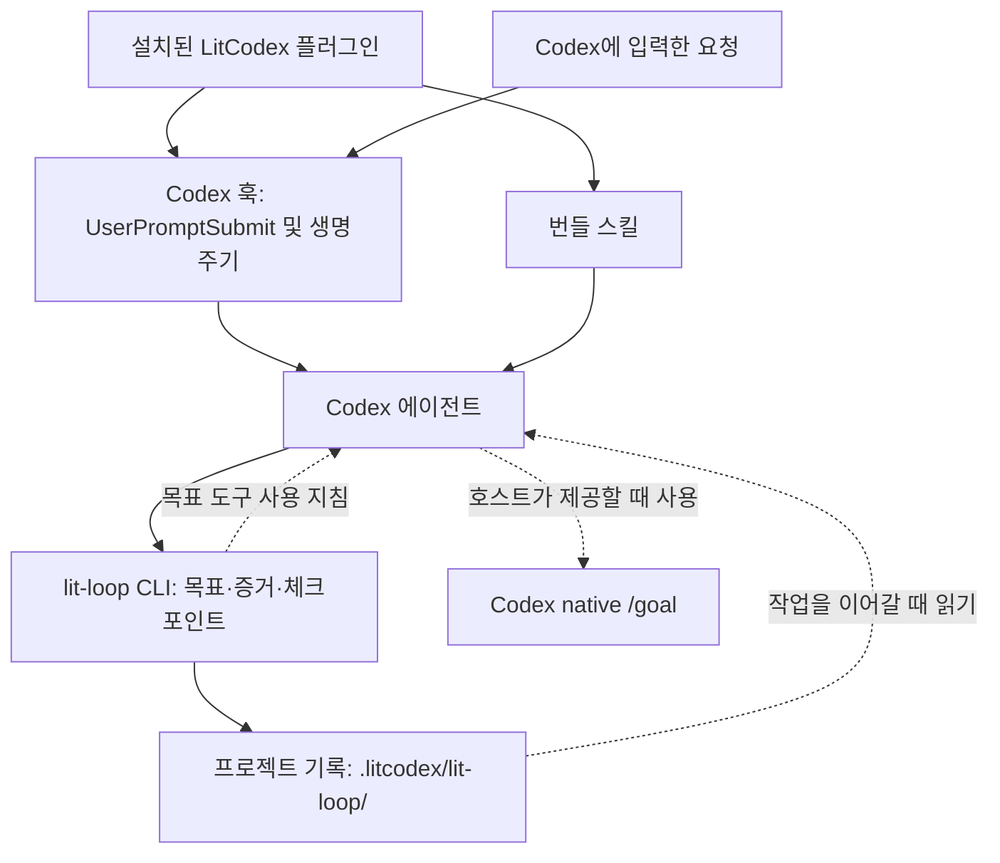

<p align="center"><picture><source media="(prefers-reduced-motion: reduce)" srcset="./docs/assets/cover-motion-still.webp" /></picture></p>

# LitCodex

**Keep the work lit.**

요청을 확인 기준이 붙은 목표로 바꾸고, 그 증거를 프로젝트에 남기고, 끝내지 못한 일은 다음 세션에 넘겨 주는
Codex CLI 플러그인입니다.

<p>
<a href="https://www.npmjs.com/package/@litfamily/litcodex"></a>
<a href="https://www.npmjs.com/package/@litfamily/litcodex"></a>
<a href="./LICENSE"></a>
<a href="https://github.com/wjgoarxiv/litcodex/stargazers"></a>
</p>

[English](./README.md) · [설치](#설치) · [첫 작업](#lit으로-시작하기) · [할 수 있는 일](#할-수-있는-일) · [명령어](#명령어) · [더 알아보기](#더-알아보기)

<p></p> <!-- demo-gif -->

## LitCodex란

Codex CLI는 바로 다음 한 걸음을 빨리 내딛습니다. 곤란해지는 건 작업이 대화 한 번보다 커질 때입니다.
컨텍스트가 차거나 세션이 끝나면, 다음 세션은 무엇을 정했고 무엇을 확인했고 무엇이 반쯤 남았는지를 처음부터
다시 짚어야 합니다. 그러다 보면 아무도 실제로 확인하지 않은 변경이 어느새 끝난 일로 처리되기도 합니다.

LitCodex는 그 흐름을 붙잡아 두는 Codex CLI 플러그인입니다. 요청에 `lit`을 넣으면 통과·실패를 가릴 수 있는
기준이 붙은 목표가 됩니다. 모든 기준에 증거가 기록돼야 목표가 끝난 것으로 인정되고, 그 기록은 프로젝트 안에
남아서 나중에 어느 세션에서든 읽을 수 있습니다. 멈추기 전에 `handoff` 한 단어만 보내 두면, 다음 세션은 어디까지
왔는지 적힌 메모에서 출발합니다.

이 루프와 함께 계획, 코드 리뷰, 조사, 디버깅, Word·PowerPoint 파일, 영어·한국어 글 다듬기를 맡는 스킬이 마흔
개 넘게 들어 있습니다. 작업은 내 컴퓨터의 Codex 안에서, 내 로그인과 내 모델로 돌아갑니다.

## 설치

Node.js 22 이상과 Codex CLI가 있으면 아래 명령 하나로 설치합니다.

```sh
npm exec --yes --package @litfamily/litcodex@1.0.21 -- litcodex install
```

설치기는 세 가지를 묻습니다. 어떤 모델이 작업을 이끌지, 어떤 모델이 거들지, 답변을 어떤 스타일로 받을지입니다.
Enter만 누르면 권장 모델과 지금 쓰는 출력 스타일이 그대로 골라집니다. 이어서 쓰려는 경로를 보여 주고, Enter를
한 번 더 누르기 전까지는 아무것도 건드리지 않습니다. 플러그인과 훅, 에이전트 역할을 등록하고,
`~/.codex/config.toml`에서는 자기가 관리하는 항목만 고칩니다. 영수증에 `Status Ready for Codex`가 보이면 doctor
검사까지 이미 통과한 것입니다.

먼저 계획만 보고 싶다면 `npm exec --yes --package @litfamily/litcodex@1.0.21 -- litcodex --dry-run install`을
실행하세요. 모든 단계를 출력하고 아무것도 쓰지 않습니다. 묻는 단계 없이 기본값으로 설치하려면 `install` 뒤에
`--yes`를 붙이면 됩니다.

`litcodex`를 `PATH`에서 바로 부르고 싶다면 다음을 실행합니다.

```sh
npm install -g @litfamily/litcodex
litcodex install
```

전역으로 설치하면 영상 스킬이 쓸 렌더링 도구도 미리 준비하느라 버전이 고정된 파일 몇 개를 내려받습니다.
무엇을 받는지와 건너뛰는 방법은 [설치 안내](./docs/install-Ko-KR.md#전역-명령으로-쓰기)에 있습니다.

> 전역 설치가 없다면 `npm exec --yes --package @litfamily/litcodex@1.0.21 -- litcodex <command>` 형식을 사용하세요. 예: `npm exec --yes --package @litfamily/litcodex@1.0.21 -- litcodex doctor`.

[설치 안내](./docs/install-Ko-KR.md)에는 기존 설정과 떼어 놓고 써 보는 법, Windows, 설치기가 보여 주는 화면
사진도 모두 있습니다. 예전 패키지 이름(`litcodex-ai`)으로 설치했다면 [기존 설치 이전 안내](./docs/npm-migration.md)를
먼저 읽어 주세요.

### 코딩 에이전트에게 설치 맡기기

Codex 같은 코딩 에이전트에게 설치를 맡길 수도 있습니다. 아래 프롬프트를 에이전트에 붙여 넣으세요. 에이전트는
필요한 도구가 있는지 확인하고, 계획을 보여 준 뒤 사용자가 허락할 때까지 아무것도 바꾸지 않습니다. 설치가 끝나면
doctor 검사를 돌리고 그 결과를 알려 줍니다.

```text
이 컴퓨터에 Codex CLI용 플러그인 LitCodex를 설치해 줘. 아래 순서를 그대로 따라 줘.

1. Node.js 22 이상과 Codex CLI가 설치되어 있는지 확인해 (node --version, codex --version).
   하나라도 없으면 멈추고 무엇을 설치해야 하는지 알려 줘.
2. 공식 npm 패키지 @litfamily/litcodex만 사용해. 이름이 비슷한 다른 패키지를 설치하거나
   다른 곳에서 설치 스크립트를 내려받지 마.
3. 먼저 계획을 보여 줘. 아래 명령은 모든 단계를 출력하고 아무것도 쓰지 않아:
   npm exec --yes --package @litfamily/litcodex@1.0.21 -- litcodex --dry-run install
   무엇이 바뀌는지 요약한 뒤 계속할지 물어봐. 내가 좋다고 하기 전에는 진행하지 마.
4. 내가 좋다고 하면 아래 명령을 실행해:
   npm exec --yes --package @litfamily/litcodex@1.0.21 -- litcodex install --yes
   (--yes는 권장 모델과 지금 쓰는 출력 스타일을 그대로 써.)
5. 검사를 실행하고 결과를 알려 줘. 문제(issue)나 경고(warning)가 있으면 그대로 옮겨 줘:
   npm exec --yes --package @litfamily/litcodex@1.0.21 -- litcodex doctor
6. 플러그인을 불러오도록 Codex를 다시 시작하고, Codex가 LitCodex 훅을 검토해 달라고 하면
   승인하라고 나에게 알려 줘.
```

## lit으로 시작하기

프로젝트에서 Codex를 엽니다. 처음에는 Codex가 LitCodex 훅을 검토해 달라고 하니 승인해 주세요. 그다음 이렇게
입력합니다.

```text
lit 회원가입 폼에 입력 검증을 추가해줘
```

모델보다 훅이 먼저 답합니다. 5행짜리 LIT 마크가 뜨는데, `UserPromptSubmit` 훅이 일반 텍스트로 보내는 것입니다.
이어서 답변이 `🔥 **LIT IGNITED · <discipline>** 🔥` 한 줄로 시작합니다. 여기서부터 요청은 작업 루프(내부 이름은
`<lit-loop-mode>`)에서 돌아갑니다. 목표와 그 확인 기준이 생기고, 기준을 통과할 때마다 증거가 기록됩니다.

마크 아래에는 지금 LIT 작업 흐름의 어디쯤에 있는지 알려 주는 줄이 하나 더 붙습니다. 프로젝트에 저장된 기록을 읽어
인터뷰, 계획, 작업(끝낸 계획 항목을 막대로 표시), 검토, 완료 순서로 보여 줍니다. 예를 들면
`🧭 ✓ › 📝 ✓ › 🔨 WORK ▰▰▰▱▱▱▱ 3/7 › 🔍 · › 🏁 ·`입니다. 저장된 근거가 없는 단계는 짐작으로 채우지 않고 빼며,
`litresearch`는 분해, 웨이브, 검증, 종합으로 이어지는 짧은 지도를 따로 씁니다. 아직 진행 중인 조사 기록이 있으면
그 지점부터 보여 주고, 없으면 분해 단계에서 시작합니다. LIT 턴이 끝나면 Stop 훅이
`✨ turn done · 2 tasks ✓ · next ▸ Write the docs` 같은 줄을 남깁니다. `lit start work`가 중간 점검 지점에 닿아 같은 턴
안에서 계획이 이어질 때는 `⏳ 3/7 tasks ✓ · continuing ▸ Write the docs`로 바뀝니다. Codex가 훅 문구를 색 없이 출력하기
때문에 두 줄 모두 이모지를 쓴 일반 텍스트입니다.

`lit`은 독립된 단어로 들어 있어야 합니다. `split`, `literal`, `litmus`처럼 글자만 섞여 있을 때는 반응하지 않고,
코드 스팬이나 코드 블록 안의 `lit`에도 반응하지 않습니다. 슬래시 명령도 건드리지 않는데, `/litresearch` 하나만
예외로 조사를 시작합니다.

메시지 전체가 그 한 단어일 때만 동작하는 단어가 두 개 있습니다. 세션을 마치기 전에 `handoff`만 보내면 인수인계
문서를 만듭니다. `lit-scientific-visualization`만 보내면 시각화 작업 모드(`<lit-scientific-visualization-mode>`)로
바뀌고, Python 패키지는 설치하지 않습니다.

### 작은 결과물 하나부터

직접 판단할 수 있는 첫 작업이 필요하다면 빈 폴더에서 이렇게 시작해 보세요.

```text
lit 현재 폴더에 HTML 파일 하나로 할 일 목록을 만들어줘. 외부 의존성은 설치하지 마.
할 일 추가와 완료 처리를 확인하고, 확인하지 못한 부분은 따로 남겨줘.
```

끝나면 세 가지를 보세요. 페이지 자체(열어서 할 일을 하나 추가해 보세요), 실제로 돌린 확인, 아직 남은 일입니다.
`lit recap`은 기록된 내용을 다시 읽어 줍니다. 세션을 닫기 전에 `handoff`만 따로 보내 두고, 다음 세션에서는
그 문서와 프로젝트 목표부터 읽게 하면 됩니다.

## 할 수 있는 일

**정말로 끝나는 작업.** `lit`은 요청을 확인 기준이 붙은 목표로 바꿉니다. 모든 기준에 통과 증거가 있어야 목표를
완료할 수 있고, Codex가 확인하지 못한 부분은 눈에 띄는 곳에 적어 둡니다.

```text
lit 자꾸 깨지는 로그인 테스트를 고치고, 고쳐졌다는 실행 결과도 보여줘
```

**고치기 전에 계획부터.** `lit plan`은 번호 붙은 단계와 성공 기준을 담은 계획을 `.litcodex/plans/`에 쓰고, 그
밖에는 아무것도 고치지 않습니다. 계획을 승인하면 `lit start work <계획 이름>`이 각 단계를 다섯 관문(계획 재확인,
자동 검증, 수동 QA, 적대적 QA, 정리)에 통과시키고, 다섯 리뷰가 모두 통과해야 마칩니다.

```text
lit plan 설정 페이지를 새 폼 라이브러리로 옮기기
```

**거절할 줄 아는 리뷰.** `lit review`는 계획이나 끝난 변경을 놓고 리뷰 다섯 개를 따로 돌립니다. 하나라도
통과하지 못하면 승인이 나지 않습니다.

**출처가 붙는 조사.** `lit research`는 여러 갈래로 증거를 모은 뒤 출처를 단 종합을 씁니다. 사실과 가설, 아직
풀리지 않은 질문은 따로 적습니다.

```text
lit research Node 22에서 PKCE를 지원하는 OAuth 라이브러리를 출처와 함께 정리해줘
```

**Word와 PowerPoint 파일.** `lit`으로 보고서나 발표자료를 부탁하면 맞는 스킬(`lit-docx`, `lit-pptx`)이 자료를
읽고 디자인 방향을 고릅니다. 고른 방향과 대안 두 가지를 밝힌 뒤, 편집할 수 있는 파일을 Markdown 원본과 함께
만듭니다.

```text
lit notes.md로 월요일 회의용 열 장짜리 발표자료를 만들어줘
```

**영어·한국어 글 다듬기.** `$litcodex:lit-humanizer`는 사실과 단서는 남기고 딱딱한 AI 문장을 다시 씁니다. 파일에
쓰기 직전에는 훅이 누가 봐도 초안 티가 나는 표현 몇 가지를 막아 줍니다.

### 그 밖의 스킬

모든 스킬은 Codex skill picker에서 고르거나 `$litcodex:debugging`처럼 이름으로 부를 수 있습니다. 스킬마다 그림과
한 줄 설명은 [스킬 안내](./docs/skills-Ko-KR.md)에 있습니다.

| 분야 | 스킬 |
| --- | --- |
| 코드 | `debugging`, `refactor`, `lit-code`, `lit-commit`, `lit-burnoff`, `lit-burnoff-file`, `structural-search`, `lsp-setup`, `lit-init` |
| 계획과 팀 작업 | `deep-interview`, `lit-crucible`, `litgoal`, `litwork`, `lit-team` |
| 조사와 지식 | `autoresearch`, `autoconference`, `wikify`, `lit-fetch`, `coding-session-audit`, `lit-comprehend` |
| 화면, 그림, 영상 | `frontend-ui-ux`, `visual-qa`, `browser-drive`, `readme-studio`, `lit-diagram-drawer`, `lit-scientific-visualization`, `lit-typographic-motion` |
| LitCodex 관리 | `litcodex-doctor`, `litcodex-report-bug`, `litcodex-contribute-bug-fix` |
| 알아서 도는 검사 | `rules`, `lsp`, `comment-checker`: 프롬프트마다 프로젝트 규칙을 넣고, 수정 뒤에는 LSP와 주석을 확인 |

## 핸드오프를 LitCodex에 맡기기

긴 세션은 컨텍스트 창을 채우고, 다음 컨텍스트는 이번에 배운 내용을 모른 채 시작합니다. `handoff`를 직접 보내도
되지만, 제때 알아차려야 합니다. 자동 핸드오프는 그 시점을 대신 알아차립니다. 직접 켜기 전까지는 꺼져 있고, 언제
동작할지는 컨텍스트 창의 몇 퍼센트인지로 정합니다. 아래 문장을 프롬프트 전체로 보내세요.

```text
lit-handoff auto on 60
```

LitCodex가 바로 답하고, 이 프롬프트는 모델에게 가지 않습니다. 이 명령은 프로젝트의 `.codex/config.toml`에도
퍼센트를 적어 두기 때문에, Codex에서 신뢰한 프로젝트라면 핸드오프가 저장된 직후 Codex가 스스로 대화를 압축합니다.

<p><picture><source media="(prefers-color-scheme: dark)" srcset="./docs/assets/auto-handoff/auto-handoff-on-dark.webp" /></picture></p>

`lit-handoff auto status`는 지금 설정을 알려 주고, `lit-handoff auto off`는 기능을 끄면서 숫자는 다음을 위해
남겨 둡니다.

<p><picture><source media="(prefers-color-scheme: dark)" srcset="./docs/assets/auto-handoff/auto-handoff-status-off-dark.webp" /></picture></p>

턴이 정한 퍼센트 이상에서 끝나면 모델이 핸드오프를 저장하고, 다른 일은 시작하지 않은 채 한 줄로 알려 줍니다.
Codex가 스스로 압축하지 않는 경우라면 그 한 줄이 `/compact`를 실행하라고 안내합니다. 압축이 끝나면 다음
컨텍스트는 방금 저장한 핸드오프에서 시작합니다.

<p><picture><source media="(prefers-color-scheme: dark)" srcset="./docs/assets/auto-handoff/auto-handoff-saved-dark.webp" /></picture></p>

환경 변수, doctor 줄, 아직 신뢰하지 않은 프로젝트에서 일어나는 일은 [자동 핸드오프 안내](./docs/auto-handoff-Ko-KR.md)에
있습니다.

## 어떻게 동작하나요

Codex가 플러그인을 불러오고 훅을 실행합니다. 훅은 요청이 어떤 모드에 속하는지 가리고 맥락을 보태며,
스킬은 에이전트가 일하는 절차를 안내합니다. 루프 CLI는 프로젝트 기록을 관리하고, Codex의 native goal 도구를
쓸 때 따를 지침을 출력합니다.


```mermaid
flowchart TD
    P["설치된 LitCodex 플러그인"] --> H["Codex 훅: UserPromptSubmit 및 생명주기"]
    P --> S["번들 스킬"]
    U["Codex에 입력한 요청"] --> H
    H --> A["Codex 에이전트"]
    S --> A
    A --> L["lit-loop CLI: 목표·증거·체크포인트"]
    L --> R["프로젝트 기록: .litcodex/lit-loop/"]
    L -. "목표 도구 사용 지침" .-> A
    A -. "호스트가 제공할 때 사용" .-> G["Codex native /goal"]
    R -. "작업을 이어갈 때 읽기" .-> A
```

Codex 목표 도구로 이어지는 점선은 도구가 있을 때 에이전트가 따르는 지침이고, LitCodex가 그 도구를 직접 부르는
일은 없습니다. 로그인, 모델 접근, 권한, 모든 실행은 내 컴퓨터의 Codex 안에서 일어납니다. 그러니 작업은
결과물과 실제로 돌린 확인을 보고 판단하세요. 더 자세한 내용은 [실행·상태 참고서](./docs/usage-Ko-KR.md)에 있습니다.

## 명령어

### Codex 작성창에서

| 입력 | 모드 | 하는 일 |
| --- | --- | --- |
| `lit` 또는 `lit-loop` | **lit-loop** | 오래 이어지는 루프에서 작업하며 증거를 체크포인트로 남김 |
| `litwork` | **litwork** | 결과 중심 작업, 수동 QA 증거 포함 |
| `lit-plan` 또는 `lit plan` | **lit-plan** | 계획만 작성: 증거와 마지막 완료 주장이 담긴 범위 있는 계획 |
| `deep-interview` 또는 `lit deep interview` | **deep-interview** | 계획만 작성: 모호한 요구를 질문으로 좁힘 |
| `litgoal` 또는 `lit goal` | **litgoal** | 목표와 기준을 루프 상태에 연결 |
| `lit-recap` 또는 `lit recap` | **lit-recap** | `.litcodex` 원장을 읽기 전용으로 요약 |
| `lit-comprehend` 또는 `comprehend` | **lit-comprehend** | 작업 트리 밖에 자체 완결형 설명 자료 생성 |
| `review-work` 또는 `lit review` | **review-work** | 계획이나 끝난 작업을 읽기 전용으로 검토 |
| `litresearch`, `/litresearch` 또는 `lit research` | **litresearch** | 사실·가설·출처·불확실성을 나눠 적는 연구 저널 |
| `lit start work <plan-name>` | **Start Work** | 승인된 계획을 실행하고 증거를 남김 |
| 정확히 단독으로 입력한 `handoff` | **lit-handoff** | 비밀값을 빼고 인수인계 문서를 만들거나 갱신 |
| 정확히 단독으로 입력한 `lit-scientific-visualization` | **lit-scientific-visualization** | 훅을 통해 출판용 시각화 어댑터를 불러옴 |

같은 모드를 한 세션에서 다시 입력해도 달라지는 것은 없습니다.

### CLI 명령어

| 명령 | 하는 일 |
| --- | --- |
| `litcodex install` | LitCodex 플러그인과 훅 등록 |
| `litcodex doctor` | 설치, 루프 상태, 호스트 기능, 실제 적용된 설정 진단 |
| `litcodex uninstall` | 플러그인과 LitCodex가 관리하는 설정 제거 |
| `litcodex config migrate` | 관리되는 Codex 설정을 미리 보거나 적용 |
| `litcodex office-runtime install` 또는 `status` | Word·PowerPoint 파일에 쓰는 고정 버전 도구를 준비하거나 확인 |
| `litcodex motion-runtime install` 또는 `status` | 영상 렌더러 도구를 준비하거나 확인 |
| `litcodex loop create` | 브리프에서 목표와 성공 기준 도출 |
| `litcodex loop status --json` | 루프 상태를 JSON으로 확인 |
| `litcodex loop run` | 다음에 실행할 수 있는 목표 선택 |
| `litcodex loop record-evidence` | 기준 하나의 통과·실패·차단 결과 기록 |
| `litcodex loop checkpoint` | 모든 기준을 통과했을 때만 목표 완료 처리 |
| `litcodex loop doctor` | 루프 상태 진단 또는 복구 |

## 작업 기록이 남는 곳

프로젝트의 루프 상태는 `.litcodex/lit-loop/` 아래에 있습니다. 기록 파일은 `brief.md`, `goals.json`,
`ledger.jsonl`이고, 증거는 `evidence/` 폴더에 쌓입니다. 파일은 한 번에 통째로 써서 중간에 끊긴 상태로 남지 않고,
목표 파일이 손상되면 버리지 않고 `.bak`으로 남겨 되살릴 수 있게 합니다. 이 기록은 이 컴퓨터에만 있고 Git과 패키지에는 들어가지 않습니다.
[상태·복구 참고서](./docs/usage-Ko-KR.md#루프-상태)에서 자세히 볼 수 있습니다.

## 설치 확인

```sh
npm exec --yes --package @litfamily/litcodex@1.0.21 -- litcodex doctor
```

`litcodex doctor`는 등록·훅·설정·호스트 기능을 확인하고, 문제가 없으면 All checks passed로 끝납니다.
`litcodex loop doctor`는 현재 프로젝트의 루프 상태를 확인합니다. 둘 다 설치 상태를 보는 검사입니다. 로그인한
모델 작업과 자식 에이전트가 실제로 도는지는 작은 작업을 하나 맡겨 보면 알 수 있습니다.

상태 줄과 터미널 제목은 Codex가 직접 그리고, 플러그인은 여기에 항목을 더할 수 없습니다. 검사를 모두
통과했는데 설정에 둘 중 하나라도 없으면 doctor가 붙여 넣을 `[tui]` 블록을 알려 줍니다. 이 블록을 넣으면
입력창 아래에는 모델과 추론 강도, 사용한 컨텍스트, 5시간·주간 한도, 작업 진행률, Git 브랜치가 뜨고, 창
제목에는 작업 중 스피너와 프로젝트 이름이 뜹니다. Codex
안에서 `/statusline`과 `/title`로 직접 고를 수도 있습니다. doctor는 제안만 보여 주고 설정은 고치지 않습니다.

## 업데이트

`npm exec` 형식으로 설치했다면 새 버전 번호를 넣어 설치 명령을 다시 실행하세요. 전역 설치는 대화형 명령 뒤에
스스로 업데이트할 수 있고, 대화형으로 실행한 `litcodex doctor`가 새 버전을 알려 줄 수도 있습니다. 둘 다 끄려면
`LITCODEX_NO_UPDATE_CHECK=1`을 설정하세요. 자세한 내용은 [개인정보 안내](./docs/privacy.md#registry-traffic-and-updates)에
있습니다.

## 문제 해결

- **터미널 창이 바로 닫힌다면.** 계속 열려 있는 터미널을 열고 도움말, 설치, doctor를 하나씩 실행해 각 종료
  코드를 적어 두세요. 그다음
  [단계별 확인](./docs/npm-migration.md#isolated-local-trial)을 따르되, Codex는 직접 실행하세요.
- **활성화되지 않는다면.** `litcodex doctor`를 실행하고 Codex에서 훅을 승인했는지 확인하세요.
- **명령을 찾지 못한다면.** 위의 `npm exec` 형식을 쓰거나, npm 전역 bin 경로가 `PATH`에 있는지 확인하세요.
- **Codex 목표가 멈췄거나(paused) 막혔다면(blocked).** `/goal resume`으로 재개하고 활성 상태인지 확인한 뒤
  `litcodex loop run --retry-failed`로 다시 시도하세요. 미완료 목표는 지우지 말고 남겨 두세요. 자세한 내용은 [복구 참고서](./docs/usage-Ko-KR.md#문제-해결)에 있습니다.

## 제거

```sh
npm exec --yes --package @litfamily/litcodex@1.0.21 -- litcodex uninstall
```

`litcodex uninstall`은 플러그인과 LitCodex가 관리하는 설정을 지우고, 관련 없는 설정은 그대로 둡니다.

## 더 알아보기

- [설치 안내](./docs/install-Ko-KR.md): 설치 방식별 차이, 전역 설치 때 받는 파일, Windows, 설치기 화면 사진,
  설치가 바꾸는 것과 바꾸지 않는 것.
- [스킬 안내](./docs/skills-Ko-KR.md): 번들 스킬 전체를 그림과 함께 소개하고, 이름을 알아 두면 편한 스킬을 설명합니다.
- [자동 핸드오프](./docs/auto-handoff-Ko-KR.md): 컨텍스트가 정해 둔 퍼센트에 이르면 핸드오프를 대신 써 줍니다.
  기본값은 꺼짐입니다.
- [Jev 스킬 힌트](./docs/jev-skill-hint-Ko-KR.md): 외부 호스팅 모델이 스킬을 제안해 주는 선택 기능입니다. 켜면
  프롬프트가 외부 서비스로 가므로 이 문서를 먼저 읽어 주세요. 기본값은 꺼짐입니다.
- [사용 참고서](./docs/usage-Ko-KR.md): 모든 경로, 모델 설정, 플랫폼 제약, 복구 방법.
- [개인정보와 네트워크 동작](./docs/privacy.md), [기존 설치 이전 안내](./docs/npm-migration.md).
- [영상과 브랜드](./docs/media-Ko-KR.md): 영상, 로고, 이름에 담은 이야기.
- 기여하는 분께: [LitCodex 계약서](./docs/spec/litcodex-contract.md), [레퍼런스 분석](./docs/reference-analysis.md),
  [릴리스 출처](./docs/release/provenance.md), [배포 체크리스트](./docs/release/publish-checklist.md),
  [CHANGELOG.md](./CHANGELOG.md). 테스트, 픽스처, 테스트 헬퍼, Vitest 설정은 이 저장소에만
  있습니다. npm 패키지와 설치된 마켓플레이스 플러그인에는 들어가지 않습니다.
- [LitFamily 허브](https://github.com/wjgoarxiv/litfamily): 다른 코딩 에이전트에서 쓰는 같은 lit 워크플로.

같은 프로젝트를 두 번 설명하는 수고를 LitCodex가 덜어 줬다면, 스타 하나가 다른 Codex 사용자가 이 저장소를
찾는 데 도움이 됩니다.

[기여 안내](./CONTRIBUTING.md) · [보안](./SECURITY.md) · [행동 강령](./CODE_OF_CONDUCT.md) · [지원](./SUPPORT.md)

## 라이선스

[MIT](./LICENSE)
