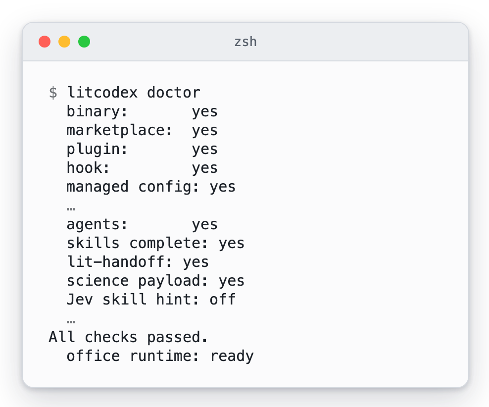
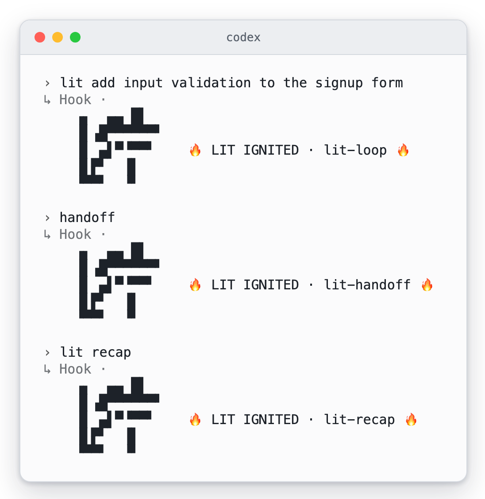
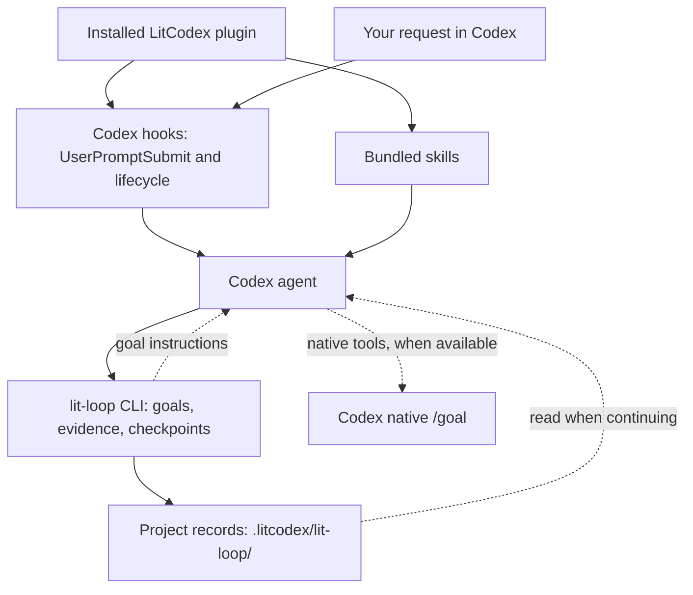
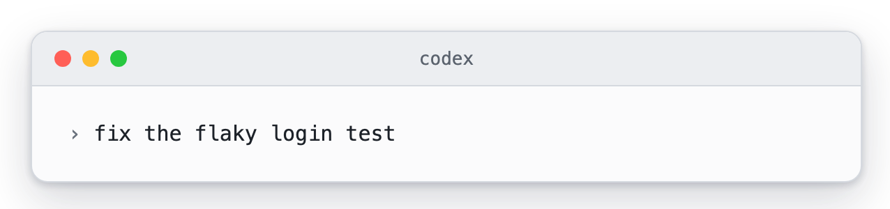
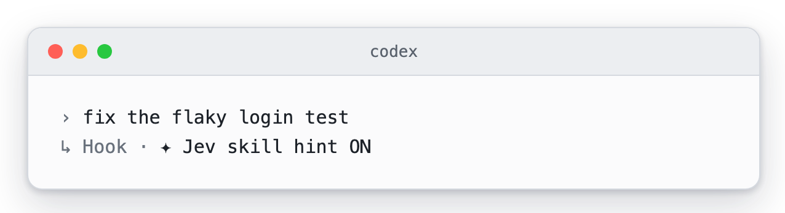
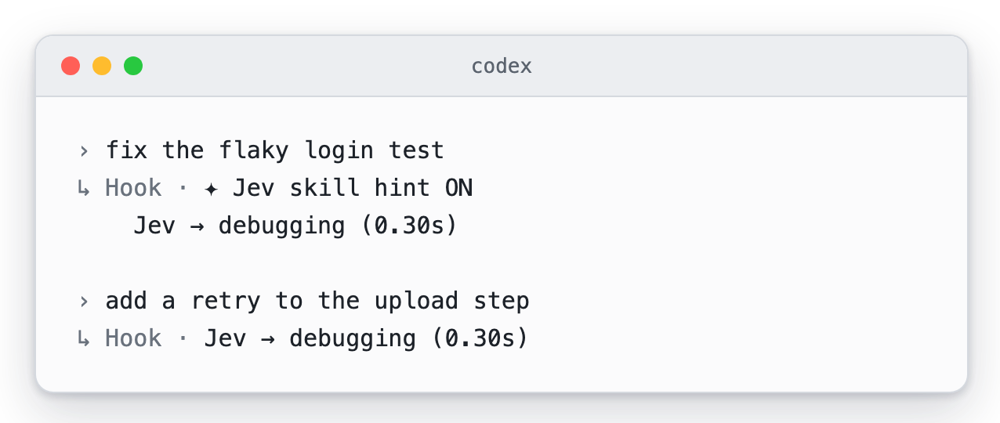
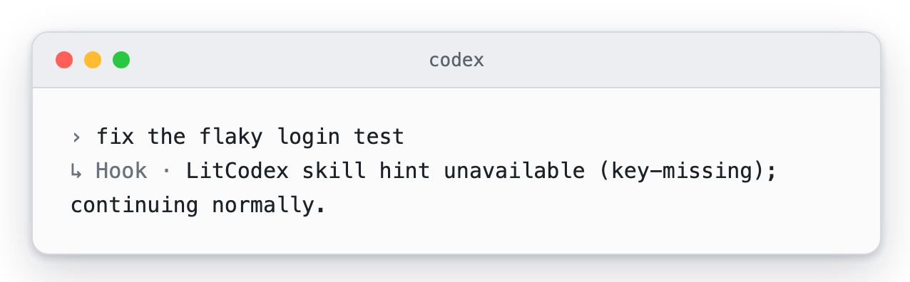
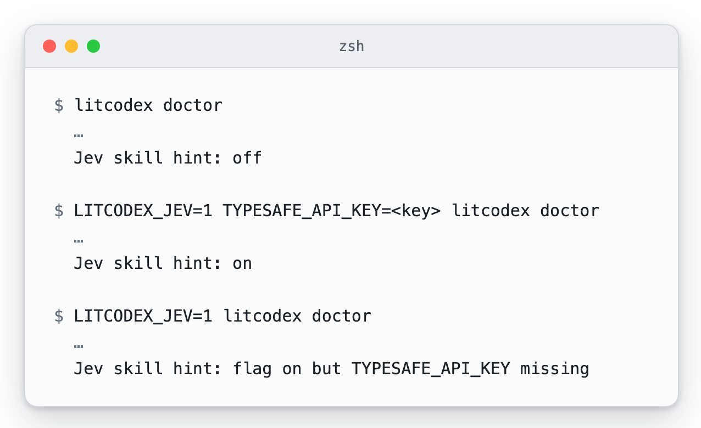

<p align="center"><picture><source media="(prefers-reduced-motion: reduce)" srcset="./docs/assets/cover-motion-still.webp" /></picture></p>

<p align="center"></p>

<details>
<summary>Copy ASCII logo</summary>

```
                             ▄▄▄▄
                   ▗███▌   ▗██████▖
 ▗▄▄▄▄▄          ▗▟████▌   ▝██████▘
 ▐█████        ▗▟██████▌    ▝▀▜█▀▘
 ▐█████      ▗▟███████▄▄▄▄▄▄▄▄▄▄▄▄▄▄▄▄▄▄▄▄
 ▐█████    ▗▟█████████████████████████ ▐█▀
 ▐█████    ████████████████████████████▀
 ▐█████    ██▛▘   ▄ ▄▄▄▄▖▄▄▄▄▄▄▄▄▄▄▄▄▄▖
 ▐█████    ▀    ▄██ ████▌█████████████▌
 ▐█████       ▄████ ████▌█████████████▌
 ▐█████     ▄█████▛
 ▐█████  ▗▟█████▀▘       ▄▄▄▄▄     ▗▖
 ▐█████ ▐█████▀          █████     ▐▛▀
 ▐█████ ▐███▀            █████
 ▐█████ ▐█▀              █████
 ▐█████ ▝                █████
 ▐█████▄▄▄▄▄▄▄▖          █████
 ▐███████████▛           █████
 ▐██████████▀            █████

LIT · codex
```

</details>

<p align="center"></p>
<p align="center"></p>

<p align="center">
<a href="#install"></a>
<a href="./LICENSE"></a>
</p>

<p align="center">
<a href="./docs/usage.md"> Docs</a> &nbsp; <a href="#install">Install</a> &nbsp; <a href="./docs/assets/readme/ignition-film.mp4"> Ignition</a> &nbsp; <a href="./LICENSE"> MIT</a>
</p>

# LitCodex

**Keep the work lit.**

[한국어](./README-Ko-KR.md) · [Install](#install) · [First task](#start-with-lit) · [Skills](#skills-at-a-glance) · [Commands](#commands) · [Troubleshooting](#troubleshooting) · [Docs](#docs-and-contributing)

## What is LitCodex

LitCodex is a plugin for Codex CLI. It adds planning, review, research and a durable execution loop,
so a piece of work can outlast the conversation it started in.

Add `lit` to a request. LitCodex turns it into a goal with checks that can pass or fail,
keeps the results in your project, and leaves the next session enough to pick up where this one stopped.

## Why LitCodex

**You have been handed a spark.<br>
Bring it to the work you want to finish.**

A bug to fix. A screen to build. A project to finish.

Starting takes a sentence. Picking up where you left off takes more: the decisions you made,
the checks you ran, and the next thing to try.

**LIT keeps that spark with your project.** Goals, plans, checked results and next steps stay in
local records that a later session can read. The spark that lasts is the work you can come back to,
long after the agent has stopped.

**Where one conversation ends, the next stretch of work can begin.**

<p align="center"> </p>

## Install

You need Node.js 22 or later and Codex CLI. Then run:

```sh
npm exec --yes --package @litfamily/litcodex@1.0.11 -- litcodex install
```

The installer sets LitCodex up inside Codex. It registers the plugin, its hooks and its agents, and
it changes only the keys it manages in `~/.codex/config.toml`. Along the way it asks three questions:
which model leads, which model helps, and which output style you like. On a fresh install the lead is
`gpt-6-astra` at `xhigh` and ordinary helpers use `gpt-6-luna` at `max`. Pick another supported model
and effort if you prefer.

Everything comes in the npm package, so there is nothing to clone and no GitHub sign-in. You need your
Codex sign-in and model access once real model work starts.

Two variants are worth knowing:

- If you want to see what would change before anything does, run `npm exec --yes --package @litfamily/litcodex@1.0.11 -- litcodex --dry-run install`.
- If you are setting up a machine without anyone at the keyboard, run `npm exec --yes --package @litfamily/litcodex@1.0.11 -- litcodex install --yes`. A `--style <id>` you pass is still used.

Want to see what the installer prints before you run it? [What you will see on screen](#what-you-will-see-on-screen) shows the questions, the receipt and the doctor check.

Coming from the old unscoped package? The [migration guide](./docs/npm-migration.md) covers the move.

### A global command

If you would rather have `litcodex` on your `PATH`:

```sh
npm install -g @litfamily/litcodex
litcodex install
```

A global install does a little more than copy files. Right after the download, unless `CI` is set, a
short setup script prints a welcome and then gets the video skill, `lit-typographic-motion`, ready ahead of time, so the
tools it renders with are already in place the first time you ask for a video.

Getting ready means a few downloads. The script runs `npm ci` to fetch pinned copies of `opentype.js`,
`playwright-core` and `ws` from your npm registry, and it fetches pinned font and license files from
GitHub and apache.org. It downloads no browser. Everything goes into
`${XDG_CACHE_HOME:-~/.cache}/litcodex/motion-runtime/`. If the step does not finish, LitCodex is still
installed, and the script prints the command to try again later: `litcodex motion-runtime install`.

You can keep the script out of the global install in either of two ways:

- Add `--ignore-scripts` to `npm install -g`. The whole script is left out, welcome included.
- Set `CI=1` for that one command. The script sees it and stops before doing anything, just as it does
  on a build server where `CI` is already set.

Leaving it out here only postpones the downloads. `litcodex install` gets the video tools ready the same
way after a successful install, and there is no switch to turn that off.

> Without a global install, use `npm exec --yes --package @litfamily/litcodex@1.0.11 -- litcodex <command>`, such as `npm exec --yes --package @litfamily/litcodex@1.0.11 -- litcodex doctor`.

### Trying it apart from your setup

To try LitCodex without touching your existing settings, follow the
[isolated trial guide](./docs/npm-migration.md#isolated-local-trial). It gives the trial a whole home of its
own, because with only `CODEX_HOME` changed, settings in your existing home can still be found.

### Windows

The installer and the CLI shims work on Windows. Python routes that rely on POSIX directory
descriptors cannot run there, so on Windows they stop with `BLOCKED_UNSUPPORTED_PYTHON_POSIX_RUNTIME`. See [platform and prompt policy](./docs/usage.md#install).

## Start with lit

Open Codex in your project and approve the LitCodex hooks when the startup review asks. Then type:

```text
lit add input validation to the signup form
```

When `lit` stands on its own as a word, LitCodex puts the request into its work loop
(`<lit-loop-mode>` internally). You see two signs of it. A five-row LIT mark appears first; the
`UserPromptSubmit` hook sends it as plain text, so it looks the same whatever your terminal colors.
Then the reply opens with `🔥 **LIT IGNITED · <discipline>** 🔥`.

Words that only happen to contain the letters, such as `split`, `literal` or `litmus`, do nothing.
Neither does `lit` inside a code span or a code block. Slash commands are left alone as well, with one
exception: `/litresearch` starts research.

`handoff` and `lit-scientific-visualization` are exact-only routes: each one works only when it is the
whole message, with nothing around it. The command table calls that "exact bare".
Send exact bare `handoff` to write a continuation packet. Send exact bare `lit-scientific-visualization`
to switch to plotting mode (`<lit-scientific-visualization-mode>`); it installs no Python packages.

### Make one small thing

Start in an empty project, with a task you can check yourself:

```text
lit build a single-file HTML task list in this folder. Do not install dependencies.
Check adding and completing a task, and record anything you could not verify.
```

When it finishes, look for three things: the result, the checks that actually ran, and what is still
unfinished. The status mark tells you the request reached LitCodex. Whether the page works is something
you find out by opening it and adding a task yourself.

Ask for `lit recap` to read what was recorded. Before you leave the session, send `handoff` as a
message of its own. In the next session, ask Codex to read that packet and the project goals before it
continues.

A goal is complete only once every one of its success criteria passes. Each step leaves something
behind:

| Step | What stays with the work |
| --- | --- |
| Plan | A goal with checks that can pass or fail |
| Make | A small result you can inspect |
| Verify | Evidence for each completed criterion; blockers stay open |
| Hand off | Decisions, remaining work, and where to resume |

Codex keeps its own goals (the `/goal` feature), and LitCodex keeps its records separately. If a Codex
goal is paused or blocked, bring it back with the recovery step under [Troubleshooting](#troubleshooting).
A handoff carries your notes forward and leaves the goal as it was.

### The routes you will use most

| Type this | What happens |
| --- | --- |
| `lit` | Starts a bounded task, with goals and checks kept in the project. |
| `handoff` or `/lit-handoff` | Carries the checked result and the next step into another session. |
| `lit-plan` | Writes a plan and success criteria before anything is edited. |
| `lit start work <approved-plan>` | Runs a plan you have approved. |
| `review-work` | Reviews the change and its evidence. |
| `litresearch` | Researches with sources and keeps track of what is still uncertain. |

The full list is under [Commands](#commands).

## What you will see on screen

Five pictures show what LitCodex prints, from the first install to your first task. Each one was captured from the
real program in a temporary home, and each caption says which lines were cut to keep the picture short. They come
from Codex CLI 0.158; other Codex versions may word or place hook lines a little differently. The optional Jev skill
hint has its own pictures under [Jev](#what-you-will-see).

Run interactively, the installer asks three questions: which model leads, which model helps, and which output style
you like. Pressing Enter keeps the first choice each time: the recommended models and your current output style. A box then lists the route the installer is about to write,
and nothing is written until you press Enter once more.

<p><picture><source media="(prefers-color-scheme: dark)" srcset="./docs/assets/screens/screen-install-questions-dark.webp" /></picture><br /><sub>Captured from a real litcodex install in a temporary home, answered with Enter at each question. The 20 model rows of each list are cut to the first two and the last, and the route box leaves out its path line; each … marks a cut.</sub></p>

After the last Enter the installer works through six steps and prints a receipt. Start with the Status row: Ready for
Codex means the plugin, the hook, the seven agent roles and the managed config keys are in place and the doctor
check passed. The two lines above the receipt report the Office and film tools that the install prepares ahead of
time. If that step cannot finish, the line says so and names the command to run later.

<p><picture><source media="(prefers-color-scheme: dark)" srcset="./docs/assets/screens/screen-install-receipt-dark.webp" /></picture><br /><sub>Captured from the same install. The description and path lines under each step and a few receipt rows are cut. This temporary home started with the film tools already cached, so the two runtime lines came up at once.</sub></p>

`litcodex doctor` is the quickest way to check the result. Most rows answer yes or no, and a clean run ends with
All checks passed. The Jev row reads off unless you switched the hint on.

<p><picture><source media="(prefers-color-scheme: dark)" srcset="./docs/assets/screens/screen-doctor-dark.webp" /></picture><br /><sub>Captured from litcodex doctor in the same home after the install. Rows about model routes, concurrency and updates, the warnings that a home without a Codex sign-in produces, and the film-tool lines are cut.</sub></p>

Type a request that starts with `lit` and the hook answers before the model does. It prints the five-row LIT
mark and a line that names the route it picked. The same mark appears for `handoff` and `lit recap`, each with its
own route name, so you can tell at a glance which mode took the request.

<p><picture><source media="(prefers-color-scheme: dark)" srcset="./docs/assets/screens/screen-lit-ignited-dark.webp" /></picture><br /><sub>Captured from a real Codex 0.158 session with the LitCodex hook and a local stand-in for the model, so nothing left the machine. The startup banner, the hook-review screen and the model replies are cut.</sub></p>

Behind the mark, the loop keeps score in your project. A new goal starts with three criteria and none passing. Each
recorded result moves the count, and a request to complete the goal early is refused until every criterion has
passed.

<p><picture><source media="(prefers-color-scheme: dark)" srcset="./docs/assets/screens/screen-loop-dark.webp" /></picture><br /><sub>Captured from the real loop commands in an empty project. The long commands are split with backslashes to fit, and the output of the second evidence command is cut. The pictures and how they were made are listed in the <a href="./docs/assets/screens/README.md">media notes</a>.</sub></p>

## Watch it in motion

A 23-second film follows one small task through LitCodex. You add `lit` to a request, and the request becomes a goal with four checks. Three checks turn green once their evidence is recorded, and one stays open. A handoff carries the open check into the next session, where it gets finished. The task and its checks are an example made for the film.

<p align="center"><picture><source media="(prefers-reduced-motion: reduce)" srcset="./docs/assets/promo/promo-still.webp" /></picture></p>

[Watch the film with sound](./docs/assets/promo/promo.mp4) · [Poster](./docs/assets/promo/promo-poster.png)

## Skills at a glance

Every bundled skill is here. Each row shows how to start it and what you get back; the last row groups
the checks that run on their own.

<table>
<tr><th>What it looks like</th><th>Skill</th><th>What you get</th></tr>
<tr>
<td></td>
<td><code>lit-loop</code><br /><sub><code>lit</code> · <code>$litcodex:lit-loop</code></sub></td>
<td>Add <code>lit</code> to a request. Codex pins down the scope, backs each step with a check, and writes down what it could not verify.</td>
</tr>
<tr>
<td></td>
<td><code>litwork</code><br /><sub><code>litwork</code> · <code>$litcodex:litwork</code></sub></td>
<td>A careful build or fix from start to finish: a failing test first, then proof where the thing actually runs.</td>
</tr>
<tr>
<td></td>
<td><code>lit-plan</code><br /><sub><code>lit plan</code> · <code>$litcodex:lit-plan</code></sub></td>
<td>An approved plan in <code>.litcodex/plans/</code> with numbered rows. Planning only.</td>
</tr>
<tr>
<td></td>
<td>Start Work<br /><sub><code>lit start work &lt;approved-plan&gt;</code></sub></td>
<td>Runs an approved plan through five gates and finishes only when all five reviews pass.</td>
</tr>
<tr>
<td></td>
<td><code>review-work</code><br /><sub><code>lit review</code> · <code>$litcodex:review-work</code></sub></td>
<td>Five separate reviews, and any one of them can hold back approval.</td>
</tr>
<tr>
<td></td>
<td><code>litgoal</code><br /><sub><code>lit goal</code> · <code>$litcodex:litgoal</code></sub></td>
<td>Ties one goal, with criteria you can observe, to the lit-loop so it carries across sessions.</td>
</tr>
<tr>
<td></td>
<td><code>lit-recap</code><br /><sub><code>lit recap</code> · <code>$litcodex:lit-recap</code></sub></td>
<td>A read-only summary: done, in progress, blocked, where the evidence is, what comes next.</td>
</tr>
<tr>
<td></td>
<td><code>lit-handoff</code><br /><sub><code>handoff</code> · <code>/lit-handoff</code></sub></td>
<td>Type <code>handoff</code> to get a continuation file the next session can read and resume from.</td>
</tr>
<tr>
<td></td>
<td><code>deep-interview</code><br /><sub><code>deep-interview</code> · <code>$litcodex:deep-interview</code></sub></td>
<td>One question at a time until the idea is clear enough to build. Quick, Standard and Deep set the target.</td>
</tr>
<tr>
<td></td>
<td><code>litresearch</code><br /><sub><code>lit research</code> · <code>$litcodex:litresearch</code></sub></td>
<td>Parallel evidence gathering and a cited synthesis, only when you ask for research.</td>
</tr>
<tr>
<td></td>
<td><code>lit-crucible</code><br /><sub><code>lit-crucible</code> · <code>$litcodex:lit-crucible</code></sub></td>
<td>Pressure-tests a brief before planning. Only the risks that survive critique reach the plan.</td>
</tr>
<tr>
<td></td>
<td><code>lit-init</code><br /><sub><code>lit-init</code> · <code>$litcodex:lit-init</code></sub></td>
<td>A short AGENTS.md, based on what is actually in the repository.</td>
</tr>
<tr>
<td></td>
<td><code>lit-comprehend</code><br /><sub><code>lit-comprehend</code> · <code>$litcodex:lit-comprehend</code></sub></td>
<td>An explainer page for agent-written work: intuition first, then the walkthrough, then a short quiz.</td>
</tr>
<tr>
<td></td>
<td><code>lit-humanizer</code><br /><sub><code>$litcodex:lit-humanizer</code></sub></td>
<td>Rewrites stiff model prose in English or Korean. Facts and hedges stay; filler goes.</td>
</tr>
<tr>
<td></td>
<td><code>lit-diagram-drawer</code><br /><sub><code>$litcodex:lit-diagram-drawer</code></sub></td>
<td>A checked, editable diagram for slides and documents, with PNG and Office-safe SVG exports.</td>
</tr>
<tr>
<td></td>
<td><code>lit-pptx</code><br /><sub><code>$litcodex:lit-pptx</code></sub></td>
<td>Ask for slides with <code>lit</code> and get an editable PowerPoint deck with its Markdown source, AZURE-PRO and Pretendard by default. Layout QA runs on the file; rendered slides are inspected when LibreOffice is present.</td>
</tr>
<tr>
<td></td>
<td><code>lit-docx</code><br /><sub><code>$litcodex:lit-docx</code></sub></td>
<td>Ask for a report with <code>lit</code> and get a styled Word file with its Markdown source; Korean text uses korean-generic. The file is reopened and linted, and pages are inspected when LibreOffice is present.</td>
</tr>
<tr>
<td></td>
<td><code>lit-fetch</code><br /><sub><code>$litcodex:lit-fetch</code></sub></td>
<td>Reads a public page with URL, DNS and text-safety checks when ordinary retrieval falls short.</td>
</tr>
<tr>
<td></td>
<td><code>lit-scientific-visualization</code><br /><sub><code>lit-scientific-visualization</code> · <code>$litcodex:lit-scientific-visualization</code></sub></td>
<td>A journal-sized figure with vector and 600 DPI exports. The chart type follows the data.</td>
</tr>
<tr>
<td></td>
<td><code>lit-team</code><br /><sub><code>lit team</code> · <code>$litcodex:lit-team</code></sub></td>
<td>Coordinates several workers with separate slices, each reporting back with evidence.</td>
</tr>
<tr>
<td></td>
<td><code>litcodex-doctor</code><br /><sub><code>$litcodex:litcodex-doctor</code></sub></td>
<td>Checks LitCodex and Codex install health after an update, drift or a failed setup.</td>
</tr>
<tr>
<td></td>
<td><code>litcodex-report-bug</code><br /><sub><code>$litcodex:litcodex-report-bug</code></sub></td>
<td>Drafts a bug report for LitCodex or Codex, backed by sources.</td>
</tr>
<tr>
<td></td>
<td><code>litcodex-contribute-bug-fix</code><br /><sub><code>$litcodex:litcodex-contribute-bug-fix</code></sub></td>
<td>Turns a diagnosed defect into a tested bug-fix PR.</td>
</tr>
<tr>
<td></td>
<td><code>coding-session-audit</code><br /><sub><code>$litcodex:coding-session-audit</code></sub></td>
<td>Reads a past Codex session from its evidence and shows where it stopped.</td>
</tr>
<tr>
<td></td>
<td><code>debugging</code><br /><sub><code>$litcodex:debugging</code></sub></td>
<td>Reproduces the bug, tests at least three explanations, and fixes only the confirmed cause.</td>
</tr>
<tr>
<td></td>
<td><code>refactor</code><br /><sub><code>$litcodex:refactor</code></sub></td>
<td>Restructures code while tests pin its behavior before and after every step.</td>
</tr>
<tr>
<td></td>
<td><code>lit-code</code><br /><sub><code>$litcodex:lit-code</code></sub></td>
<td>Strict implementation rules: tests first, typed boundaries, small files.</td>
</tr>
<tr>
<td></td>
<td><code>lit-commit</code><br /><sub><code>$litcodex:lit-commit</code></sub></td>
<td>Splits your changes into atomic commits in the repo's own style and leaves unrelated work alone.</td>
</tr>
<tr>
<td></td>
<td><code>lsp-setup</code><br /><sub><code>$litcodex:lsp-setup</code></sub></td>
<td>Checks language-server setup and runs a real diagnostics check on demand.</td>
</tr>
<tr>
<td></td>
<td><code>readme-studio</code><br /><sub><code>$litcodex:readme-studio</code></sub></td>
<td>A factual README with a moving cover, checked at phone and desktop widths in light and dark.</td>
</tr>
<tr>
<td></td>
<td><code>lit-typographic-motion</code><br /><sub><code>$litcodex:lit-typographic-motion</code></sub></td>
<td>Ask for a video with <code>lit</code>. A treatment comes first, then an authored stage page or the type engine, a sound bed, and look rounds on the rendered stills.</td>
</tr>
<tr>
<td></td>
<td><code>structural-search</code><br /><sub><code>$litcodex:structural-search</code></sub></td>
<td>Finds code by its syntax shape, not its text, and previews rewrites before applying them.</td>
</tr>
<tr>
<td></td>
<td><code>visual-qa</code><br /><sub><code>$litcodex:visual-qa</code></sub></td>
<td>Checks a real screen at each viewport and returns an honest verdict, or names exactly what blocked it.</td>
</tr>
<tr>
<td></td>
<td><code>browser-drive</code><br /><sub><code>browser-drive</code> · <code>$litcodex:browser-drive</code></sub></td>
<td>Drives a real page after verifying the browser driver. If there is none, it says so.</td>
</tr>
<tr>
<td></td>
<td><code>frontend-ui-ux</code><br /><sub><code>$litcodex:frontend-ui-ux</code></sub></td>
<td>Builds a working interface, then a measured probe renders it in seven views: four widths, dark, reduced motion and 200% zoom.</td>
</tr>
<tr>
<td></td>
<td><code>lit-burnoff</code><br /><sub><code>$litcodex:lit-burnoff</code></sub></td>
<td>Cleans AI-written bloat out of a change set after tests lock what it does.</td>
</tr>
<tr>
<td></td>
<td><code>lit-burnoff-file</code><br /><sub><code>$litcodex:lit-burnoff-file</code></sub></td>
<td>The same cleanup for one file: fewer narrating comments, less defensive noise, flatter code.</td>
</tr>
<tr>
<td></td>
<td><code>wikify</code><br /><sub><code>$litcodex:wikify</code></sub></td>
<td>Keeps reviewed project knowledge on disk and answers later questions from it, with sources.</td>
</tr>
<tr>
<td></td>
<td><code>autoresearch</code><br /><sub><code>$litcodex:autoresearch</code></sub></td>
<td>An approved, budgeted experiment loop. Each round changes one thing and keeps or reverts it.</td>
</tr>
<tr>
<td></td>
<td><code>autoconference</code><br /><sub><code>$litcodex:autoconference</code></sub></td>
<td>A budgeted research conference: separate researchers, reviewers, and a synthesis that keeps disagreement.</td>
</tr>
<tr>
<td></td>
<td><code>rules</code> · <code>lsp</code> · <code>comment-checker</code><br /><sub>runs on its own</sub></td>
<td>Runs on its own: project rules on each prompt, LSP and comment checks after edits.</td>
</tr>
</table>

## How it works

Codex hosts the plugin and runs its hooks. The hooks work out which mode a request belongs to and add
context; the skills tell the agent how to do the work. The loop CLI keeps the project records and prints
instructions for Codex's native goal tools.



The dotted line to Codex's goal tools is an instruction the agent follows. LitCodex itself never calls
those tools. When they are there, the agent uses them. When they are missing, it keeps the local records
and says that it could not sync the Codex goal. A paused or blocked goal comes back only through the
documented recovery step; reading a handoff leaves it as it was.

Codex CLI does the running: it starts the hooks and the agents, and sign-in, model access, permissions
and any look at the screen all happen in Codex on your machine. So judge a piece of work by what it
produced and which checks ran. The route mark and the pictures in this README only show where the work
started. The [runtime and state reference](./docs/usage.md) goes deeper.

## Commands

### In the Codex composer

| Type this | Mode | What it does |
| --- | --- | --- |
| `lit` or `lit-loop` | **lit-loop** | Runs the work in a durable loop and checkpoints the evidence |
| `litwork` | **litwork** | Outcome-first work, backed by manual QA evidence |
| `lit-plan` or `lit plan` | **lit-plan** | Planning only: a bounded plan with evidence and a final done claim |
| `deep-interview` or `lit deep interview` | **deep-interview** | Planning only: asks questions until a vague brief is clear |
| `litgoal` or `lit goal` | **litgoal** | Binds an objective and its criteria into the loop state |
| `lit-recap` or `lit recap` | **lit-recap** | A read-only recap from the `.litcodex` ledgers |
| `lit-comprehend` or `comprehend` | **lit-comprehend** | Builds a self-contained explainer outside the worktree |
| `review-work` or `lit review` | **review-work** | A read-only review of a plan or of finished work |
| `litresearch`, `/litresearch`, or `lit research` | **litresearch** | A research journal that keeps facts, hypotheses, sources and uncertainty apart |
| `lit start work <plan-name>` | **Start Work** | Runs an approved plan and keeps its evidence |
| exact bare `handoff` | **lit-handoff** | Creates or refreshes a continuation packet that leaves secrets out |
| exact bare `lit-scientific-visualization` | **lit-scientific-visualization** | Loads the publication plotting adapter through the hook |

Typing the same mode again in one session has no extra effect. You can also pick any standalone skill by
its exact ID in the Codex skill picker, or mention it by scoped name, such as `$litcodex:lit-handoff`,
`$litcodex:lit-scientific-visualization`, `$litcodex:lit-humanizer` or `$litcodex:lit-fetch`.

A few skills are worth knowing by name:

- **Diagrams.** For architecture, workflow, system and conceptual diagrams, pick `lit-diagram-drawer`
  from the Codex skill picker. A diagram request with `lit` also tells Codex to load it. Product screens
  and plots of measured data have their own skills.
- **Word and PowerPoint.** Pick `lit-docx` for a Word report or proposal and `lit-pptx` for slides.
  A `lit` request for either one loads the matching skill, and asking for both loads both. You always
  get editable Markdown next to the DOCX or PPTX. Both skills need a few pinned tools, which
  `litcodex install` fetches ahead of time, outside the Codex session. To see whether they are ready,
  run `litcodex office-runtime status` or `litcodex doctor`. If you installed without a network, run
  `litcodex office-runtime install` later, outside the sandbox. The Office runner's own doctor command
  tells you whether the optional LibreOffice, pandoc and XeLaTeX support is there.
- **Prose.** Pick `lit-humanizer` to edit English or Korean prose. Before a file is written, its hook
  stops a small set of clear drafting tells and points out the softer ones without stopping anything.
  Office and PDF files are checked right after they are made, when the host can pull out their text.

### CLI commands

| Command | What it does |
| --- | --- |
| `litcodex install` | Registers the LitCodex plugin and hook |
| `litcodex doctor` | Diagnoses the install, loop state, host capabilities and effective config |
| `litcodex uninstall` | Removes the plugin and the config LitCodex manages |
| `litcodex config migrate` | Previews or applies the managed Codex config keys |
| `litcodex hook user-prompt-submit` | The entry point the host calls for the hook |
| `litcodex loop create` | Derives goals and criteria from a brief |
| `litcodex loop status --json` | Shows the loop state as JSON |
| `litcodex loop run` | Picks the next goal that can run |
| `litcodex loop record-evidence` | Records a pass, fail or blocked result for one criterion |
| `litcodex loop checkpoint` | Completes a goal, but only when every criterion passes |
| `litcodex loop doctor` | Diagnoses or recovers the loop state |

The Codex skill picker lists the whole library. Skills that were renamed still answer to their previous
leading name for one release; see [rename compatibility](./docs/usage.md#skill-rename-compatibility) and
[CHANGELOG.md](./CHANGELOG.md).

## Where your work is kept

A project's loop state lives under `.litcodex/lit-loop/`: `brief.md`, `goals.json`, `ledger.jsonl` and the
`evidence/` folder. Each write lands whole or not at all, and if the goals file is ever damaged, it is
kept as `.bak` so you can recover it. The state stays on your machine, out of Git and out of packages.
See [state and recovery](./docs/usage.md#loop-state).

## Check the install

```sh
npm exec --yes --package @litfamily/litcodex@1.0.11 -- litcodex doctor
```

`litcodex doctor` checks registration, hooks, config and host capabilities. `litcodex loop doctor`
checks the loop state of the current project. Both look at the setup. To see signed-in model work and
child agents actually run, give Codex a small real task.

## Safety

- Plans and evidence stay where you can read them. A criterion is met by recorded evidence that it
  passed; simply running a test command does not count.
- Installing leaves your unrelated Codex settings as they are. Look at the planned changes before you
  use `--reconfigure`.
- Doctor only looks: the doctor diagnostic core never modifies your Codex config, install state or
  plugin state. There are two small update helpers around it, and you can switch both off.
  - The update notice. An eligible interactive doctor run (a successful run you start by hand in a terminal) may show
    a cached advisory notice about a newer version. To keep that notice fresh, a detached background
    worker does a fixed registry refresh and saves the answer in `~/.litcodex/update-check.json`. It
    never installs anything.
  - The updater. After an eligible interactive management command, a separate foreground updater can
    install a newer global package.

  Set `LITCODEX_NO_UPDATE_CHECK=1` if you want neither. A doctor run that failed, or ran with `--json`,
  `--dry-run`, in a non-TTY or CI shell, or with that opt-out set, stays side-effect-free. See
  [privacy](./docs/privacy.md).
- The model you pick is a setting in your config. Whether that model is open to you, and whether it
  actually runs, is up to Codex and your account. See [managed model compatibility](./docs/usage.md#safety).

## Automatic handoff (optional)

A long session eventually runs out of room, and the next context starts without what this one learned. A
handoff file carries that knowledge across. This option writes the handoff for you when the conversation
reaches a size you choose, so you never have to watch the context meter.

It is off by default, and you choose the percent of the context window at which it acts. LitCodex has no
default percent. To turn it on, send this as your whole prompt (60 is only an example; any whole number
from 1 to 99 works):

```text
lit-handoff auto on 60
```

LitCodex answers right away and does not send that prompt to the model. The same prompt family covers the rest:

- `lit-handoff auto off` turns it off and remembers your number.
- `lit-handoff auto on` with no number brings back the last number you used, and asks you for one when you never gave one.
- `lit-handoff auto status` shows what is set and why.

If you prefer the environment, set `LITCODEX_AUTO_HANDOFF=1` and `LITCODEX_AUTO_HANDOFF_PERCENT=60` before you
start Codex. While they are set they take priority over the command. A percent outside 1 to 99, or one that is
not a whole number, leaves the option off, and `litcodex doctor` says so.

Here is what happens at the chosen percent, and which steps LitCodex does by itself on Codex:

1. **Watching (automatic).** When a turn ends, the Stop hook reads how much of the context window the last model
   request used. That is the same number Codex compares with its own compaction setting.
2. **Saving (automatic, once per crossing).** At or above your percent, LitCodex asks the model to write the
   handoff now with the lit-handoff skill, and to put a line naming this session in the file. It asks once.
   It asks again only after the context has dropped below your percent and climbed back.
3. **Compacting (automatic when you turned it on by command, a reminder otherwise).** Turning it on by command also
   writes your percent into the project's `.codex/config.toml`, so Codex compacts as soon as the turn that saved
   the handoff ends. Codex reads that file only in a trusted project, and the setting needs Codex CLI 0.158 or
   newer. LitCodex looks at your Codex config to see whether the project is trusted and promises the automatic
   compaction only when it is. When Codex is not set up to compact (you used the environment variables, the
   project is not trusted yet, or the project file already holds a value of its own), the model ends the turn with
   one line: "Handoff saved. Run /compact now."
4. **Coming back (automatic).** After the compaction, LitCodex hands the model the start of the handoff this session
   just saved, with its path, once. A handoff written before the trigger, or one that names another session, is left out.

Choose a percent below the point where Codex compacts on its own; otherwise Codex can compact before the
handoff is saved, and `litcodex doctor` warns when your percent reaches that point. Turning the option off
removes only the lines LitCodex added to `.codex/config.toml`. Your choice and the per-session records live in
`.litcodex/auto-handoff/` inside the project, on your machine and out of Git. See
[privacy](./docs/privacy.md#automatic-handoff).

## Jev skill hint (optional)

Sometimes you type a plain request that one of the bundled skills would handle well. With this option on,
LitCodex asks Jev, a hosted model from TypeSafe (typesafe.ai), which skill fits. When Jev is confident
enough, the `UserPromptSubmit` hook adds one line to the turn's context naming that skill. It is only a
suggestion: Codex still decides whether to load the skill, and the hint grants no permission and runs no
tool.

It is off by default, and [What you will see](#what-you-will-see) below shows each state on screen. To turn it on, set both variables in the environment Codex runs in, then restart Codex:

```sh
export LITCODEX_JEV=1
export TYPESAFE_API_KEY=<your own TypeSafe key>
```

- **Turning it on sends each eligible prompt to TypeSafe (typesafe.ai).** The text is cut to 2,000
  characters, and home paths, email addresses and token-shaped strings are redacted first. Nothing else from
  the session goes with it: no files, tool output or history. Slash commands, `$skill` mentions and prompts
  that already start a lit route are not sent.
- Anything in the prompt without a token shape is sent as written: hostnames, customer names, or passwords
  that are not written as `password=…`, for example.
- `TYPESAFE_API_KEY` is exported in the shell that starts Codex, so Codex's own tools can read it too.
  Give this feature a key of its own with a low spend limit.
- TypeSafe bills your key, at about $0.04 per million input tokens. Each request carries the prompt and the
  skill list. A session makes at most 200 requests (`LITCODEX_JEV_MAX_CALLS`).
- The hint goes to the model, and you normally never see it. If you want to, also set `LITCODEX_JEV_SHOW=1`;
  every turn that got a hint then shows one line in the Codex transcript, such as
  `Jev → lit-humanizer (0.37s)`.
- So you can tell it is on, the first prompt of each session that does not start a lit route shows
  `✦ Jev skill hint ON` once.
- Each request waits at most 1.5 seconds. After a timeout or any other failure the turn carries on without a
  hint, and one short note appears once per session.
- `litcodex doctor` shows `Jev skill hint: off`, `on`, or `flag on but TYPESAFE_API_KEY missing`.
- To turn it off, unset `LITCODEX_JEV` (any value other than `1` also turns it off) and restart Codex.
  See [privacy](./docs/privacy.md#optional-jev-skill-hint).

### What you will see

Jev adds very little to the screen, so it helps to know what each state looks like before you switch it on.
The pictures show Codex CLI 0.158 with the LitCodex hook installed; other Codex versions may word or place hook
lines a little differently. Each caption says whether the picture was captured as it ran or built around a canned
Jev answer, and the skill name in any example is only an example.

With Jev off, which is how LitCodex ships, your prompt goes to Codex as you typed it. LitCodex adds no line to
the transcript and makes no request to TypeSafe.

<p><picture><source media="(prefers-color-scheme: dark)" srcset="./docs/assets/jev/jev-off-dark.webp" /></picture><br /><sub>Captured from a real Codex session with Jev off. The model's reply is trimmed from the picture.</sub></p>

Once Jev is on, the first prompt of each session shows one short line, <code>✦ Jev skill hint ON</code>. It appears
once and tells you that eligible prompts are now going to TypeSafe. A prompt that starts a lit route skips Jev, so
the line waits for the first prompt that does not. In this picture Jev found no skill worth suggesting, so the
notice is all you see.

<p><picture><source media="(prefers-color-scheme: dark)" srcset="./docs/assets/jev/jev-on-notice-dark.webp" /></picture><br /><sub>Sample output. A real Codex session runs LitCodex's own hook, and a canned answer stands in for Jev, so nothing left the machine.</sub></p>

Set `LITCODEX_JEV_SHOW=1` as well and each hinted turn adds a line with the skill's name and how long Jev took.
That is handy while you decide whether Jev suits your work, because you can see which prompts got a suggestion and
how quickly. The first prompt of a session shows the notice and the hint line together, and later prompts show the
hint line alone. Without this variable the hint still reaches Codex, and the transcript stays as quiet as in the
notice picture above.

<p><picture><source media="(prefers-color-scheme: dark)" srcset="./docs/assets/jev/jev-hint-shown-dark.webp" /></picture><br /><sub>Sample output from the same setup, again with a canned Jev answer. The skill name debugging and the 0.30 s are stand-ins; your hints will name other skills and show other times.</sub></p>

If you set `LITCODEX_JEV=1` and forget the key, LitCodex says so once, in a single line, and carries on without a
hint. The prompt still goes to Codex as usual, and nothing is sent to TypeSafe.

<p><picture><source media="(prefers-color-scheme: dark)" srcset="./docs/assets/jev/jev-key-missing-dark.webp" /></picture><br /><sub>Captured from a real Codex session with LITCODEX_JEV=1 and no key.</sub></p>

You can also check the setting without opening Codex. `litcodex doctor` prints one Jev line, and it reads `off`,
`on` or `flag on but TYPESAFE_API_KEY missing`, matching the states above.

<p><picture><source media="(prefers-color-scheme: dark)" srcset="./docs/assets/jev/jev-doctor-dark.webp" /></picture><br /><sub>Captured from litcodex doctor in a temporary home. The rest of each report is left out, and the key is shown as a placeholder.</sub></p>

The pictures and how they were made are listed in the [media notes](./docs/assets/jev/README.md).

## Troubleshooting

- **The pane closes before any output.** You cannot tell yet which step failed, so find out one step
  at a time. In a terminal that is already open, run help, install and doctor separately and note
  each exit status. Then follow the [staged trial](./docs/npm-migration.md#isolated-local-trial) and
  start Codex yourself.
- **Nothing activates.** Run `litcodex doctor` and check that the hooks are approved in Codex.
- **The command is missing.** Use the `npm exec` form above, or check that npm's global bin directory is on
  your `PATH`.
- **A native goal is paused or blocked.** Run `/goal resume`, confirm the goal is active, then retry with
  `litcodex loop run --retry-failed`. Keep the unfinished goal. [Recovery details](./docs/usage.md#troubleshooting).

## Uninstall

```sh
npm exec --yes --package @litfamily/litcodex@1.0.11 -- litcodex uninstall
```

`litcodex uninstall` removes the plugin and the config LitCodex manages, and leaves your other settings alone.

## License

[MIT](./LICENSE)

## Docs and contributing

- [Usage reference](./docs/usage.md): every route, model configuration, platform limits and recovery.
- [LitCodex contract](./docs/spec/litcodex-contract.md): hooks, native goal boundaries and evidence requirements.
- [Reference analysis](./docs/reference-analysis.md): design and compatibility decisions.
- [Release provenance](./docs/release/provenance.md), the [publish checklist](./docs/release/publish-checklist.md)
  and [CHANGELOG.md](./CHANGELOG.md) for release history.

Tests, fixtures, test helpers and the Vitest configuration live only in this repository. Neither the npm
package nor the installed marketplace plugin includes them.

[Contributing](./CONTRIBUTING.md) · [Security](./SECURITY.md) · [Code of conduct](./CODE_OF_CONDUCT.md) · [Support](./SUPPORT.md) · [Privacy](./docs/privacy.md)

### LITFAMILY


Five armored machines, one for each product in the LIT family.

### Ignition motion

Select the poster to watch the 10-second film.

<p align="center"><a href="./docs/assets/readme/ignition-film.mp4"></a></p>

[Animated GIF](./docs/assets/readme/ignition-readme.gif) · [Media and icon credits](./docs/assets/readme/README.md)
