<p align="center"><picture><source media="(prefers-reduced-motion: reduce)" srcset="./docs/assets/cover-motion-still.webp" />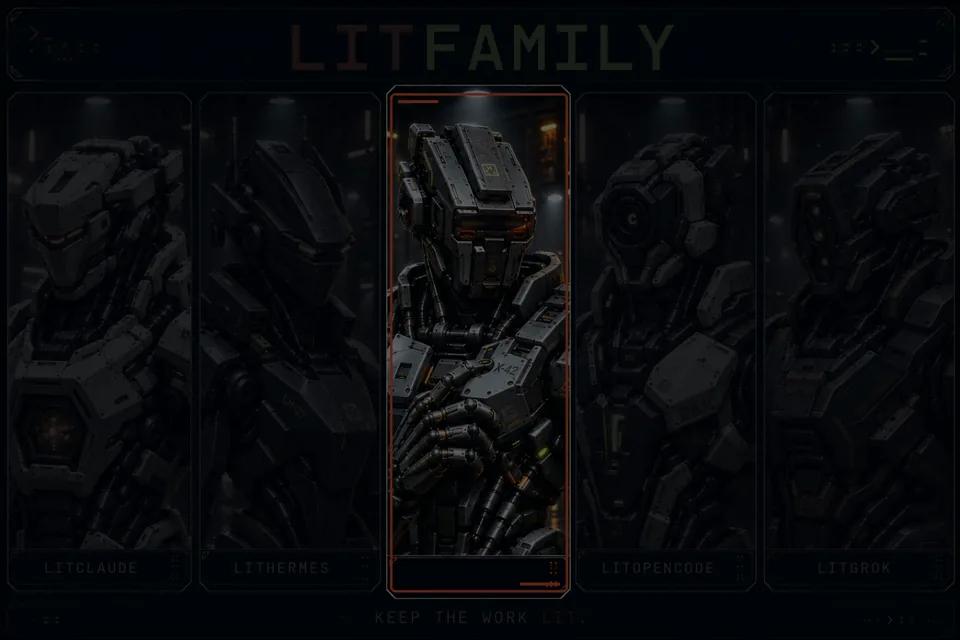</picture></p>

<p align="center">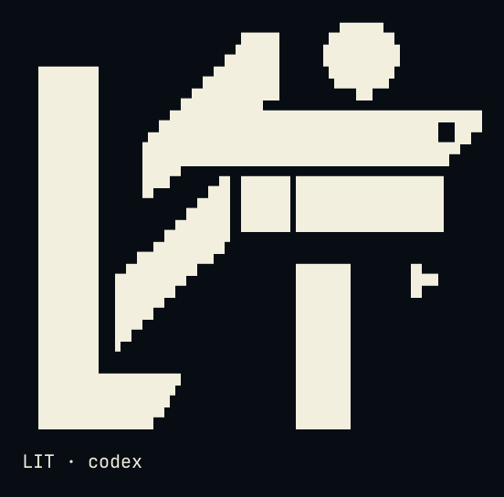</p>

<details>
<summary>Copy ASCII logo</summary>

```
                             ▄▄▄▄
                   ▗███▌   ▗██████▖
 ▗▄▄▄▄▄          ▗▟████▌   ▝██████▘
 ▐█████        ▗▟██████▌    ▝▀▜█▀▘
 ▐█████      ▗▟███████▄▄▄▄▄▄▄▄▄▄▄▄▄▄▄▄▄▄▄▄
 ▐█████    ▗▟█████████████████████████ ▐█▀
 ▐█████    ████████████████████████████▀
 ▐█████    ██▛▘   ▄ ▄▄▄▄▖▄▄▄▄▄▄▄▄▄▄▄▄▄▖
 ▐█████    ▀    ▄██ ████▌█████████████▌
 ▐█████       ▄████ ████▌█████████████▌
 ▐█████     ▄█████▛
 ▐█████  ▗▟█████▀▘       ▄▄▄▄▄     ▗▖
 ▐█████ ▐█████▀          █████     ▐▛▀
 ▐█████ ▐███▀            █████
 ▐█████ ▐█▀              █████
 ▐█████ ▝                █████
 ▐█████▄▄▄▄▄▄▄▖          █████
 ▐███████████▛           █████
 ▐██████████▀            █████

LIT · codex
```

</details>

<p align="center"></p>
<p align="center"></p>

<p align="center">
<a href="#install"></a>
<a href="./LICENSE"></a>
</p>

<p align="center">
<a href="./docs/usage.md"> Docs</a> &nbsp; <a href="#install">Install</a> &nbsp; <a href="./docs/assets/readme/ignition-film.mp4"> Ignition</a> &nbsp; <a href="./LICENSE"> MIT</a>
</p>

# LitCodex

**Keep the work lit.**

[한국어](./README-Ko-KR.md) · [Install](#install) · [Quick start](#activate-lit) · [Key features](#key-features) · [Skills](#skills-at-a-glance) · [Commands](#commands) · [Troubleshooting](#troubleshooting) · [Links](#links)

## What is LitCodex

LitCodex adds planning, review, research, and a durable execution loop to Codex CLI.

## Install

> Install `@litfamily/litcodex@1.0.7` with the scoped command below. See [migration guidance](./docs/npm-migration.md).

With **Node.js 22+** and **Codex CLI** installed, run:

```sh
npm exec --yes --package @litfamily/litcodex@1.0.7 -- litcodex install
```

The installer registers the plugin, hooks, and agents, then updates managed keys in `~/.codex/config.toml`.
It asks for the lead model, helper model, and output style. Codex authentication and model access are required
when you run model work; installation itself does not require GitHub credentials.

Fresh installs default to `gpt-6-astra` at `xhigh` for the lead route and `gpt-6-luna` at `max` for ordinary helpers. The installer also accepts supported model and effort choices.

Preview changes with `npm exec --yes --package @litfamily/litcodex@1.0.7 -- litcodex --dry-run install`. For unattended setup, use
`npm exec --yes --package @litfamily/litcodex@1.0.7 -- litcodex install --yes`. An explicit `--style <id>` still applies.

For a persistent command:

```sh
npm install -g @litfamily/litcodex
litcodex install
```

> Without a global install, use `npm exec --yes --package @litfamily/litcodex@1.0.7 -- litcodex <command>`, such as `npm exec --yes --package @litfamily/litcodex@1.0.7 -- litcodex doctor`.

For an isolated trial apart from existing settings, follow the [isolated trial guide](./docs/npm-migration.md#isolated-local-trial).
Changing only `CODEX_HOME` can still discover settings in your existing home.

Windows supports the installer and CLI shims. Descriptor-dependent Python routes require POSIX and fail
closed on Windows with `BLOCKED_UNSUPPORTED_PYTHON_POSIX_RUNTIME`. See [platform and prompt policy](./docs/usage.md#install).

## Activate lit

Open Codex in your project, approve the LitCodex hooks in startup review, and type:

```text
lit add input validation to the signup form
```

A bare `lit` selects `<lit-loop-mode>`. The hook emits the same plain-text, five-row activation mark
through `UserPromptSubmit`'s `systemMessage` regardless of terminal color settings. The reply begins with
`🔥 **LIT IGNITED · <discipline>** 🔥`. `split`, `literal`, and `litmus` stay inert.
Code spans and fences are ignored; slash-command-style mentions are ignored except the explicit `/litresearch` research route.

The exact bare `lit-scientific-visualization` hook route selects
`<lit-scientific-visualization-mode>`; it does not install Python dependencies. Both this and
exact bare `handoff` are exact-only routes.

### Make one small thing

Start in an empty project with a task you can inspect:

```text
lit build a single-file HTML task list in this folder. Do not install dependencies.
Check adding and completing a task, and record anything you could not verify.
```

Look for the result, the checks actually performed, and the unfinished work. A status mark confirms
routing; it does not prove the page works. Ask for `lit recap` to read the recorded state. Before
leaving the session, send exact bare `handoff` as its own message. In the next session, ask Codex
to read that packet and the project goals before continuing.

| Step | What stays with the work |
| --- | --- |
| Plan | A goal with checks that can pass or fail |
| Make | A small result you can inspect |
| Verify | Evidence for each completed criterion; blockers stay open |
| Hand off | Decisions, remaining work, and where to resume |

Native Codex goals and the local loop ledger have separate boundaries. A paused or blocked native
goal needs the documented recovery step below; a handoff does not silently resume it.

## Key features

**You have been handed a spark.<br>
Bring it to the work you want to finish.**

A bug to fix. A screen to build. A project to finish.

Starting takes a sentence. Picking up where you left off takes more: the decisions you made,
the checks you ran, and the next thing to try.

**LIT keeps that spark with your project.** Goals, plans, checked results, and next steps stay in
local records that a later session can read. An enduring spark means work you can return to;
it is not a promise that an agent runs forever.

**Where one conversation ends, the next stretch of work can begin.**

Plan, execute, and verify work in Codex CLI. Type `lit` to keep goals, checks, and evidence with your project.

Its `UserPromptSubmit`
hook routes your request into the right discipline; the bundled library provides 40 skills. A goal is complete
only after every success criterion passes. The npm package is self-contained and installs without a GitHub clone.

Use `lit` to start a bounded task, `handoff` or `/lit-handoff` to carry checked work forward,
`lit-plan` to set criteria before editing, `lit start work <approved-plan>` to execute an approved
plan, `review-work` to inspect the change, and `litresearch` to record sources and uncertainty. Each
route keeps its expected effect in project-local records; no new slash route is introduced here.
Select `lit-humanizer` for English or Korean prose edits. Its pre-write hook blocks a small set of
high-confidence drafting patterns; softer matches stay advisory, and generated Office or PDF text is
checked after creation when the host can extract it.
Host limit: Codex CLI owns hook and agent execution, while authentication, model access, permissions,
and any visual check remain host capabilities. A route mark or static editorial image is not completion
evidence.

<p align="center"> </p>

### How it fits together

Codex hosts the plugin and runs its hooks. The hooks supply routing and context; skills guide the
agent's work. The loop CLI keeps project records and prints instructions for native goal tools.

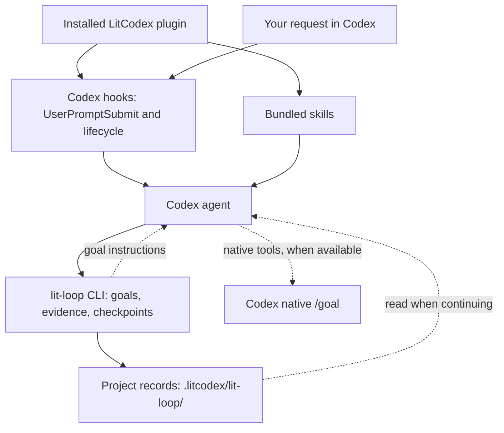

The dotted native-goal connection is an agent protocol: the package does not call native goal tools
itself. When those tools are unavailable, keep the local records and report that native goal sync
was unavailable. A paused or blocked goal needs the documented recovery step; reading a handoff
does not automatically resume it. [Runtime and state reference](./docs/usage.md).

## Skills at a glance

Each row is a skill you can start by name or route, with how to start it and what you get. The last row groups the checks that run on their own.

<table>
<tr><th>What it looks like</th><th>Skill</th><th>What you get</th></tr>
<tr>
<td>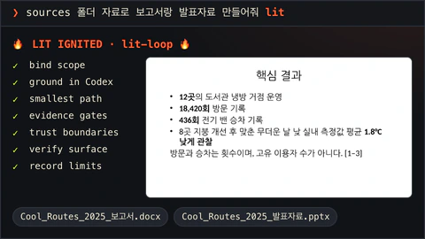</td>
<td><code>lit-loop</code><br /><sub><code>lit</code> · <code>$litcodex:lit-loop</code></sub></td>
<td>Add <code>lit</code> to a request. Codex binds the scope, works with evidence and records what it could not verify.</td>
</tr>
<tr>
<td>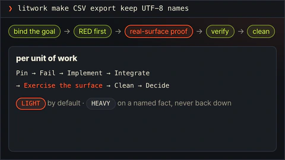</td>
<td><code>litwork</code><br /><sub><code>litwork</code> · <code>$litcodex:litwork</code></sub></td>
<td>Careful end-to-end build or fix: RED first, then proof on the real surface.</td>
</tr>
<tr>
<td>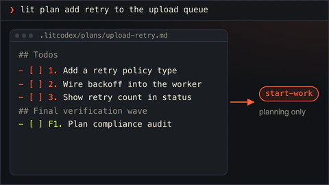</td>
<td><code>lit-plan</code><br /><sub><code>lit plan</code> · <code>$litcodex:lit-plan</code></sub></td>
<td>An approved plan in <code>.litcodex/plans/</code> with numbered rows. Planning only.</td>
</tr>
<tr>
<td>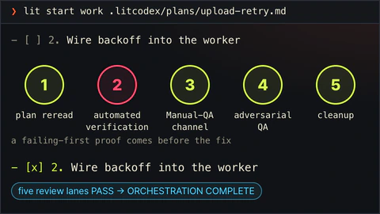</td>
<td>Start Work<br /><sub><code>lit start work &lt;approved-plan&gt;</code></sub></td>
<td>Runs an approved plan through five gates. All five review lanes must pass at the end.</td>
</tr>
<tr>
<td>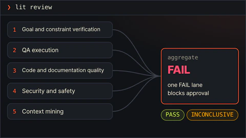</td>
<td><code>review-work</code><br /><sub><code>lit review</code> · <code>$litcodex:review-work</code></sub></td>
<td>Five blocking review lanes. One failing lane blocks approval.</td>
</tr>
<tr>
<td>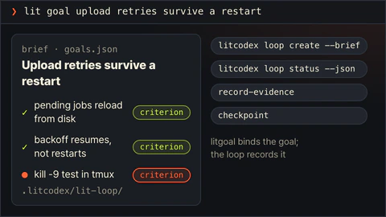</td>
<td><code>litgoal</code><br /><sub><code>lit goal</code> · <code>$litcodex:litgoal</code></sub></td>
<td>Binds one goal with observable criteria to the durable lit-loop.</td>
</tr>
<tr>
<td>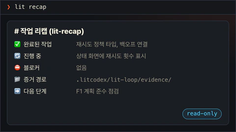</td>
<td><code>lit-recap</code><br /><sub><code>lit recap</code> · <code>$litcodex:lit-recap</code></sub></td>
<td>A read-only summary: done, in progress, blocked, where the evidence is, what comes next.</td>
</tr>
<tr>
<td>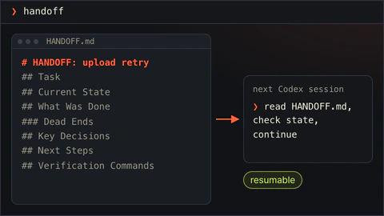</td>
<td><code>lit-handoff</code><br /><sub><code>handoff</code> · <code>/lit-handoff</code></sub></td>
<td>Type <code>handoff</code> to get a continuation file the next session can read and resume from.</td>
</tr>
<tr>
<td>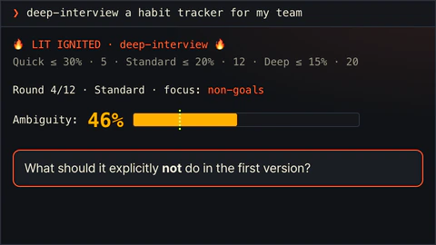</td>
<td><code>deep-interview</code><br /><sub><code>deep-interview</code> · <code>$litcodex:deep-interview</code></sub></td>
<td>One question at a time until the idea is clear enough to build. Quick, Standard and Deep set the target.</td>
</tr>
<tr>
<td>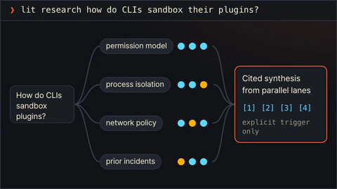</td>
<td><code>litresearch</code><br /><sub><code>lit research</code> · <code>$litcodex:litresearch</code></sub></td>
<td>Parallel evidence gathering and a cited synthesis, only when you ask for research.</td>
</tr>
<tr>
<td>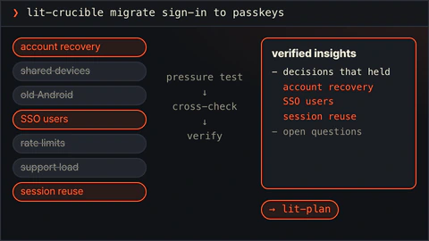</td>
<td><code>lit-crucible</code><br /><sub><code>lit-crucible</code> · <code>$litcodex:lit-crucible</code></sub></td>
<td>Pressure-tests a brief before planning. Only the risks that survive critique reach the plan.</td>
</tr>
<tr>
<td>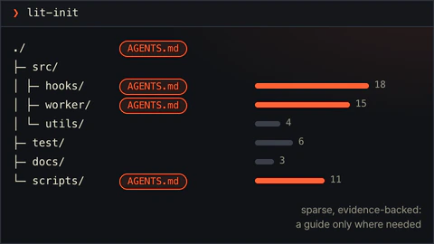</td>
<td><code>lit-init</code><br /><sub><code>lit-init</code> · <code>$litcodex:lit-init</code></sub></td>
<td>Sparse AGENTS.md guidance backed by what is in the repository.</td>
</tr>
<tr>
<td>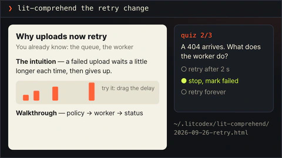</td>
<td><code>lit-comprehend</code><br /><sub><code>lit-comprehend</code> · <code>$litcodex:lit-comprehend</code></sub></td>
<td>An explainer page for agent-written work: intuition first, then the walkthrough, then a short quiz.</td>
</tr>
<tr>
<td>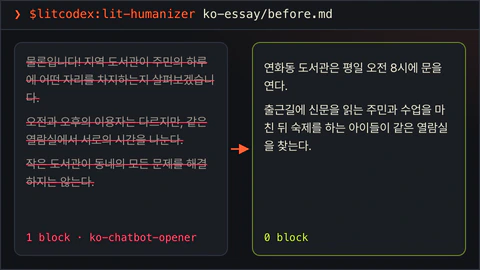</td>
<td><code>lit-humanizer</code><br /><sub><code>$litcodex:lit-humanizer</code></sub></td>
<td>Rewrites stiff model prose in English or Korean. Facts and hedges stay; filler goes.</td>
</tr>
<tr>
<td>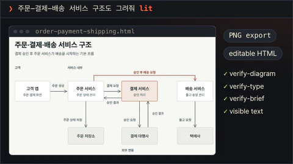</td>
<td><code>lit-diagram-drawer</code><br /><sub><code>$litcodex:lit-diagram-drawer</code></sub></td>
<td>A checked, editable diagram for slides and documents, with PNG and Office-safe SVG exports.</td>
</tr>
<tr>
<td>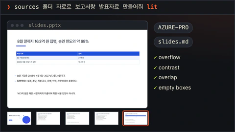</td>
<td><code>lit-pptx</code><br /><sub><code>$litcodex:lit-pptx</code></sub></td>
<td>Ask for slides with <code>lit</code> and get an editable PowerPoint deck with its Markdown source, AZURE-PRO and Pretendard by default. Layout QA runs on the file; rendered slides are inspected when LibreOffice is present.</td>
</tr>
<tr>
<td>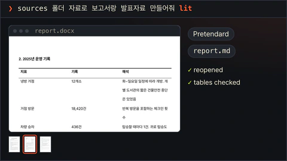</td>
<td><code>lit-docx</code><br /><sub><code>$litcodex:lit-docx</code></sub></td>
<td>Ask for a report with <code>lit</code> and get a styled Word file with its Markdown source; Korean text uses korean-generic. The file is reopened and linted, and pages are inspected when LibreOffice is present.</td>
</tr>
<tr>
<td>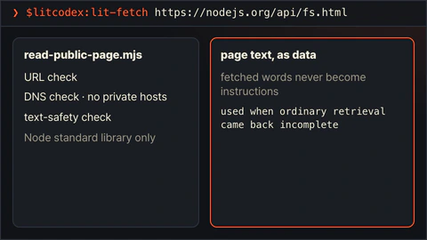</td>
<td><code>lit-fetch</code><br /><sub><code>$litcodex:lit-fetch</code></sub></td>
<td>Reads a public page with URL, DNS and text-safety checks when ordinary retrieval falls short.</td>
</tr>
<tr>
<td>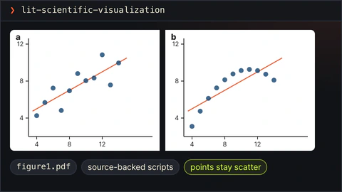</td>
<td><code>lit-scientific-visualization</code><br /><sub><code>lit-scientific-visualization</code> · <code>$litcodex:lit-scientific-visualization</code></sub></td>
<td>A journal-sized figure with vector and 600 DPI exports. The chart type follows the data.</td>
</tr>
<tr>
<td>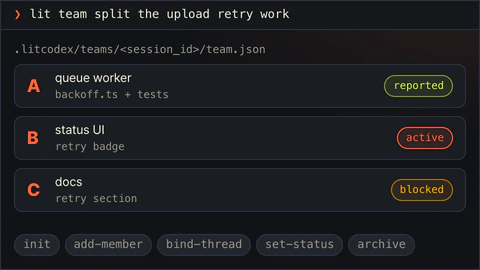</td>
<td><code>lit-team</code><br /><sub><code>lit team</code> · <code>$litcodex:lit-team</code></sub></td>
<td>Coordinates several workers with separate slices, each reporting back with evidence.</td>
</tr>
<tr>
<td>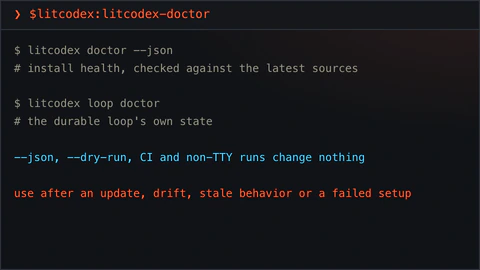</td>
<td><code>litcodex-doctor</code><br /><sub><code>$litcodex:litcodex-doctor</code></sub></td>
<td>Checks LitCodex and Codex install health after an update, drift or a failed setup.</td>
</tr>
<tr>
<td>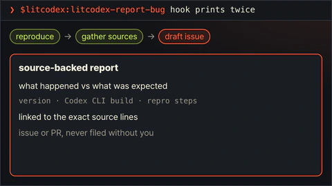</td>
<td><code>litcodex-report-bug</code><br /><sub><code>$litcodex:litcodex-report-bug</code></sub></td>
<td>Drafts a bug report for LitCodex or Codex, backed by sources.</td>
</tr>
<tr>
<td>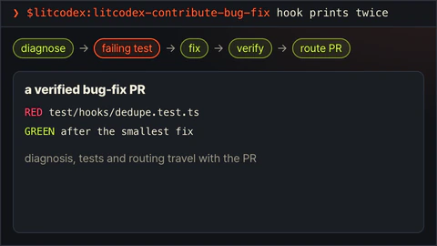</td>
<td><code>litcodex-contribute-bug-fix</code><br /><sub><code>$litcodex:litcodex-contribute-bug-fix</code></sub></td>
<td>Turns a diagnosed defect into a tested bug-fix PR.</td>
</tr>
<tr>
<td>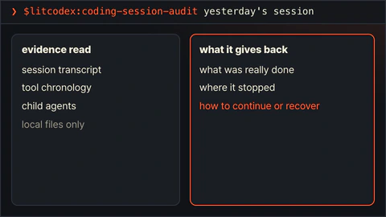</td>
<td><code>coding-session-audit</code><br /><sub><code>$litcodex:coding-session-audit</code></sub></td>
<td>Reads a past Codex session from its evidence and shows where it stopped.</td>
</tr>
<tr>
<td>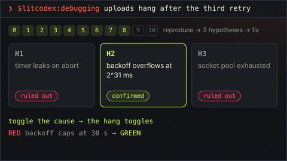</td>
<td><code>debugging</code><br /><sub><code>$litcodex:debugging</code></sub></td>
<td>Reproduces the bug, tests at least three explanations, and fixes only the confirmed cause.</td>
</tr>
<tr>
<td>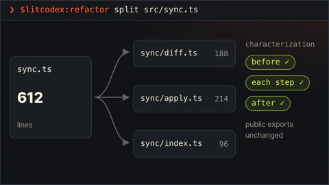</td>
<td><code>refactor</code><br /><sub><code>$litcodex:refactor</code></sub></td>
<td>Restructures code while tests pin its behavior before and after every step.</td>
</tr>
<tr>
<td>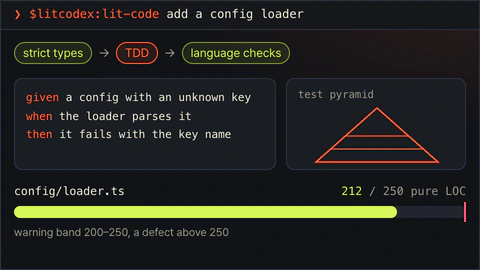</td>
<td><code>lit-code</code><br /><sub><code>$litcodex:lit-code</code></sub></td>
<td>Strict implementation rules: tests first, typed boundaries, small files.</td>
</tr>
<tr>
<td>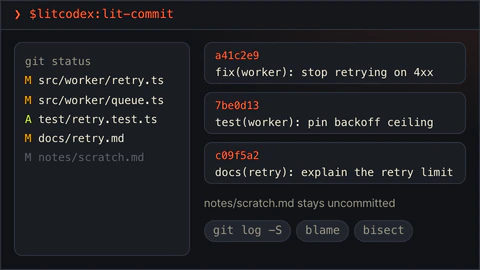</td>
<td><code>lit-commit</code><br /><sub><code>$litcodex:lit-commit</code></sub></td>
<td>Splits your changes into atomic commits in the repo's own style and leaves unrelated work alone.</td>
</tr>
<tr>
<td>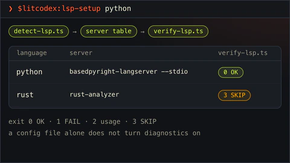</td>
<td><code>lsp-setup</code><br /><sub><code>$litcodex:lsp-setup</code></sub></td>
<td>Checks language-server setup and runs a real diagnostics check on demand.</td>
</tr>
<tr>
<td>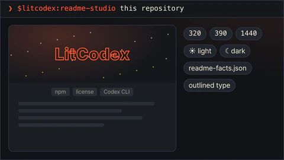</td>
<td><code>readme-studio</code><br /><sub><code>$litcodex:readme-studio</code></sub></td>
<td>A factual README with a moving cover, checked at phone and desktop widths in light and dark.</td>
</tr>
<tr>
<td>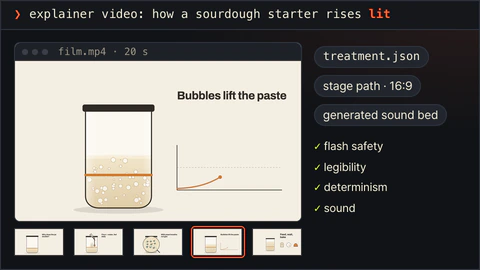</td>
<td><code>lit-typographic-motion</code><br /><sub><code>$litcodex:lit-typographic-motion</code></sub></td>
<td>Ask for a video with <code>lit</code>. A treatment comes first, then an authored stage page or the type engine, a sound bed, and look rounds on the rendered stills.</td>
</tr>
<tr>
<td>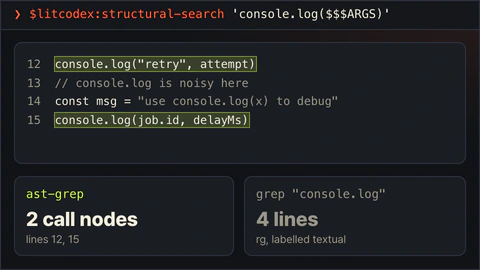</td>
<td><code>structural-search</code><br /><sub><code>$litcodex:structural-search</code></sub></td>
<td>Finds code by its syntax shape, not its text, and previews rewrites before applying them.</td>
</tr>
<tr>
<td>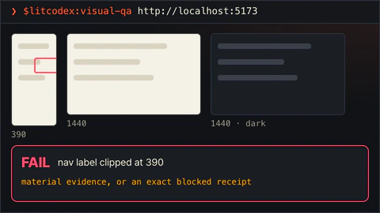</td>
<td><code>visual-qa</code><br /><sub><code>$litcodex:visual-qa</code></sub></td>
<td>Checks a real screen at each viewport and returns an honest verdict, or names exactly what blocked it.</td>
</tr>
<tr>
<td>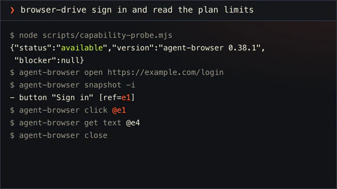</td>
<td><code>browser-drive</code><br /><sub><code>browser-drive</code> · <code>$litcodex:browser-drive</code></sub></td>
<td>Drives a real page after verifying the browser driver. If there is none, it says so.</td>
</tr>
<tr>
<td>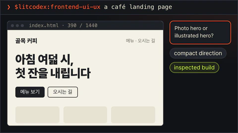</td>
<td><code>frontend-ui-ux</code><br /><sub><code>$litcodex:frontend-ui-ux</code></sub></td>
<td>Builds a working interface, then a measured probe renders it in seven views: four widths, dark, reduced motion and 200% zoom.</td>
</tr>
<tr>
<td>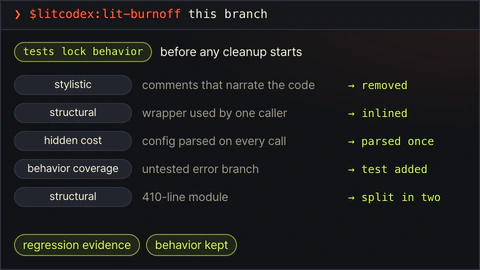</td>
<td><code>lit-burnoff</code><br /><sub><code>$litcodex:lit-burnoff</code></sub></td>
<td>Cleans AI-written bloat out of a change set after tests lock what it does.</td>
</tr>
<tr>
<td>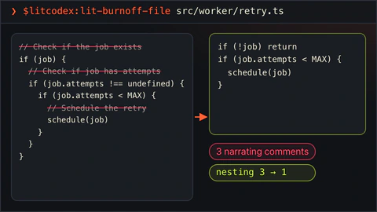</td>
<td><code>lit-burnoff-file</code><br /><sub><code>$litcodex:lit-burnoff-file</code></sub></td>
<td>The same cleanup for one file: fewer narrating comments, less defensive noise, flatter code.</td>
</tr>
<tr>
<td>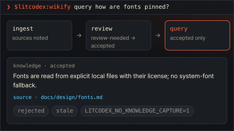</td>
<td><code>wikify</code><br /><sub><code>$litcodex:wikify</code></sub></td>
<td>Keeps reviewed project knowledge on disk and answers later questions from it, with sources.</td>
</tr>
<tr>
<td>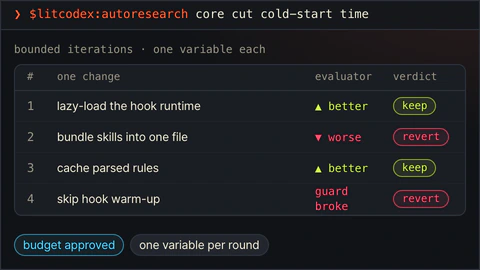</td>
<td><code>autoresearch</code><br /><sub><code>$litcodex:autoresearch</code></sub></td>
<td>An approved, budgeted experiment loop. Each round changes one thing and keeps or reverts it.</td>
</tr>
<tr>
<td>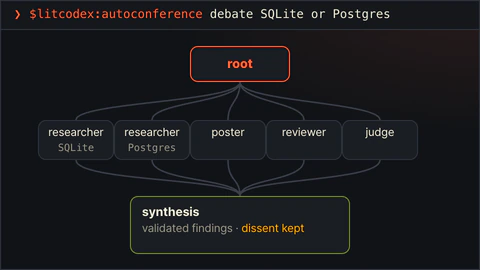</td>
<td><code>autoconference</code><br /><sub><code>$litcodex:autoconference</code></sub></td>
<td>A budgeted research conference: separate researchers, reviewers, and a synthesis that keeps disagreement.</td>
</tr>
<tr>
<td>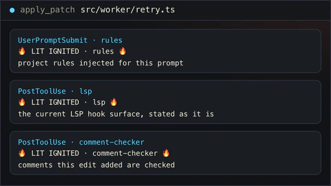</td>
<td><code>rules</code> · <code>lsp</code> · <code>comment-checker</code><br /><sub>runs on its own</sub></td>
<td>Runs on its own: project rules on each prompt, LSP and comment checks after edits.</td>
</tr>
</table>

## A/B: plain Codex vs lit

Each prompt below is one casual Korean line. The baseline got the line as typed; the lit arm got the same line with ` lit` added and nothing else. Both arms ran Codex CLI 0.157.1 with `gpt-6-sol` at high effort on 2026-09-26, one trial per arm, each in its own disposable home. The lit arm used a local pre-release build of LitCodex, not a published version. Where LitCodex was fixed and run again, the table compares the latest lit run with the same baseline. A blind judge (Claude Opus 5.5) compared each pair in both orders. The maintainer then looked at both outputs side by side and made the final call; the judge's verdict is kept next to it for reference.

S3 and S4 were run again in a later interface round, together with S11. S5 was run again in an office round, together with S8 and S9; there the lit arm used `lit-pptx` and `lit-docx`.

| Task | Prompt | Final verdict | Blind judge (same round) |
| --- | --- | --- | --- |
| S1 terminal to-do CLI | `터미널에서 쓰는 할 일 관리 CLI 만들어줘` | **Baseline won** | Baseline won |
| S2 API server bugs | `이 API 서버 가끔 이상하게 동작하는데 고쳐줘` | **Tie** | Baseline won |
| S3 budget dashboard | `개인 가계부 대시보드 웹페이지 만들어줘` | **LitCodex won** | Baseline won |
| S4 café landing page | `동네 카페 브랜드 랜딩페이지 만들어줘` | **LitCodex won** | Tie |
| S5 report and slides from sources | `sources 폴더 자료로 보고서랑 발표자료 만들어줘` | **LitCodex won** | Tie |
| S6 Node 22 to 24 research | `Node 22에서 24로 올릴 때 달라지는 거 조사해줘` | **LitCodex won** | LitCodex won |
| S7 order, payment and shipping diagram | `주문-결제-배송 서비스 구조도 그려줘` | **LitCodex won** (blind judge; not reviewed by eye) | LitCodex won |
| S8 quarterly results deck | `분기 실적 발표자료 만들어줘` | **LitCodex won** | Baseline won |
| S9 new product plan | `신제품 기획서 써줘` | **LitCodex won** | LitCodex won |
| S11 meeting-room booking app | `회의실 예약 웹앱 만들어줘` | **LitCodex won** | Baseline won |
| Total | | **8 won, 1 tie, 1 lost** | 3 won, 2 ties, 5 lost |

The motion skill, `lit-typographic-motion`, was rebuilt after its first A/B and has no A/B result yet. The cover at the top was made with the LitFamily motion skill.

In the interface round the Codex sandbox blocked the browser, so the lit arm's interface probe could not measure its pages; neither arm checked its rendered screen. In the office round the renderer failed inside the sandbox, so the lit arm never saw previews of its slides and pages, and each reply said so. Looking at the office round as a whole, the maintainer found the LitCodex files much better suited to real work.

### What each side produced

- **S1, lost.** The baseline CLI can add, list, edit, complete, reopen and delete items, with checked due dates. The LitCodex CLI had fewer commands (no editing, no due dates), claimed Python 3.10 support while importing a 3.11-only API, and its own tests did not pass in the checker. The blind judge also preferred the baseline over the two earlier LitCodex runs, and the maintainer called it a clear loss.
- **S2, tie.** Both sides fixed all six seeded bugs, with no failing visible tests. The judge leaned to the baseline because its reply mentioned that creating an item now returns 201 instead of 200, which the LitCodex reply left out. The maintainer called it a tie.
- **S3, won.** The LitCodex dashboard shows monthly income, spending and the budget, and lets you add, delete and search transactions and change the budget. The judge preferred the baseline's richer analysis: an income and expense line chart, a category donut and budgets per category. The maintainer preferred the LitCodex page.
- **S4, won.** The judge called it a tie: the baseline's shop-front photos and menu felt more finished, while the LitCodex page showed mock-up labels to visitors because the prompt gave no address or hours. The checker found no clipped text on the LitCodex page (9 items on the baseline) but more accessibility findings (38 against 29).
- **S5, won.** LitCodex made a Word report and a 7-slide deck, each with an editable Markdown source. The judge called it a tie: the baseline report was better built (a data-period box, an interpretation column and numbered citations), while the LitCodex slides looked more polished. The checker counted 12 of 12 facts right for the baseline and 11 of 12 for LitCodex, none wrong on either side, and 5 invented-number flags against 14.
- **S6, won.** LitCodex correctly lists `dirent.path` as removed, where the baseline called it only deprecated, and notes that `require(esm)` and type stripping already exist in Node 22. The checker found 3 of 10 expected facts against 2; 75% of LitCodex's links were official sources, against 100% for the baseline.
- **S7, won (blind judge; not reviewed by eye).** LitCodex saved a rendered PNG and an editable HTML diagram with labelled arrows and a payment-failure path. The baseline gave Mermaid code in its reply and no rendered file, although its architecture covered more services.
- **S8, won.** The prompt gave no figures. The baseline made a 10-slide fill-in template with blanks for every number, and the checker flagged 18 overflowing text boxes. LitCodex made an 8-slide deck for a fictional company with sample figures labelled as examples and 3 tables; the checker flagged one overflowing box and one overlap. The judge preferred the baseline's template.
- **S9, won.** The baseline answered in chat with a short plan and made no document. LitCodex wrote a 6-page Word plan with its Markdown source: decision gates, scope, schedule, risks and unit economics, with every figure marked as an assumption. The judge agreed, noting leftover checklist files, wrong numbering in one list and too many caveats.
- **S11, won.** The judge preferred the baseline: a weekly date strip and a room-by-time timeline with click-to-book, where the LitCodex app shows a large header and a room list with no view of existing bookings. LitCodex finds rooms by date, size and equipment, blocks overlapping bookings, includes unit tests and had 2 accessibility findings against 124.

### Pictures

**S3, budget dashboard (baseline left, LitCodex right).**

<p> 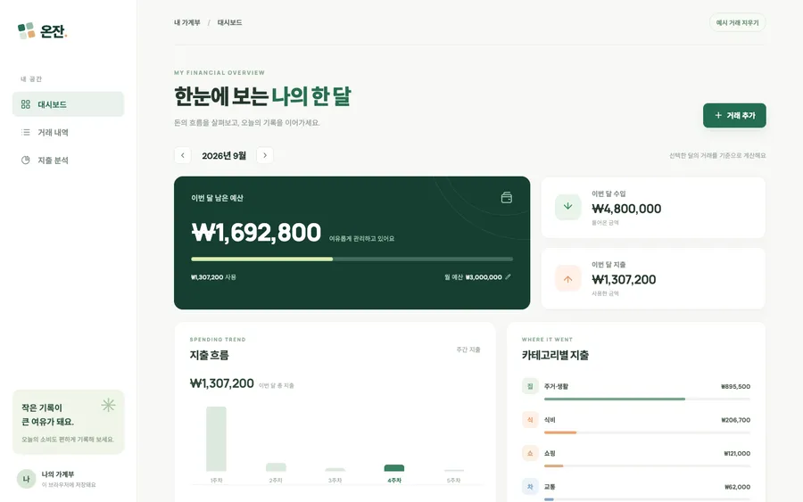</p>

<details><summary>S3 on a phone</summary>

<p> </p>

</details>

**S4, café landing page (baseline left, LitCodex right).**

<p>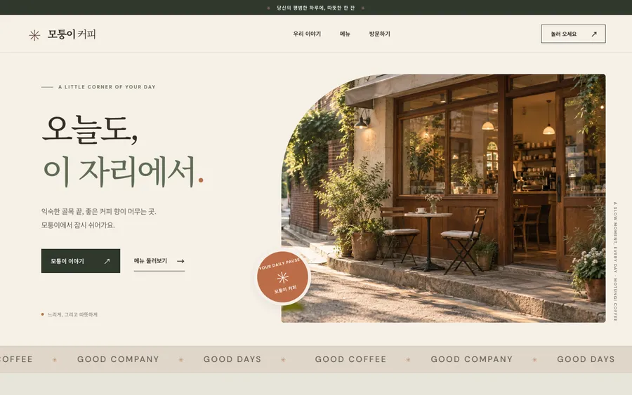 </p>

<details><summary>S4 on a phone</summary>

<p> 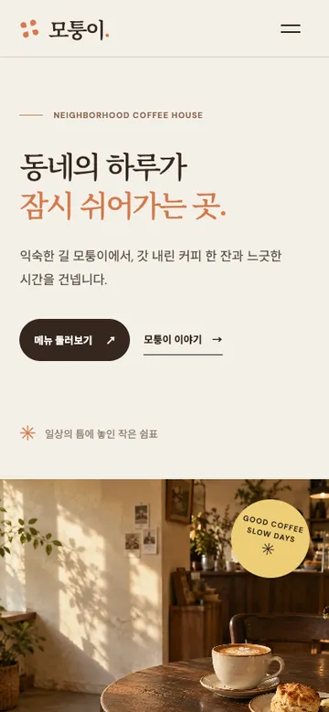</p>

</details>

**S5, first five slides (baseline above, LitCodex below).**

<p></p>
<p>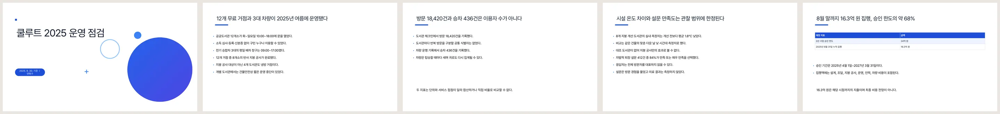</p>

**S7, the LitCodex diagram.** The baseline returned Mermaid code without a rendered file.

<p>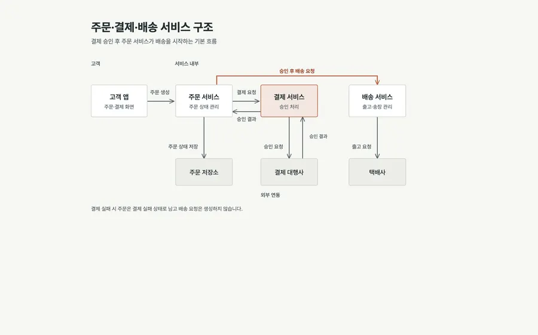</p>

**S8, first five slides (baseline above, LitCodex below).**

<p>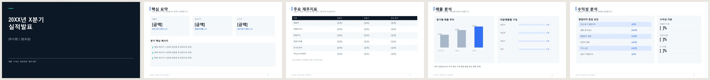</p>
<p></p>

**S9, first three pages of the LitCodex plan.** The baseline answered in chat and made no file.

<p></p>

**S11, meeting-room booking app (baseline left, LitCodex right).**

<p> </p>

<details><summary>S11 on a phone</summary>

<p> </p>

</details>

## Commands

### Start with one lit task

Append `lit` to a prompt to activate the Codex CLI hook. It routes the request into the durable loop; Codex still owns model execution.

| Prompt or route | Effect |
| --- | --- |
| `lit` | Start a bounded task with goals and checks in the project. |
| `handoff` or `/lit-handoff` | Carry the checked result and next step to another session. |
| `lit-plan` | Prepare a plan and success criteria before editing. |
| `lit start work <approved-plan>` | Execute an approved plan. |
| `review-work` | Review the change and its evidence. |
| `litresearch` | Record source-backed research and uncertainty. |

The hook is an entry signal; it does not prove that a model result or visual check completed.

<p align="center"><a href="./docs/assets/readme/ignition-film.mp4"></a></p>

Select the poster for the optional film; this README keeps motion opt-in.

### In the Codex composer

| Type this | Mode | What it does |
| --- | --- | --- |
| `lit` or `lit-loop` | **lit-loop** | Durable, evidence-checkpointed execution |
| `litwork` | **litwork** | Outcome-first work with manual-QA evidence |
| `lit-plan` or `lit plan` | **lit-plan** | Planning-only, bounded plan with evidence and a Final DoneClaim |
| `deep-interview` or `lit deep interview` | **deep-interview** | Planning-only discovery for ambiguous briefs |
| `litgoal` or `lit goal` | **litgoal** | Bind an objective and criteria into loop state |
| `lit-recap` or `lit recap` | **lit-recap** | Read-only recap from `.litcodex` ledgers |
| `lit-comprehend` or `comprehend` | **lit-comprehend** | Build a self-contained explainer outside the worktree |
| `review-work` or `lit review` | **review-work** | Read-only plan or completed-work review |
| `litresearch`, `/litresearch`, or `lit research` | **litresearch** | Research journal separating facts, hypotheses, sources, and uncertainty |
| `lit start work <plan-name>` | **Start Work** | Execute an approved plan with durable evidence |
| exact bare `handoff` | **lit-handoff** | Create or refresh a secret-safe continuation packet |
| exact bare `lit-scientific-visualization` | **lit-scientific-visualization** | Load the publication plotting adapter through the hook |

Typing the same mode again in one session is idempotent. Standalone skills can also be selected by exact ID
from the Codex picker or with a scoped mention, including `$litcodex:lit-handoff` and
`$litcodex:lit-scientific-visualization`, `$litcodex:lit-humanizer`, and `$litcodex:lit-fetch`.
For architecture, workflow, system, and conceptual diagrams, select `lit-diagram-drawer` from the Codex skill picker. For a diagram request with `lit`, the bounded workflow also directs Codex to load this skill. Product screens and measured-data plots stay on their dedicated skills.
For a Word report or proposal, select `lit-docx`; for presentation slides, select `lit-pptx`. A bounded `lit` request for either output loads the matching skill, and a request for both loads both. The skills keep editable Markdown beside the DOCX/PPTX. `litcodex install` prepares their pinned dependencies outside the Codex session; `litcodex office-runtime status` and `litcodex doctor` show readiness. If the install had no network, run `litcodex office-runtime install` later outside the sandbox. Optional LibreOffice, pandoc, and XeLaTeX capabilities are reported by the Office runner's doctor command.

### CLI commands

| Command | Purpose |
| --- | --- |
| `litcodex install` | Register the LitCodex plugin and hook |
| `litcodex doctor` | Diagnose installation, loop state, host capabilities, and effective config |
| `litcodex uninstall` | Remove the plugin and LitCodex-managed config |
| `litcodex config migrate` | Preview or apply managed Codex config keys |
| `litcodex hook user-prompt-submit` | Run the host hook entrypoint |
| `litcodex loop create` | Derive goals and criteria from a brief |
| `litcodex loop status --json` | Inspect loop state as JSON |
| `litcodex loop run` | Select the next runnable goal |
| `litcodex loop record-evidence` | Record a criterion pass, fail, or blocked result |
| `litcodex loop checkpoint` | Complete a goal only when every criterion passes |
| `litcodex loop doctor` | Diagnose or recover loop state |

Use the Codex skill picker for the full library. Previous leading skill names redirect for one release;
see [rename compatibility](./docs/usage.md#skill-rename-compatibility) and [CHANGELOG.md](./CHANGELOG.md).

## Loop state

Project state stays under `.litcodex/lit-loop/`: `brief.md`, `goals.json`, `ledger.jsonl`, and `evidence/`.
Writes are atomic; a damaged goals file is preserved as `.bak`. Local state is excluded from Git and packages.
See [state and recovery](./docs/usage.md#loop-state).

## Verify it worked

```sh
npm exec --yes --package @litfamily/litcodex@1.0.7 -- litcodex doctor
```

`litcodex doctor` checks registration, hooks, config, and host capabilities. `litcodex loop doctor` checks
project loop state. A successful installation check does not prove authenticated model or child execution.

## Safety

- Plans and evidence stay reviewable. No criterion is marked complete merely because a test command ran.
- Installation preserves unrelated Codex settings. Preview changes before `--reconfigure`.
- The doctor diagnostic core never modifies Codex config, install state, or plugin state. An eligible interactive
  doctor may show a cached advisory notice. Its detached worker performs a fixed registry refresh at
  `~/.litcodex/update-check.json`; that worker never installs packages.
  A separate foreground updater can install a newer global package after eligible interactive management commands.
  Set `LITCODEX_NO_UPDATE_CHECK=1` to disable both update paths. Failed, `--json`, `--dry-run`, non-TTY, CI,
  and opt-out doctor paths stay side-effect-free. See [privacy](./docs/privacy.md).
- Model routes are configuration choices, not guarantees of access or execution. See [managed model compatibility](./docs/usage.md#safety).

## Jev skill hint (optional)

LitCodex can ask Jev, a hosted model from TypeSafe (typesafe.ai), which bundled LitCodex skill fits a plain
prompt. When Jev picks one with enough confidence, the `UserPromptSubmit` hook adds one advisory line naming
that skill to the turn's context. Codex still decides whether to load it. The hint never grants a permission
or runs a tool.

It is off by default. To turn it on, set both variables in the environment Codex runs in, then restart Codex:

```sh
export LITCODEX_JEV=1
export TYPESAFE_API_KEY=<your own TypeSafe key>
```

- **Enabling it sends each eligible prompt to TypeSafe (typesafe.ai).** The text is truncated to 2,000
  characters, and home paths, email addresses and token-shaped strings are redacted first. Nothing else from
  the session is sent: no files, tool output or history. Slash commands, `$skill` mentions and prompts that
  already start a lit route are not sent.
- Anything in the prompt without a token shape is sent as written: hostnames, customer names, or passwords
  that are not written as `password=…`, for example.
- Because `TYPESAFE_API_KEY` is exported in the shell that starts Codex, Codex's own tools can read it too.
  Use a key dedicated to this feature, with low spend limits.
- TypeSafe bills your key, at about $0.04 per million input tokens. Each request carries the prompt and the
  skill list. A session makes at most 200 requests (`LITCODEX_JEV_MAX_CALLS`).
- The hint itself goes only to the model. To see it, also set `LITCODEX_JEV_SHOW=1`: a turn that got a hint
  then shows one line in the Codex transcript, such as `Jev → lit-humanizer (0.37s)`.
- While it is on, the first prompt of each session that does not start a lit route shows `✦ Jev skill hint ON`
  once, so you can tell it is enabled.
- Each request waits at most 1.5 seconds. After a timeout or any other failure the turn continues without a
  hint, and one short note appears once per session.
- `litcodex doctor` shows `Jev skill hint: off`, `on`, or `flag on but TYPESAFE_API_KEY missing`.
- To turn it off, unset `LITCODEX_JEV` (any value other than `1` also turns it off) and restart Codex.
  See [privacy](./docs/privacy.md#optional-jev-skill-hint).

## Troubleshooting

- **Pane closes before any output:** the failing stage is unknown. In an already-open terminal, run help,
  install, and doctor separately and retain each exit status. Follow the [staged trial](./docs/npm-migration.md#isolated-local-trial),
  then launch the host yourself.
- No activation: run `litcodex doctor` and check hook approval in Codex.
- Command missing: use the npx form above or check the npm global bin directory in `PATH`.
- Native goal paused or blocked: use `/goal resume`, confirm it is active, then retry
  `litcodex loop run --retry-failed`. Preserve the unfinished goal. [Recovery details](./docs/usage.md#troubleshooting).

## Uninstall

```sh
npm exec --yes --package @litfamily/litcodex@1.0.7 -- litcodex uninstall
```

`litcodex uninstall` removes the plugin and LitCodex-managed config while preserving unrelated settings.

## License

MIT

## Links

### Documentation

- [Usage reference](./docs/usage.md) — complete routes, model configuration, platform limits, and recovery.
- [LitCodex contract](./docs/spec/litcodex-contract.md) — hooks, native goal boundaries, and evidence requirements.
- [Reference analysis](./docs/reference-analysis.md) — design and compatibility decisions.
- [Release provenance](./docs/release/provenance.md), [publish checklist](./docs/release/publish-checklist.md), and [CHANGELOG.md](./CHANGELOG.md).

The bundled skill library also includes `autoconference`, `autoresearch`, `browser-drive`, `coding-session-audit`,
`comment-checker`, `debugging`, `frontend-ui-ux`, `lit-commit`, `lit-crucible`, `lit-init`, `lit-humanizer`, `lit-fetch`, `lit-docx`, `lit-pptx`,
`litcodex-contribute-bug-fix`, `litcodex-doctor`, `litcodex-report-bug`, `lsp`, `lsp-setup`, `lit-code`, `refactor`,
`lit-burnoff`, `readme-studio`, `structural-search`, `lit-team`, `visual-qa`, and `wikify`.

Tests, fixtures, test helpers, and Vitest configuration remain tracked repository coverage and are excluded from npm and installed marketplace payloads.

[Contributing](./CONTRIBUTING.md) · [Security](./SECURITY.md) · [Code of conduct](./CODE_OF_CONDUCT.md) · [Support](./SUPPORT.md) · [Privacy](./docs/privacy.md)

### LITFAMILY


Five armored machines, one for each product in the LIT family.

### Ignition motion

Select the poster to watch the 10-second film.

<p align="center"><a href="./docs/assets/readme/ignition-film.mp4"></a></p>

[Animated GIF](./docs/assets/readme/ignition-readme.gif) · [Media and icon credits](./docs/assets/readme/README.md)
