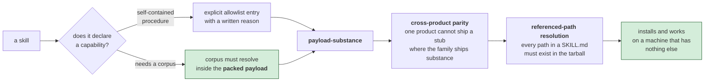

# LitCodex 사용 참고서

[빠른 시작](../README-Ko-KR.md) · [English](./usage.md)

LitCodex의 작업은 계획에서 검증된 인수인계까지 이 경로를 따릅니다. 각 항목은 이진 확인 방법이 있어야 승인되고, 실제 표면의 산출물과 정리 증거가 남기 전에는 슬라이스를 완료로 보지 않습니다. 테스트 통과만으로는 충분하지 않습니다.

```mermaid
flowchart TD
    R["a request<br/>make it better"] --> DI["<b>deep-interview</b><br/>turn it into a decision-complete brief"]
    DI --> P["<b>lit-plan</b><br/>objective · non-goals<br/>action / output / <b>binary verification</b>"]
    P --> GATE{"user approves?"}
    GATE -->|no| P
    GATE -->|yes| SW["<b>start&#45;work</b><br/>execute one slice"]

    subgraph LOOP["each slice: RED to GREEN to SURFACE to CLEAN"]
        SW --> RED["failing test first"]
        RED --> GREEN["smallest change that passes"]
        GREEN --> SURF["exercise the <b>real surface</b><br/>not just the test"]
        SURF --> CLEAN["tear down · cleanup receipt"]
    end

    CLEAN --> EV{"evidence complete?"}
    EV -->|"tests only"| SW
    EV -->|"artifact + receipt"| RW["<b>review-work</b><br/>scope · evidence · payload<br/>security · real surface"]
    RW -->|findings| SW
    RW -->|clean| HO["<b>lit-handoff</b><br/>resumable packet"]

    style GATE fill:#fff3cd,stroke:#856404
    style EV fill:#fff3cd,stroke:#856404
    style SURF fill:#d4edda,stroke:#155724
    style RW fill:#d1ecf1,stroke:#0c5460
```



## LitCodex란

LitCodex는 `UserPromptSubmit` 훅을 설치합니다. Codex 작성창에 단독 경계 토큰 `lit`을 입력하면
`<lit-loop-mode>`가 주입되고 **lit-loop**가 시작됩니다. 목표, 성공 기준, 증거는 프로젝트의
`.litcodex/lit-loop`에 기록되며, 모든 기준에 증거가 있어야 완료됩니다.

Codex의 훅과 마켓플레이스가 컴파일된 LitCodex 구성요소와 모델 정책을 거쳐 내구성 원장으로 이어지는 실제 연결입니다. 설치된 카탈로그에는 42개 스킬이 함께 제공됩니다.

```mermaid
flowchart LR
    subgraph CX["Codex CLI"]
        HK["hooks"]; MP["marketplace"]
    end
    subgraph LX["LitCodex plugin"]
        COMP["compiled components<br/>lit-loop · rules · lsp<br/>start&#45;work&#45;continuation"]
        MODEL["model policy<br/>lead vs subagent split"]
        LEDGER[("durable ledger")]
    end
    HK --> COMP --> LEDGER
    MP --> LX
    COMP --> MODEL
    LX --> S["42 skills"]
```



계획, 검토, 연구, 리캡, 이해, 인수인계, 로컬 지식 기능도 함께 제공합니다. Codex skill picker에서
`autoconference`, `autoresearch`, `browser-drive`, `coding-session-audit`, `comment-checker`, `debugging`,
`frontend-ui-ux`, `lit-commit`, `lit-crucible`, `lit-init`, `lit-korean`, `lit-fetch`, `litcodex-doctor`, `litcodex-report-bug`, `lsp`,
`lsp-setup`, `lit-code`, `refactor`, `lit-burnoff`, `structural-search`, `lit-team`,
`visual-qa`, `wikify`를 선택할 수 있습니다. 저장소 초기 조사를 위한 `lit-init`도 번들 카탈로그에 포함됩니다.

릴리스 이력은 [CHANGELOG.md](../CHANGELOG.md)에서 관리합니다. 설치기는 npm 패키지에 포함된
마켓플레이스 페이로드를 `~/.codex/marketplaces/litcodex`에 배치합니다. 테스트, 픽스처, 테스트 헬퍼 및 Vitest 설정은 추적되는 저장소 검증 자산으로 유지되며 npm 및 설치된 마켓플레이스 페이로드에서는 제외됩니다.

저장소에 파일이 있다는 사실만으로는 충분하지 않습니다. 패키징된 페이로드 안에서 절차와 코퍼스, 참조 경로가 모두 확인되어야 새 머신에서도 스킬이 실행됩니다.

보고서·기획서·워드 출력에는 `lit-docx`, 발표자료·슬라이드 출력에는 `lit-pptx`를 사용합니다. 범위가 정해진 `lit` 요청은 해당 스킬을 읽고, 두 형식을 함께 요청하면 둘 다 읽습니다. 명시적 스킬 선택도 가능합니다. `litcodex install`이 Codex 세션 밖에서 고정된 의존성을 준비합니다. `litcodex office-runtime status` 또는 `litcodex doctor`로 상태를 확인하고, 오프라인 설치였다면 나중에 샌드박스 밖에서 `litcodex office-runtime install`을 실행합니다.



### 스킬 이름 전환

스킬 선택기에는 새 `lit-*` ID만 표시됩니다. `lit-burnoff-file`은 한 파일의 코드 정리에 사용합니다.
명시적으로 문장 앞에 입력한 스킬 이름은 설치된 본문을 불러옵니다. 이전 이름과 scoped mention은
한 릴리스 동안 새 이름으로 연결되며 안내 한 줄을 표시하고, 다음 minor에서 제거됩니다.
[변경 목록](../CHANGELOG.md#unreleased)에 전체 이름 대응표가 있습니다. 이 스킬에는 slash 명령 파일이
없으므로 UserPromptSubmit에서 호환 경로를 처리합니다. 코드 구간과 일반 설명 문장은 실행하지 않습니다.
설치와 업데이트는 manifest와 SHA-256 파일 트리를 비교해 관리되는 marketplace를 원자적으로 교체합니다.
버전이 같아도 이전 스킬 디렉터리는 제거되며, 관리 트리 밖의 사용자 스킬은 보존됩니다.


## 설치

> 로컬 후보 패키지의 공개 배포 여부는 아직 확인되지 않았습니다. 아래 npm 명령은 해당 패키지가 공개된 뒤에 사용하세요.
> 지금 체험할 때는 제공받은 로컬 tarball과 [격리된 체험 절차](./npm-migration.md#isolated-local-trial)를 사용합니다.
> `CODEX_HOME`만 바꿔도 기존 홈의 `.codex/config.toml`이 검색될 수 있습니다.

권장 설치는 다음 한 줄입니다.

```sh
npm exec --yes --package @litfamily/litcodex@1.0.13 -- litcodex install
```

이 명령은 플러그인과 마켓플레이스를 등록하고 `UserPromptSubmit` 훅을 연결하며 `~/.codex/config.toml`을
비파괴적으로 갱신합니다. 변경 계획만 보려면 다음을 먼저 실행하세요.

```sh
npm exec --yes --package @litfamily/litcodex@1.0.13 -- litcodex --dry-run install
```

전역 명령이 필요하면 전역 설치 후 플러그인을 등록합니다.

```sh
npm install -g @litfamily/litcodex
litcodex install
```

무인 설치는 `litcodex install --yes` 또는 `npm exec --yes --package @litfamily/litcodex@1.0.13 -- litcodex install --yes`로 실행합니다.
`--yes`, 빈 값도 포함한 `CI`, 비TTY 입출력, `--no-tui`, `--json`, `--dry-run`에서는 모델·스타일 선택과
확인 질문을 건너뜁니다. 명시한 `--style <id>`는 실제 설치에 적용됩니다. 빈 값도 포함한 `NO_COLOR`는
대화형 선택을 유지하면서 ANSI 이스케이프 없는 질문을 표시합니다. `TERM=dumb`과 UTF-8이 아닌 로케일에서도
일반 텍스트 출력을 사용하며 블록 로고 대신 `LIT` 텍스트 워드마크를 표시합니다.

새로 설치하면 기본 리드 경로는 `gpt-6-astra`와 `xhigh`이고 기본 helper 경로는 `gpt-6-luna`와 `max`입니다. 명시적으로 관리되는 `--reconfigure`는 선택한
경로를 적용하며 명시적인 모델 선택을 덮어쓰지 않습니다. 이는 제품이 선택하는 경로이지 호스트 메타데이터·사용
권한·모델 실행을 주장하는 것이 아닙니다. GPT-6 Astra와 Sol은
`low|medium|high|xhigh|max|ultra`를 지원하며 GPT-6 Luna에는 `ultra`가 없습니다. 기존 `sol|gpt-5.6|luna|terra`
별칭과 모델별 effort 범위도 유지됩니다.
권장 coding-lead 대안은 `gpt-6.1-sol`과 `xhigh`이며 `gpt-6-sol`과 GPT-5.6 Sol도 이전 세대 선택지로 계속 사용할 수 있습니다.
카탈로그에는 GPT-5.6 Sol, Terra, Luna의 지원 종료일이 등록되어 있지 않습니다.
`--model luna`는 `model = "gpt-5.6-luna"`를 작성하며 LitCodex는 `model_reasoning_effort = "max"`를 작성합니다.
이는 공식 Codex CLI/config 안내를 따르는 백엔드 호환성 완화 조치입니다. `gpt-5.6-sol`과 `gpt-5.6-terra`를
유효하지 않거나 지원 중단되었거나 지원되지 않는다고 표현하지 않습니다. 카탈로그에서 지원 종료 예정일이 등록된 모델은
`gpt-5.5`뿐이며, 날짜는 2026-10-14이고 업그레이드 권장 모델은 `gpt-5.6-sol`입니다. 세션마다 `-m gpt-5.5`를
반복해서 지정할 필요가 없습니다.

일반 설치와 업데이트는 이미 설정된 모델을 바꾸지 않습니다. 기존 안전 정책을 통과하는 공급자 지정 루트 모델을 그대로 보존합니다. Luna는 high 미만이면 기존과 동일하게 실패 종료합니다.
기존 명시적 Sol 표현은 일반 설치에서 보존됩니다. 한 번 검토한 `litcodex install --reconfigure`만 기존 루트를 선택한 별칭으로 바꾸고,
관련 없는 설정을 유지합니다. 새 설치와 명시적 관리 재구성에서는 `model_context_window`과 `model_auto_compact_token_limit`을
설정하지 않고 Codex 호스트 기본값을 따릅니다. 기존의 기본값처럼 보이는 사용자 루트와 유효한 역할 TOML도 일반 재설치에서 초기화하지 않습니다.

번들된 litwork 라우팅은 역할별로 고정합니다. `litcodex-plan`, `litcodex-momus`, `litcodex-litwork-reviewer`는
`gpt-6-astra`와 `xhigh`를 사용합니다. `litcodex-explorer`, `litcodex-librarian`, `litcodex-metis`는
`gpt-6-luna`와 `max`를 사용합니다. 설치기는 파일을 쓰기 전에 TOML 라우트를 검증합니다. 개발자 지시문은
여섯 named-role 모두에서 그대로 복사되며 지시문 안의 라우트처럼 보이는 텍스트는 데이터로만 처리합니다. 알 수 없거나
안전하지 않은 라우트와 기존 `gpt-5.6-luna` 및 `xhigh` 조합은 거부합니다.

일반 설치는 `model-catalog.json`에 있는 모든 canonical id와 alias(새 `gpt-6.1-sol`, `gpt-6-sol`, `gpt-6-luna` 및 선택 가능한
GPT-5.6 항목 포함), 모델별 `--effort` 범위를 사용합니다. `--subagent-model`과 대응하는 effort는 명시적 helper
경로를 고릅니다. 새 기본 helper는 리드가 Astra여도 GPT-6 Luna/max입니다. 네이티브 `[agents.default].config_file`은 자동 검색되는
`<CODEX_HOME>/agents/` 밖의 `<CODEX_HOME>/litcodex-default.toml` 모델 전용 generic 역할을 가리키며, 여섯 named-role은
`agents/` 아래에 남습니다. `--subagent-model gpt-6-astra --subagent-effort low`를 명시하면 그 generic 역할에 Astra/low를
선택할 수 있습니다. 직접 `litcodex config migrate --model` 파서도 같은 catalog id와 effort 범위를 사용합니다. 지원되지 않는 `default_subagent_model` 전역 키는 작성하지 않습니다. 영수증이나 doctor의
라우트 요약은 네이티브 JSONL child 영수증 없이는 child 실행을 주장하지 않습니다.

### 모델 카탈로그 갱신

허용된 모델 ID와 alias, 지원·설정 가능 effort 목록, 기본값, 역할 경로, legacy profile 매핑, 호스트 context probe 포함 여부,
설치 모델/effort 메뉴 행의 원본은
`packages/litcodex-ai/model-catalog.json`입니다. `packages/litcodex-ai/src/config-migration/catalog.ts`는
이 JSON을 검증하고 읽습니다. 라우트 정책의 profile 상수와 호스트 context probe 목록도 catalog에서 파생되며 별도의 모델 표를 두지 않습니다.
네이티브 Codex 역할 설정은 `plugins/litcodex/components/lit-loop/agents/`의 TOML로 배포되므로,
각 파일의 라우트 헤더는 JSON `roles`의 정적 미러입니다. 역할 기본값을 바꾸면 대응하는 TOML 헤더도 같은 catalog 경로로 맞춥니다.
JSON을 직접 수정한 뒤 `npm run build`와
`npm run test:vitest -- plugins/litcodex/components/lit-loop/test/gpt56-authored-roles.test.ts`를 실행해
모든 배포 TOML의 역할 목록과 model/effort 값을 검증합니다. 별도 카탈로그 생성 단계는 없습니다. 허용 ID·기본값·effort 범위·메뉴 행은
`packages/litcodex-ai/src/install/install-model-choice.test.ts`가 profile 매핑까지 확인하고, 이 문서 내용은
`node --test tools/readme.test.mjs`가 확인합니다. 번들 skill prose도 바꾸면
`npm run generate:skill-payload-hashes`로 hash를 다시 만들고
`npm run check:skill-payload-hashes`로 확인합니다.

## lit 활성화

Codex 작성창에 다음처럼 입력합니다.

```text
lit 회원가입 폼에 입력 검증을 추가해줘
```

훅은 경계 토큰과 문맥에 맞는 모드를 라우팅합니다. `split`, `literal`, `litmus`처럼 글자만 포함한
단어와 코드 스팬·코드 펜스 안의 입력은 발동하지 않습니다. 슬래시로 시작하는 일반적인 명령 형태도 무시하지만, 정확한 `/litresearch`만 예외로 연구 모드로 라우팅합니다.
정확히 단독으로 입력한 `handoff`와 정확히 단독으로 입력한 `lit-scientific-visualization`은 별도 라우트입니다.

### 작은 결과물 하나부터

빈 프로젝트에서 직접 확인할 수 있는 작업을 맡겨보세요.

```text
lit 현재 폴더에 HTML 파일 하나로 할 일 목록을 만들어줘. 외부 의존성은 설치하지 마.
할 일 추가와 완료 처리를 확인하고, 확인하지 못한 부분은 따로 남겨줘.
```

결과물, 실제로 확인한 내용, 남은 일을 살펴보세요. 상태 마크가 떴다는 사실만으로 화면이 정상
동작한다고 볼 수는 없습니다. `lit recap`으로 기록된 상태를 확인하고, 세션을 마치기 전에는
다른 문구 없이 `handoff`만 보내세요. 다음 세션에서는 그 인수인계 문서와 프로젝트 목표를
먼저 읽고 이어가도록 요청합니다.

| 단계 | 작업에 남기는 것 |
| --- | --- |
| 계획하기 | 통과 여부를 확인할 수 있는 목표와 기준 |
| 만들기 | 직접 살펴볼 수 있는 작은 결과물 |
| 확인하기 | 완료한 기준의 증거와 아직 해결하지 못한 문제 |
| 다음 작업에 건네기 | 결정한 내용, 남은 일, 다시 시작할 위치 |

Codex의 native goal과 로컬 루프 기록은 별도로 관리됩니다. paused 또는 blocked인 native goal은
아래 복구 절차를 따라야 합니다. 인수인계 문서를 작성했다고 자동으로 재개되지는 않습니다.

## lit 명령어 패밀리

| 입력 | 모드 | 동작 |
| --- | --- | --- |
| `lit` 또는 `lit-loop` | **lit-loop** | 증거 체크포인트가 있는 실행 루프 |
| `litwork` | **litwork** | 수동 QA 증거를 포함한 결과 중심 작업 |
| `lit-plan` 또는 `lit plan` | **lit-plan** | 범위가 제한된 계획과 검증 체크리스트 작성 |
| `deep-interview` 또는 `lit deep interview` | **deep-interview** | 모호한 요구를 질문으로 좁히는 계획 전용 탐색 |
| `litgoal` 또는 `lit goal` | **litgoal** | 목표와 기준을 루프 상태에 연결 |
| `lit-recap` 또는 `lit recap` | **lit-recap** | `.litcodex` 원장을 읽기 전용으로 요약 |
| `lit-comprehend` 또는 `comprehend` | **lit-comprehend** | 작업 트리 밖에 자체 완결형 설명 자료 생성 |
| `review-work` 또는 `lit review` | **review-work** | 계획 또는 완료 작업을 읽기 전용으로 검토 |
| `litresearch`, `/litresearch` 또는 `lit research` | **litresearch** | 사실·가설·출처·불확실성을 나누는 연구 저널 |
| `lit start work <plan-name>` | **Start Work** | 승인된 계획을 증거와 함께 실행 |
| 정확히 단독으로 입력한 `handoff` | **lit-handoff** | 비밀값을 보호하는 재개 패킷 생성 또는 갱신 |
| 정확히 단독으로 입력한 `lit-scientific-visualization` | **lit-scientific-visualization** | 훅을 통해 출판용 시각화 어댑터 로드 |

같은 모드를 한 세션에서 다시 입력해도 중복 실행하지 않습니다. 스킬은 Codex skill picker 또는
`$litcodex:lit-fetch`, `$litcodex:lit-korean` 같은 정확한 ID로 선택할 수 있습니다.

## 명령어

| 명령 | 동작 |
| --- | --- |
| `litcodex install` | LitCodex 플러그인과 훅 등록 |
| `litcodex doctor` | 설치, 호스트 설정, 루프 상태 진단 |
| `litcodex uninstall` | 플러그인과 관리 설정 제거 |
| `litcodex config migrate` | 관리되는 Codex 설정을 미리 보거나 적용 |
| `litcodex hook user-prompt-submit` | 호스트가 호출하는 훅 진입점 |
| `litcodex loop create` | 브리프에서 목표와 성공 기준 도출 |
| `litcodex loop status --json` | 루프 상태를 JSON으로 확인 |
| `litcodex loop run` | 다음 실행 가능한 목표 선택 |
| `litcodex loop record-evidence` | 기준별 통과·실패·차단 결과 기록 |
| `litcodex loop checkpoint` | 모든 기준 통과 시 목표 완료 처리 |
| `litcodex loop doctor` | 루프 상태 진단 또는 복구 |

전역 설치가 없다면 이후 명령도 `npm exec --yes --package @litfamily/litcodex@1.0.13 -- litcodex <command>` 형식으로 실행하세요. 예를 들어
`npm exec --yes --package @litfamily/litcodex@1.0.13 -- litcodex doctor`를 사용합니다.

## 자동 핸드오프

자동 핸드오프는 직접 켜야 동작합니다. 쉬운 설명은 [README 해당 절](../README-Ko-KR.md#자동-핸드오프-선택)에 있고,
이 절은 훅 구성을 보려는 분을 위해 구성 요소만 정리합니다.

| 구성 요소 | 위치 | 하는 일 |
| --- | --- | --- |
| 스위치 | 프롬프트 `lit-handoff auto on <percent>`, `off`, `status`, 또는 `LITCODEX_AUTO_HANDOFF=1`과 `LITCODEX_AUTO_HANDOFF_PERCENT` | 퍼센트(1~99)를 정합니다. 기본 퍼센트는 없으며, 명령은 프롬프트를 막아 모델이 보지 못하게 합니다. |
| 확인하고 요청 | Stop 훅, `litcodex hook stop` | 세션 기록에서 마지막 토큰 수를 읽고, 퍼센트 이상이면 한 번 넘을 때마다 한 번, 핸드오프를 저장하라는 지시로 종료를 막습니다. `stop_hook_active`일 때는 동작하지 않습니다. |
| 압축 | 프로젝트 `.codex/config.toml`의 `model_post_turn_compact_threshold_percent`, 또는 사용자의 `/compact` | 키가 설정돼 있고 Codex 설정에서 프로젝트를 신뢰했다면 핸드오프 턴 뒤에 Codex가 압축합니다(Codex CLI 0.158 이상). 아니면 모델이 `/compact` 실행을 안내합니다. |
| 압축 기록 | PostCompact 훅, `litcodex hook post-compact` | 핸드오프를 요청한 세션이 압축됐다고 표시합니다. |
| 다시 불러오기 | SessionStart 훅(source `compact`), `litcodex hook session-start`, 그다음 UserPromptSubmit | 이 세션이 방금 저장한 핸드오프의 앞부분을 한 번 넣습니다. 오래된 핸드오프나 이 세션의 표식 줄이 없는 핸드오프는 거부합니다. |
| 상태 보기 | `litcodex doctor`의 `automatic handoff` 줄, `lit-handoff auto status` | 켜짐/꺼짐, 퍼센트, 출처를 보여 주고, 퍼센트가 Codex 자체 압축 지점에 닿으면 경고합니다. |

핸드오프 파일은 [lit-handoff](../plugins/litcodex/skills/lit-handoff/SKILL.md)의 저장 위치 규칙을 따르고,
다시 불러올 때 알아보는 표식인 `Auto-handoff session: <session id>` 줄을 담습니다. 관련 파일은
[개인정보 안내](./privacy.md#automatic-handoff)에 있습니다.

## 루프 상태

LitCodex는 현재 프로젝트 루트의 `.litcodex/lit-loop/`에 상태를 저장합니다.

```text
.litcodex/lit-loop/
├── brief.md       # 원본 작업 브리프
├── goals.json     # 목표·성공 기준·상태
├── ledger.jsonl   # append-only 감사 로그
└── evidence/      # 기준별 실제 표면 증거
```

쓰기 작업은 원자적으로 수행합니다. 손상된 `goals.json`은 `.bak`으로 보존하고 덮어쓰지 않습니다.
프로젝트의 `.litcodex/` 상태는 git에서 무시되며 npm 및 marketplace payload에서 제외됩니다.

## 동작 확인

```sh
litcodex doctor
litcodex loop doctor
```

`doctor`는 플러그인 등록, 훅 연결, 설정, 루프 상태를 보고합니다. 인증 없는 설치 검증은 격리된 환경에서
패키지를 pack하고 `litcodex install --no-tui --codex-autonomous --json` 및 `litcodex doctor --json`을
실행하며, 모델 실행은 `NOT_REQUESTED`로 남깁니다.

## 안전

- 모든 성공 기준에 증거가 있어야 목표를 완료합니다.
- 진단은 읽기 전용입니다. 조건에 맞는 대화형 관리 명령은 별도 업데이트 실행기를 통해 새 전역 패키지를 설치할 수 있습니다. [개인정보·업데이트 설정](privacy.md)을 확인하세요.
- `~/.codex/config.toml`의 관련 없는 키는 보존합니다. 재구성 전에는 `--dry-run`으로 확인하세요.
- 플러그인 제거는 LitCodex가 관리하는 항목만 대상으로 합니다.

## 더 깊은 문서

- [LitCodex 계약](./spec/litcodex-contract.md) — 훅, 상태, 증거 경계
- [참조 분석](./reference-analysis.md) — 설계와 호환성 메모
- [릴리스 provenance](./release/provenance.md) 및 [publish checklist](./release/publish-checklist.md)
- [CHANGELOG.md](../CHANGELOG.md) — 릴리스 이력

설치기 수정 후에는 기본 검증에 이어 `npm run qa:installer-tty`를 실행할 수 있습니다. POSIX/Python 3에서
실제 패키지를 pack·설치하고 저장소에 고정된 Codex CLI와 격리 프로필로 터미널 정책 16개를 검증합니다.
질문 응답과 실행 시간에는 상한이 있으며, pack 과정에서 빌드하므로 다른 검증과 동시에 실행하지 마세요.
기록은 `.litcodex/installer-tty-policy/`에 남고 설치 경로·프로필·npm 캐시는 실행 후 제거됩니다.

## 문제 해결

**출력 전에 pane이 닫혔다면 원인은 아직 확인되지 않은 상태입니다.** 설치 성공이나 플러그인 충돌로
단정하지 마세요. 이미 열린 터미널에서 [격리된 체험 절차](./npm-migration.md#isolated-local-trial)에 따라
도움말 → 설치 → doctor를 한 단계씩 실행하고 바로 다음 줄에서 종료 코드를 기록하세요. 오류가 난
단계에서 멈추고 명령·출력·종료 코드를 공유하되 인증값과 개인 설정 내용은 제외합니다. 호스트 실행은
설치 명령에 연결하지 않습니다.

- **`lit`에 반응하지 않아요.** `litcodex doctor`로 훅 연결을 확인하고 Codex 시작 검토에서 훅을 승인하세요.
- **`litcodex: command not found`.** `npm ls -g @litfamily/litcodex`와 npm 전역 bin 디렉터리의 `PATH`를 확인하세요.
- **루프 상태가 이상해요.** `litcodex loop doctor`를 실행하세요. 손상된 목표는 `.bak`으로 보존됩니다.
- **native goal이 blocked 또는 paused예요.** `/goal resume`을 실행하고 활성 상태를 확인한 뒤 `litcodex loop run --retry-failed`로 다시 실행하세요.
- **설치 계획만 보고 싶어요.** `litcodex --dry-run install`을 실행하세요.

## 제거

```sh
litcodex uninstall
```

등록된 플러그인과 LitCodex 관리 설정을 제거하며, 관련 없는 Codex 설정은 남겨 둡니다.

## 라이선스

MIT
