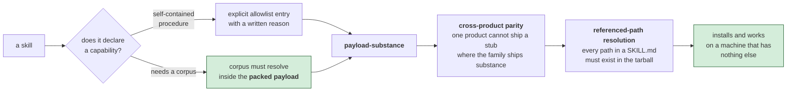

# LitCodex usage reference

[Quick start](../README.md) · [한국어](./usage-Ko-KR.md)

Here is the discipline behind a LitCodex run: a plan is ready only when each item has a binary check; a slice closes only after its real surface leaves an artifact and QA resources are torn down. A green test run alone is not completion.

```mermaid
flowchart TD
    R["a request<br/>make it better"] --> DI["<b>deep-interview</b><br/>turn it into a decision-complete brief"]
    DI --> P["<b>lit-plan</b><br/>objective · non-goals<br/>action / output / <b>binary verification</b>"]
    P --> GATE{"user approves?"}
    GATE -->|no| P
    GATE -->|yes| SW["<b>start&#45;work</b><br/>execute one slice"]

    subgraph LOOP["each slice: RED to GREEN to SURFACE to CLEAN"]
        SW --> RED["failing test first"]
        RED --> GREEN["smallest change that passes"]
        GREEN --> SURF["exercise the <b>real surface</b><br/>not just the test"]
        SURF --> CLEAN["tear down · cleanup receipt"]
    end

    CLEAN --> EV{"evidence complete?"}
    EV -->|"tests only"| SW
    EV -->|"artifact + receipt"| RW["<b>review-work</b><br/>scope · evidence · payload<br/>security · real surface"]
    RW -->|findings| SW
    RW -->|clean| HO["<b>lit-handoff</b><br/>resumable packet"]

    style GATE fill:#fff3cd,stroke:#856404
    style EV fill:#fff3cd,stroke:#856404
    style SURF fill:#d4edda,stroke:#155724
    style RW fill:#d1ecf1,stroke:#0c5460
```



## What is LitCodex

LitCodex installs a `UserPromptSubmit` hook. A bare `lit` injects `<lit-loop-mode>` and starts **lit-loop**;
the runtime stores goals, criteria, and evidence under `.litcodex/lit-loop`. A goal completes only when every
criterion has passing evidence. Blocked work remains incomplete.

Codex contributes the hook and marketplace entry points; LitCodex's compiled components apply routing and model policy before recording durable loop state. The installed catalog exposes 42 skills.

```mermaid
flowchart LR
    subgraph CX["Codex CLI"]
        HK["hooks"]; MP["marketplace"]
    end
    subgraph LX["LitCodex plugin"]
        COMP["compiled components<br/>lit-loop · rules · lsp<br/>start&#45;work&#45;continuation"]
        MODEL["model policy<br/>lead vs subagent split"]
        LEDGER[("durable ledger")]
    end
    HK --> COMP --> LEDGER
    MP --> LX
    COMP --> MODEL
    LX --> S["42 skills"]
```



The same plugin provides planning, review, research, recap, comprehension, handoff, and local-knowledge
surfaces. The Codex skill picker exposes the bundled library, including `autoconference`, `autoresearch`,
`browser-drive`, `coding-session-audit`, `comment-checker`, `debugging`, `frontend-ui-ux`, `lit-commit`, `lit-crucible`, `lit-init`, `lit-korean`, `lit-fetch`,
`litcodex-contribute-bug-fix`, `litcodex-doctor`, `litcodex-report-bug`, `lsp`, `lsp-setup`, `lit-code`,
`refactor`, `lit-burnoff`, `readme-studio`, `structural-search`, `lit-team`, `visual-qa`, and `wikify`.

Release history belongs in [CHANGELOG.md](../CHANGELOG.md). The package carries the runtime marketplace
payload and stages it at `~/.codex/marketplaces/litcodex`; installation does not clone GitHub or require
GitHub credentials. Tests, fixtures, test helpers, and Vitest configuration remain tracked repository coverage and are excluded from npm and installed marketplace payloads.

Repository presence is not enough to ship a runnable skill. The packed payload must contain either the allowlisted self-contained procedure or the corpus it names, and every referenced path must resolve before a fresh installation is considered ready.



### Skill rename compatibility

The skill picker lists the new `lit-*` ids, including `lit-burnoff-file` for focused single-file cleanup.
Explicit leading bare skill names invoke their installed bodies. Previous names and their scoped
mentions redirect for one release and print a deprecation note; they are removed in the next minor.
See [the rename table](../CHANGELOG.md#unreleased). Codex has no command-file slash surface for these skills,
so compatibility is implemented in UserPromptSubmit. Code spans, slash paths, and ordinary prose stay inert.
Install/update compares the managed marketplace manifest and SHA-256 tree, then replaces the tree atomically.
This removes old skill directories even at the same package version and preserves user skills outside the managed marketplace.


## Install

> Public registry availability of this local candidate is not established. Use the npm commands below only
> after the package is available. For a trial now, use the supplied local tarball and the
> [isolated trial procedure](./npm-migration.md#isolated-local-trial). `CODEX_HOME` alone does not isolate
> config discovery from the existing home.

The recommended path is one command:

```sh
npm exec --yes --package @litfamily/litcodex@1.0.11 -- litcodex install
```

This registers the marketplace and plugin, wires `UserPromptSubmit`, installs the litwork agents, and makes a
non-destructive update to `~/.codex/config.toml`. Preview the plan first:

```sh
npm exec --yes --package @litfamily/litcodex@1.0.11 -- litcodex --dry-run install
```

> Without a global install, run later commands as `npm exec --yes --package @litfamily/litcodex@1.0.11 -- litcodex <command>`, for example
> `npm exec --yes --package @litfamily/litcodex@1.0.11 -- litcodex doctor`.

For a persistent `litcodex` command, install globally and then install the plugin:

```sh
npm install -g @litfamily/litcodex
litcodex install
```

For an unattended install, use `litcodex install --yes` (or `npm exec --yes --package @litfamily/litcodex@1.0.11 -- litcodex install --yes`).
Model, style, and confirmation prompts are skipped with `--yes`, `CI` (even empty), non-TTY input/output,
`--no-tui`, `--json`, or `--dry-run`. An explicit `--style <id>` still applies on installation.
`NO_COLOR` (even empty) keeps interactive choices available with plain prompts and no ANSI escapes.
`TERM=dumb` and non-UTF-8 locales also use plain output and the `LIT` text wordmark.

### Windows / PowerShell

npm on Windows installs `codex` as a `.cmd`, `.exe`, or — in some PowerShell-managed setups — a
`codex.ps1`-only shim. Since 0.3.66 the installer spawns `codex.cmd`/`codex.bat` through `ComSpec`
(`cmd.exe /d /s /c`) and reads the Codex version from stdout; this release additionally routes a
`codex.ps1`-only PATH through `powershell -NoProfile -ExecutionPolicy Bypass -File`. If an install
fails with `LITCODEX_INSTALL_CODEX_VERSION_UNSUPPORTED · codex-version-unrecognized`, you are almost
certainly running a pre-0.3.66 copy from the npx cache; run the pinned recovery command:

```powershell
npm exec --yes --package @litfamily/litcodex@1.0.11 -- litcodex install
```

> `npx` caches packages, so a bare `npm exec --package @litfamily/litcodex -- litcodex` can keep executing an older cached version.
> Pinning the version (`@1.0.11` or `@latest`) forces npx past the stale cache entry.

Lit-loop's descriptor-bound filesystem guarantees are POSIX-only. Node does not expose the Windows
directory-descriptor and `openat`/`dir_fd` contract these checks require, and Python's `dir_fd` APIs
are Unix-only. On Windows, descriptor-dependent Python routes fail closed with
`BLOCKED_UNSUPPORTED_PYTHON_POSIX_RUNTIME`; this is expected partial support, not a parity claim.

## Activate lit

In the Codex composer, type:

```text
lit add input validation to the signup form
```

The hook routes bounded phrases to the matching mode. `split`, `literal`, and `litmus` do not trigger it.
Code spans and fences are ignored; slash-command-style mentions are ignored except the explicit `/litresearch` research route.
Exact bare `handoff` and exact bare `lit-scientific-visualization` are separate routes.
Each exact-only hook route loads its own discipline context.

### Make one small thing

Start in an empty project with a task you can inspect:

```text
lit build a single-file HTML task list in this folder. Do not install dependencies.
Check adding and completing a task, and record anything you could not verify.
```

Look for the result, the checks actually performed, and the unfinished work. A status mark confirms
routing; it does not prove the page works. Ask for `lit recap` to read the recorded state. Before
leaving the session, send exact bare `handoff` as its own message. In the next session, ask Codex
to read that packet and the project goals before continuing.

| Step | What stays with the work |
| --- | --- |
| Plan | A goal with checks that can pass or fail |
| Make | A small result you can inspect |
| Verify | Evidence for each completed criterion; blockers stay open |
| Hand off | Decisions, remaining work, and where to resume |

Native Codex goals and the local loop ledger have separate boundaries. A paused or blocked native
goal needs the documented recovery step below; a handoff does not silently resume it.

## The lit command family

| Type this | Mode | What it does |
| --- | --- | --- |
| `lit` or `lit-loop` | **lit-loop** | Durable, evidence-checkpointed execution |
| `litwork` | **litwork** | Outcome-first work with manual-QA evidence |
| `lit-plan` or `lit plan` | **lit-plan** | Planning-only, bounded plan with evidence and a Final DoneClaim |
| `deep-interview` or `lit deep interview` | **deep-interview** | Planning-only discovery for ambiguous briefs |
| `litgoal` or `lit goal` | **litgoal** | Bind an objective and criteria into loop state |
| `lit-recap` or `lit recap` | **lit-recap** | Read-only recap from `.litcodex` ledgers |
| `lit-comprehend` or `comprehend` | **lit-comprehend** | Build a self-contained explainer outside the worktree |
| `review-work` or `lit review` | **review-work** | Read-only plan or completed-work review |
| `litresearch`, `/litresearch`, or `lit research` | **litresearch** | Research journal separating facts, hypotheses, sources, and uncertainty |
| `lit start work <plan-name>` | **Start Work** | Execute an approved plan with durable evidence |
| exact bare `handoff` | **lit-handoff** | Create or refresh a secret-safe continuation packet |
| exact bare `lit-scientific-visualization` | **lit-scientific-visualization** | Load the publication plotting adapter through the hook |

Typing the same mode again in one session is idempotent. Standalone skills can also be selected by exact ID
from the Codex picker or with a scoped mention, including `$litcodex:lit-handoff` and
`$litcodex:lit-scientific-visualization`.
For report or proposal output, bare `lit` loads `lit-docx`; for slide or presentation output it loads `lit-pptx`. Both are loaded when both formats are requested. Explicit picker or `$litcodex:lit-docx` and `$litcodex:lit-pptx` selection also works. `litcodex install` prepares the pinned runtime outside the session; `litcodex office-runtime status` and `litcodex doctor` report readiness. If offline, run `litcodex office-runtime install` later outside the sandbox.

## Commands

| Command | Purpose |
| --- | --- |
| `litcodex install` | Register the LitCodex plugin and hook |
| `litcodex doctor` | Diagnose installation, loop state, host capabilities, and effective config |
| `litcodex uninstall` | Remove the plugin and LitCodex-managed config |
| `litcodex config migrate` | Preview or apply managed Codex config keys |
| `litcodex hook user-prompt-submit` | Run the host hook entrypoint |
| `litcodex loop create` | Derive goals and criteria from a brief |
| `litcodex loop status --json` | Inspect loop state as JSON |
| `litcodex loop run` | Select the next runnable goal |
| `litcodex loop record-evidence` | Record a criterion pass, fail, or blocked result |
| `litcodex loop checkpoint` | Complete a goal only when every criterion passes |
| `litcodex loop doctor` | Diagnose or recover loop state |

## Loop state

LitCodex writes state in the current project root:

```text
.litcodex/lit-loop/
├── brief.md       # original task brief
├── goals.json     # goals, criteria, and status
├── ledger.jsonl   # append-only audit trail
└── evidence/      # real-surface evidence per criterion
```

Writes are atomic. A damaged `goals.json` is preserved as a `.bak` and reported rather than silently
overwritten. The separate Wikify authority is `.litcodex/knowledge/claims.jsonl`; only reviewed, accepted
records can be injected by the local hook. Project `.litcodex/` state is gitignored and excluded from npm and
marketplace payloads.

## Verify it worked

Run:

```sh
litcodex doctor
litcodex loop doctor
```

`doctor` reports plugin registration, hook wiring, config state, and loop health. A credentialless installed
probe can pack the current package in an isolated home, run `litcodex install --no-tui --codex-autonomous --json`,
and require a healthy `litcodex doctor --json`; model execution is `NOT_REQUESTED` in that scope.

## Safety

- Completion is evidence-bound: every success criterion must pass before a goal is complete.
- Doctor diagnostic checks are read-only. Eligible interactive management commands can separately run the foreground updater and install a newer global package; see [privacy and update controls](privacy.md).
- Unrelated keys in `~/.codex/config.toml` are preserved. Use `--dry-run` before any reviewed reconfiguration.
- Detached update notices are cache-only and user-mediated. The foreground update barrier can be disabled with
  `--no-auto-update` or `LITCODEX_NO_AUTO_UPDATE=1`.
- An eligible interactive doctor may show a cached advisory notice. A detached worker performs a fixed registry
  refresh and records it at `~/.litcodex/update-check.json`; it never installs an update automatically.
- Failed, `--json`, `--dry-run`, non-TTY, CI, and opt-out paths stay side-effect-free.

<details>
<summary>Managed model and config compatibility</summary>

On fresh installs, the default lead route is `gpt-6-astra` with `xhigh` effort and the default helper route is
`gpt-6-luna` with `max`. An explicit managed `--reconfigure` applies the selected route and does not override an
explicit model choice. This is the product's selected route, not a claim about host metadata, entitlement, or model
execution. The shipped `model-catalog.json` is authoritative: GPT-6 Astra and Sol support
`low|medium|high|xhigh|max|ultra`, while GPT-6 Luna intentionally omits `ultra`; the listed GPT-5.6 ids remain
selectable with their catalog bounds. `--model luna` keeps the legacy `model = "gpt-5.6-luna"` route and max effort.
The recommended coding-lead alternative is `gpt-6-sol` with `xhigh`; GPT-5.6 Sol remains selectable as a previous-generation option. The catalog has no retirement metadata for the GPT-5.6 Sol, Terra, or Luna ids.
The catalog marks `gpt-5.5` as retiring on 2026-10-14 with an upgrade to `gpt-5.6-sol`; users need no recurring
`-m gpt-5.5` workaround.

An ordinary install or update never rewrites an already configured model. Existing customized and provider-qualified root models that pass the existing safety policy remain preserved by a
normal reinstall; Luna below high fails closed unchanged. Existing explicit Sol representations remain preserved by
a normal install. A one-time reviewed `litcodex install --reconfigure` updates an existing root to the selected
alias, removes its old root context/compaction overrides, and preserves unrelated keys. Fresh installs and explicit
managed reconfiguration leave `model_context_window` and `model_auto_compact_token_limit` unset so Codex applies host
defaults. Existing default-looking user root values and valid role TOMLs are not reset by an ordinary reinstall.

Bundled litwork routing is explicit: `litcodex-plan`, `litcodex-momus`, and `litcodex-litwork-reviewer` use
`gpt-6-astra` with `xhigh`; `litcodex-explorer`, `litcodex-librarian`, and `litcodex-metis` use
`gpt-6-luna` with `max`. The installer validates these TOMLs before writing, copies all six named-role developer
instructions unchanged, and treats route-looking text inside those instructions as data. It rejects unknown or
unsafe routes, including the legacy `gpt-5.6-luna` plus `xhigh` combination.

Since 0.4.2 the interactive installer asks for the LEAD model (plans and reviews) and the HELPER
model (spawned/delegated agents) with numbered menus and prints a MODEL ROUTE summary card before
any write. Normal install accepts every canonical id and alias listed by `model-catalog.json` (including
`gpt-6-sol`, `gpt-6-luna`, and the selectable GPT-5.6 entries) with model-specific `--effort` bounds; the matching
`--subagent-model` and effort flags select an explicit helper route. The fresh/default helper is GPT-6 Luna/max even
when the lead is Astra. The native Codex `[agents.default].config_file`
binding points to the installed model-only generic role at `<CODEX_HOME>/litcodex-default.toml`, outside the
autodiscovered `<CODEX_HOME>/agents/` directory; the six named roles remain under `agents/`. An explicit
`--subagent-model gpt-6-astra --subagent-effort low` may select Astra/low for that native generic role. The direct
`litcodex config migrate --model` parser uses the same catalog ids and effort bounds. LitCodex writes no unsupported global
`default_subagent_model` or `default_subagent_reasoning_effort` keys. Existing valid role/default bindings are
reported as preserved on ordinary reinstall; `--reconfigure` is the explicit permission to update managed route
headers. A receipt or doctor route summary does not claim child execution without a native JSONL child receipt.

### Refreshing the model catalog

`packages/litcodex-ai/model-catalog.json` is the authored source for accepted model ids and aliases, supported and configurable effort lists, defaults, role routes, legacy profile mappings, host-context probe membership, and installer model/effort rows. `packages/litcodex-ai/src/config-migration/catalog.ts` validates and exposes that JSON; route-policy profile constants and the host-context probe list are derived from the catalog. Native Codex role configs are shipped as TOML under `plugins/litcodex/components/lit-loop/agents/`, so their route headers are static mirrors of `roles` in the JSON; update those headers with the matching catalog route when a role default changes. Edit the JSON directly, run `npm run build`, and verify every shipped role header against it with `npm run test:vitest -- plugins/litcodex/components/lit-loop/test/gpt56-authored-roles.test.ts`; there is no separate catalog generator. `packages/litcodex-ai/src/install/install-model-choice.test.ts` pins accepted ids, defaults, effort bounds, profile mappings, and menu rows, while `node --test tools/readme.test.mjs` checks this documentation. If bundled skill prose changes, regenerate its hashes with `npm run generate:skill-payload-hashes` and verify them with `npm run check:skill-payload-hashes`.

</details>

## Deeper docs

- [LitCodex contract](./spec/litcodex-contract.md) — hook, state, and evidence boundaries.
- [Reference analysis](./reference-analysis.md) — design and compatibility notes.
- [Release provenance](./release/provenance.md) and [publish checklist](./release/publish-checklist.md).
- [CHANGELOG.md](../CHANGELOG.md) — release history.

Installer contributors can run `npm run qa:installer-tty` after the native gates. This POSIX/Python 3
regression packs and installs the actual package, uses the repository's pinned Codex CLI in disposable
profiles, and checks 16 terminal-policy cases with bounded prompt handling. Run it serially because
packing rebuilds the workspace. Transcripts and receipts remain under `.litcodex/installer-tty-policy/`;
the installed prefix, profiles, and npm cache are removed after the run.

## Troubleshooting

**If the pane closes before output, the failing stage and cause are still unknown.** Do not infer installation
success or a plugin crash. Use an already-open terminal and the [isolated trial procedure](./npm-migration.md#isolated-local-trial).
Run help, install, and doctor one step at a time; record the status immediately after each command.
Stop at the failed step and share the command, output, and status without credentials or personal config.
Do not attach host startup to the install command.

- **`lit` did nothing.** Run `litcodex doctor` and approve the LitCodex hooks in Codex startup review.
- **`litcodex: command not found`.** Check `npm ls -g @litfamily/litcodex` and that npm’s global `bin` directory is on `PATH`; use the npx form above for an ephemeral install.
- **Loop state looks wrong.** Run `litcodex loop doctor`; damaged goals are preserved as `.bak`.
- **A matching native goal is blocked or paused.** Run `/goal resume`, confirm `get_goal` reports it active, then retry with `litcodex loop run --retry-failed`. Do not replace or clear the unfinished native goal.
- **A native goal is `budgetLimited`, or its status is malformed.** LitCodex fails closed without creating, updating, or clearing that goal; resolve it explicitly in Codex.
- **Want to see the install plan first?** Run `litcodex --dry-run install`.

## Uninstall

```sh
litcodex uninstall
```

This removes the registered plugin and LitCodex-managed config while leaving unrelated Codex settings untouched.

## License

MIT
